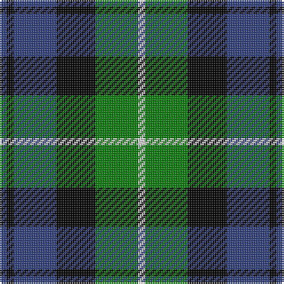

In pattern [BKBKGW](/patterns/bkbkgw/).

This was sourced from weddslist.  It is a [6 stripes tartan](/stripes/stripes6/).

Original link http://www.weddslist.com/cgi-bin/tartans/pg.pl?source=sts

## Thread count
B/4 K4 B24 K22 G24 LN/4

## Palette
Each colour and its ΔE from the base-6 reference it is a variant of.

| Colour | Shade | Base | ΔE (OKLab) |
|---|---|---|---|
| B | <code style="background-color:#304080;">#304080</code> `#304080` | B <code style="background-color:#2A418A;">#2A418A</code> | 0.02 |
| G | <code style="background-color:#008000;">#008000</code> `#008000` | G <code style="background-color:#006100;">#006100</code> | 0.10 |
| K | <code style="background-color:#000000;">#000000</code> `#000000` | K <code style="background-color:#000000;">#000000</code> | 0.00 |
| LN | <code style="background-color:#E0E0E0;">#E0E0E0</code> `#E0E0E0` | W <code style="background-color:#F7F7F7;">#F7F7F7</code> | 0.07 |

# Sample pattern

## Nearest tartans

The nearest existing variants by ΔTartan distance.

1. [Murray](/setts/s6/b4k4b24k16g22r4-b304080-g008000-k000000-rc00000/) — ΔT 0.48
1. [Forbes](/setts/s7/b2k2b12k12g12k2w2-b304080-g008000-k000000-we0e0e0/) — ΔT 0.51
1. [Morrison](/setts/s6/k6g28k28g4b28r6-b304080-g008000-k000000-rc00000/) — ΔT 0.51
1. [Unnamed, No 26](/setts/s6/w4b4g22k20b20w3-b304080-g008000-k000000-we0e0e0/) — ΔT 0.54
1. [Ferguson](/setts/s6/g8b48r6k48g50k8-b304080-g008000-k000000-rc00000/) — ΔT 0.65
1. [MacNeil 1](/setts/s6/w4b36k36g36k8w4-b304080-g008000-k000000-we0e0e0/) — ΔT 0.66
1. [Fletcher #2](/setts/s7/b20k6b20k28r4g28k8-b1474b4-g007800-k000000-rc80000/) — ΔT 0.73
1. [Glenturret](/setts/s6/k6g28k28g4b30y4-b000050-g008000-k000000-yf0c000/) — ΔT 0.74
1. [Wellington, or Waterloo](/setts/s6/b6g24k28b22r6b6-b5480b0-g008000-k000000-rc00000/) — ΔT 0.78
1. [Lennie](/setts/s6/g4b16k18ba4g20k4-b800080-ba5480b0-g008000-k000000/) — ΔT 0.80

## Neighbour map

Every grey dot is one of 15726 variants placed by the first two principal components of the ΔTartan feature space (44% of its variance). Red is this tartan; blue dots are its nearest — click one to open its page.

<svg viewBox="0 0 640 380" role="img" style="max-width:100%;height:auto;border:1px solid #e0e0e0;border-radius:4px;display:block" xmlns="http://www.w3.org/2000/svg"><image href="/nn/cloud.v1.png" width="640" height="380"/><a href="/setts/s6/b4k4b24k16g22r4-b304080-g008000-k000000-rc00000/"><circle cx="149.3" cy="238.9" r="4" fill="#3465a4"><title>Murray</title></circle></a><a href="/setts/s7/b2k2b12k12g12k2w2-b304080-g008000-k000000-we0e0e0/"><circle cx="139.0" cy="222.3" r="4" fill="#3465a4"><title>Forbes</title></circle></a><a href="/setts/s6/k6g28k28g4b28r6-b304080-g008000-k000000-rc00000/"><circle cx="133.8" cy="234.5" r="4" fill="#3465a4"><title>Morrison</title></circle></a><a href="/setts/s6/w4b4g22k20b20w3-b304080-g008000-k000000-we0e0e0/"><circle cx="114.6" cy="224.1" r="4" fill="#3465a4"><title>Unnamed, No 26</title></circle></a><a href="/setts/s6/g8b48r6k48g50k8-b304080-g008000-k000000-rc00000/"><circle cx="151.5" cy="224.2" r="4" fill="#3465a4"><title>Ferguson</title></circle></a><a href="/setts/s6/w4b36k36g36k8w4-b304080-g008000-k000000-we0e0e0/"><circle cx="142.8" cy="216.1" r="4" fill="#3465a4"><title>MacNeil 1</title></circle></a><a href="/setts/s7/b20k6b20k28r4g28k8-b1474b4-g007800-k000000-rc80000/"><circle cx="128.4" cy="237.6" r="4" fill="#3465a4"><title>Fletcher #2</title></circle></a><a href="/setts/s6/k6g28k28g4b30y4-b000050-g008000-k000000-yf0c000/"><circle cx="139.5" cy="231.7" r="4" fill="#3465a4"><title>Glenturret</title></circle></a><a href="/setts/s6/b6g24k28b22r6b6-b5480b0-g008000-k000000-rc00000/"><circle cx="113.2" cy="248.3" r="4" fill="#3465a4"><title>Wellington, or Waterloo</title></circle></a><a href="/setts/s6/g4b16k18ba4g20k4-b800080-ba5480b0-g008000-k000000/"><circle cx="124.6" cy="244.4" r="4" fill="#3465a4"><title>Lennie</title></circle></a><circle cx="126.2" cy="235.3" r="5" fill="#c00000"/></svg>

ID: /setts/s6/b4k4b24k22g24w4-b304080-g008000-k000000-we0e0e0/
