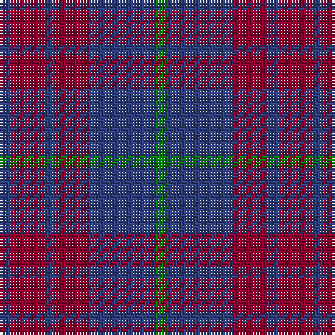

In pattern [BRBRBG](/patterns/brbrbg/).

This was sourced from weddslist.  It is a [6 stripes tartan](/stripes/stripes6/).

Original link http://www.weddslist.com/cgi-bin/tartans/pg.pl?source=sts

## Thread count
B/4 DR12 B4 DR12 B24 G/4

## Palette
Each colour and its ΔE from the base-6 reference it is a variant of.

| Colour | Shade | Base | ΔE (OKLab) |
|---|---|---|---|
| B | <code style="background-color:#304080;">#304080</code> `#304080` | B <code style="background-color:#2A418A;">#2A418A</code> | 0.02 |
| DR | <code style="background-color:#900030;">#900030</code> `#900030` | R <code style="background-color:#CC0000;">#CC0000</code> | 0.14 |
| G | <code style="background-color:#008000;">#008000</code> `#008000` | G <code style="background-color:#006100;">#006100</code> | 0.10 |

# Sample pattern

## Nearest tartans

The nearest existing variants by ΔTartan distance.

1. [Robbins Family Tartan Tartan Number: 412. Earliest known date: 1985 See products available Copyright © Blair Urquhart, Comrie, 2015](/setts/s6/b4r12b4r12b24g4-b2c2c80-g006818-ra00048/) — ΔT 0.78
1. [Unidentified Tartan Tartan Number: 598. Earliest known date: 0 Seen by Alex Lumsden in a Toronto subway 1984. See products available Copyright © Blair Urquhart, Comrie, 2015](/setts/s5/b48g6b48g57r12-b2c2c80-g604000-rc80000/) — ΔT 1.12
1. [Hillsdale (Corporate?)](/setts/s5/b26ba12r102b102ba10-b1c1c50-ba5c5c5c-r880000/) — ΔT 1.29
1. [MacArthur-Fox, dress](/setts/s6/b8r64ba12r12ba52ra8-b5480b0-ba304080-r800000-rac00000/) — ΔT 1.41
1. [Unidentified #24](/setts/s5/b48g6b48g57r12-b2c4084-g503c14-rdc0000/) — ΔT 1.45
1. [Robbins](/setts/s6/b8r24b8r24b48g8-b1c0070-g006818-r880000/) — ΔT 1.50
1. [Feniston (Personal)](/setts/s5/b60ba20b6ba60r6-b680028-ba202060-rec34c4/) — ΔT 1.51
1. [MacArthur-Fox Dress Personal Tartan Tartan Number: 459. Earliest known date: 1986 This is the older of the two MacArthur setts, which links the clan with the Campbells. See products available Copyright © Blair Urquhart, Comrie, 2015](/setts/s6/b8r64ba12r12ba52ra8-b5c8ca8-ba2c2c80-r880000-rac80000/) — ΔT 1.54
1. [Unidentified 17](/setts/s5/b48r6b48r57ra12-b304080-r806050-rac00000/) — ΔT 1.57
1. [Cameron, hunting](/setts/s6/r30ra10r60b64r8y6-b304080-r806050-rac00000-yf0c000/) — ΔT 1.66

## Neighbour map

Every grey dot is one of 15726 variants placed by the first two principal components of the ΔTartan feature space (44% of its variance). Red is this tartan; blue dots are its nearest — click one to open its page.

<svg viewBox="0 0 640 380" role="img" style="max-width:100%;height:auto;border:1px solid #e0e0e0;border-radius:4px;display:block" xmlns="http://www.w3.org/2000/svg"><image href="/nn/cloud.v1.png" width="640" height="380"/><a href="/setts/s6/b4r12b4r12b24g4-b2c2c80-g006818-ra00048/"><circle cx="355.2" cy="275.9" r="4" fill="#3465a4"><title>Robbins Family Tartan Tartan Number: 412. Earliest known date: 1985 See products available Copyright © Blair Urquhart, Comrie, 2015</title></circle></a><a href="/setts/s5/b48g6b48g57r12-b2c2c80-g604000-rc80000/"><circle cx="383.4" cy="289.5" r="4" fill="#3465a4"><title>Unidentified Tartan Tartan Number: 598. Earliest known date: 0 Seen by Alex Lumsden in a Toronto subway 1984. See products available Copyright © Blair Urquhart, Comrie, 2015</title></circle></a><a href="/setts/s5/b26ba12r102b102ba10-b1c1c50-ba5c5c5c-r880000/"><circle cx="386.1" cy="261.7" r="4" fill="#3465a4"><title>Hillsdale (Corporate?)</title></circle></a><a href="/setts/s6/b8r64ba12r12ba52ra8-b5480b0-ba304080-r800000-rac00000/"><circle cx="346.9" cy="239.5" r="4" fill="#3465a4"><title>MacArthur-Fox, dress</title></circle></a><a href="/setts/s5/b48g6b48g57r12-b2c4084-g503c14-rdc0000/"><circle cx="398.7" cy="298.6" r="4" fill="#3465a4"><title>Unidentified #24</title></circle></a><a href="/setts/s6/b8r24b8r24b48g8-b1c0070-g006818-r880000/"><circle cx="331.8" cy="270.0" r="4" fill="#3465a4"><title>Robbins</title></circle></a><a href="/setts/s5/b60ba20b6ba60r6-b680028-ba202060-rec34c4/"><circle cx="424.1" cy="277.2" r="4" fill="#3465a4"><title>Feniston (Personal)</title></circle></a><a href="/setts/s6/b8r64ba12r12ba52ra8-b5c8ca8-ba2c2c80-r880000-rac80000/"><circle cx="329.9" cy="230.6" r="4" fill="#3465a4"><title>MacArthur-Fox Dress Personal Tartan Tartan Number: 459. Earliest known date: 1986 This is the older of the two MacArthur setts, which links the clan with the Campbells. See products available Copyright © Blair Urquhart, Comrie, 2015</title></circle></a><a href="/setts/s5/b48r6b48r57ra12-b304080-r806050-rac00000/"><circle cx="407.8" cy="299.2" r="4" fill="#3465a4"><title>Unidentified 17</title></circle></a><a href="/setts/s6/r30ra10r60b64r8y6-b304080-r806050-rac00000-yf0c000/"><circle cx="377.7" cy="238.9" r="4" fill="#3465a4"><title>Cameron, hunting</title></circle></a><circle cx="364.6" cy="281.8" r="5" fill="#c00000"/></svg>

ID: /setts/s6/b4r12b4r12b24g4-b304080-g008000-r900030/
