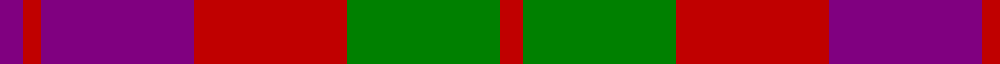

In pattern [BRBRGR](/patterns/brbrgr/).

This was sourced from weddslist.  It is a [6 stripes tartan](/stripes/stripes6/).

Original link http://www.weddslist.com/cgi-bin/tartans/pg.pl?source=sts

## Thread count
P/8 R6 P52 R52 G52 R/8

## Palette
Each colour and its ΔE from the base-6 reference it is a variant of.

| Colour | Shade | Base | ΔE (OKLab) |
|---|---|---|---|
| G | <code style="background-color:#008000;">#008000</code> `#008000` | G <code style="background-color:#006100;">#006100</code> | 0.10 |
| P | <code style="background-color:#800080;">#800080</code> `#800080` | B <code style="background-color:#2A418A;">#2A418A</code> | 0.17 |
| R | <code style="background-color:#C00000;">#C00000</code> `#C00000` | R <code style="background-color:#CC0000;">#CC0000</code> | 0.03 |

# Sample pattern

## Nearest tartans

The nearest existing variants by ΔTartan distance.

1. [Unidentified Artifact Tartan Tartan Number: 463. Earliest known date: 0 Wilson's of Bannockburn 'New Broad Sett' perhaps. See products available Copyright © Blair Urquhart, Comrie, 2015](/setts/s6/b4r3b26r26g26r4x2~b780078-g006818-rc80000/) — ΔT 0.37
1. [Unidentified #21](/setts/s6/b4r3b26r26g26r4x2~b5a008c-g005020-rdc0000/) — ΔT 0.78
1. [Scottish Netball Association](/setts/s7/b3g14r2b10g2r14b3x2~b800080-g008000-r900030/) — ΔT 0.87
1. [MacNab (Macgregor - Hastie)](/setts/s6/b3r19b18g19b3g3x2~b500050-g005020-rdc0000/) — ΔT 0.88
1. [MacFadyan (MacGregor Hastie)](/setts/s7/b3r25b17r5g22r9b3x2~b2c2c80-g006818-rc80000/) — ΔT 0.99
1. [MacNab 1](/setts/s6/b3r19b18g19b3g3x2~b500060-g008000-rc00000/) — ΔT 1.04
1. [Thomson, Red (Name)](/setts/s6/b4r28k6b12k12b3x2~b5c8ca8-k101010-rc80000/) — ΔT 1.08
1. [MacFadyen, MacBean (Old)](/setts/s7/b3r25b17r5g22r9b3x2~b304080-g008000-rc00000/) — ΔT 1.14
1. [Moray of Abercairney #2](/setts/s5/r8ra1g4ra1b4x2~b2c4084-g005020-rdc0000-rac82828/) — ΔT 1.20
1. [Thompson/Thomson/MacTavish (Bonner)](/setts/s6/b4r30k6b13k13b3x2~b2c4084-k101010-rdc0000/) — ΔT 1.23

## Neighbour map

Every grey dot is one of 15726 variants placed by the first two principal components of the ΔTartan feature space (44% of its variance). Red is this tartan; blue dots are its nearest — click one to open its page.

<svg viewBox="0 0 640 380" role="img" style="max-width:100%;height:auto;border:1px solid #e0e0e0;border-radius:4px;display:block" xmlns="http://www.w3.org/2000/svg"><image href="/nn/cloud.v1.png" width="640" height="380"/><a href="/setts/s6/b4r3b26r26g26r4x2~b780078-g006818-rc80000/"><circle cx="249.0" cy="235.8" r="4" fill="#3465a4"><title>Unidentified Artifact Tartan Tartan Number: 463. Earliest known date: 0 Wilson's of Bannockburn 'New Broad Sett' perhaps. See products available Copyright © Blair Urquhart, Comrie, 2015</title></circle></a><a href="/setts/s6/b4r3b26r26g26r4x2~b5a008c-g005020-rdc0000/"><circle cx="231.4" cy="230.7" r="4" fill="#3465a4"><title>Unidentified #21</title></circle></a><a href="/setts/s7/b3g14r2b10g2r14b3x2~b800080-g008000-r900030/"><circle cx="218.7" cy="238.9" r="4" fill="#3465a4"><title>Scottish Netball Association</title></circle></a><a href="/setts/s6/b3r19b18g19b3g3x2~b500050-g005020-rdc0000/"><circle cx="225.0" cy="251.1" r="4" fill="#3465a4"><title>MacNab (Macgregor - Hastie)</title></circle></a><a href="/setts/s7/b3r25b17r5g22r9b3x2~b2c2c80-g006818-rc80000/"><circle cx="265.1" cy="234.3" r="4" fill="#3465a4"><title>MacFadyan (MacGregor Hastie)</title></circle></a><a href="/setts/s6/b3r19b18g19b3g3x2~b500060-g008000-rc00000/"><circle cx="208.9" cy="246.6" r="4" fill="#3465a4"><title>MacNab 1</title></circle></a><a href="/setts/s6/b4r28k6b12k12b3x2~b5c8ca8-k101010-rc80000/"><circle cx="242.1" cy="220.7" r="4" fill="#3465a4"><title>Thomson, Red (Name)</title></circle></a><a href="/setts/s7/b3r25b17r5g22r9b3x2~b304080-g008000-rc00000/"><circle cx="267.4" cy="235.9" r="4" fill="#3465a4"><title>MacFadyen, MacBean (Old)</title></circle></a><a href="/setts/s5/r8ra1g4ra1b4x2~b2c4084-g005020-rdc0000-rac82828/"><circle cx="239.5" cy="231.2" r="4" fill="#3465a4"><title>Moray of Abercairney #2</title></circle></a><a href="/setts/s6/b4r30k6b13k13b3x2~b2c4084-k101010-rdc0000/"><circle cx="254.7" cy="219.4" r="4" fill="#3465a4"><title>Thompson/Thomson/MacTavish (Bonner)</title></circle></a><circle cx="239.5" cy="232.0" r="5" fill="#c00000"/></svg>

ID: /setts/s6/b4r3b26r26g26r4x2~b800080-g008000-rc00000/
