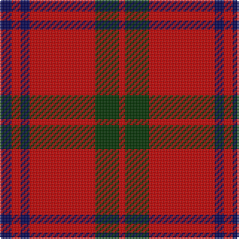

In pattern [BRBRGR](/patterns/brbrgr/).

This was sourced from weddslist.  It is a [6 stripes tartan](/stripes/stripes6/).

Original link http://www.weddslist.com/cgi-bin/tartans/pg.pl?source=sts

## Thread count
DB/8 R6 DB6 R44 DG16 R/4

## Palette
Each colour and its ΔE from the base-6 reference it is a variant of.

| Colour | Shade | Base | ΔE (OKLab) |
|---|---|---|---|
| DB | <code style="background-color:#000050;">#000050</code> `#000050` | B <code style="background-color:#2A418A;">#2A418A</code> | 0.21 |
| DG | <code style="background-color:#003000;">#003000</code> `#003000` | G <code style="background-color:#006100;">#006100</code> | 0.17 |
| R | <code style="background-color:#C00000;">#C00000</code> `#C00000` | R <code style="background-color:#CC0000;">#CC0000</code> | 0.03 |

# Sample pattern

## Nearest tartans

The nearest existing variants by ΔTartan distance.

1. [Glen Shiel (Fashion)](/setts/s5/r13w3r1g3w1x6~g003820-r880000-we8ccb8/) — ΔT 0.88
1. [Auld Reekie](/setts/s6/b4r3b3r22g8r2x2~b2c2c80-g006818-rc80000/) — ΔT 0.92
1. [MacKeane](/setts/s5/r4k8r12k1y1x2~k101010-rc80000-ye8c000/) — ΔT 0.96
1. [MacGregor, Black (Personal)](/setts/s5/r41k19r7k9w3x2~k101010-rc80000-wfcfcfc/) — ΔT 1.00
1. [Hopkins (Name)](/setts/s5/r36k18r4k7w2x2~k101010-rc80000-we0e0e0/) — ΔT 1.08
1. [MacKintosh Plaid](/setts/s6/r16b6r2g6r2b1x2~b2c2c80-g285800-rc80000/) — ΔT 1.13
1. [Auld Lang Syne (red) Tartan Tartan Number: 2402. Earliest known date: Threadcount and colours aren't 100% original. Generated manually. See products available Copyright © Blair Urquhart, Comrie, 2015](/setts/s7/r4g14r5k6r24g2r4x2~g006818-k101010-rc80000/) — ΔT 1.15
1. [Lougheed](/setts/s8/w3r3k4w2r18k1r2k2x4~k101010-r880000-we8ccb8/) — ΔT 1.16
1. [Grant of Lurg Artifact Tartan Tartan Number: 527. Earliest known date: pre 1859 Owned by the family Dunbar. Count not given. A plaid. Previously marked 'Unidentified' See products available Copyright © Blair Urquhart, Comrie, 2015](/setts/s6/b2r25g10r2b10r2x2~b2c2c80-g006818-rc80000/) — ΔT 1.16
1. [MacKintosh D](/setts/s6/r22b5r2g11r3b1x2~b000064-g004c00-rc80000/) — ΔT 1.16

## Neighbour map

Every grey dot is one of 15726 variants placed by the first two principal components of the ΔTartan feature space (44% of its variance). Red is this tartan; blue dots are its nearest — click one to open its page.

<svg viewBox="0 0 640 380" role="img" style="max-width:100%;height:auto;border:1px solid #e0e0e0;border-radius:4px;display:block" xmlns="http://www.w3.org/2000/svg"><image href="/nn/cloud.v1.png" width="640" height="380"/><a href="/setts/s5/r13w3r1g3w1x6~g003820-r880000-we8ccb8/"><circle cx="418.5" cy="199.8" r="4" fill="#3465a4"><title>Glen Shiel (Fashion)</title></circle></a><a href="/setts/s6/b4r3b3r22g8r2x2~b2c2c80-g006818-rc80000/"><circle cx="418.0" cy="211.2" r="4" fill="#3465a4"><title>Auld Reekie</title></circle></a><a href="/setts/s5/r4k8r12k1y1x2~k101010-rc80000-ye8c000/"><circle cx="385.3" cy="220.7" r="4" fill="#3465a4"><title>MacKeane</title></circle></a><a href="/setts/s5/r41k19r7k9w3x2~k101010-rc80000-wfcfcfc/"><circle cx="383.0" cy="210.0" r="4" fill="#3465a4"><title>MacGregor, Black (Personal)</title></circle></a><a href="/setts/s5/r36k18r4k7w2x2~k101010-rc80000-we0e0e0/"><circle cx="399.8" cy="197.1" r="4" fill="#3465a4"><title>Hopkins (Name)</title></circle></a><a href="/setts/s6/r16b6r2g6r2b1x2~b2c2c80-g285800-rc80000/"><circle cx="403.3" cy="203.0" r="4" fill="#3465a4"><title>MacKintosh Plaid</title></circle></a><a href="/setts/s7/r4g14r5k6r24g2r4x2~g006818-k101010-rc80000/"><circle cx="395.2" cy="210.1" r="4" fill="#3465a4"><title>Auld Lang Syne (red) Tartan Tartan Number: 2402. Earliest known date: Threadcount and colours aren't 100% original. Generated manually. See products available Copyright © Blair Urquhart, Comrie, 2015</title></circle></a><a href="/setts/s8/w3r3k4w2r18k1r2k2x4~k101010-r880000-we8ccb8/"><circle cx="423.4" cy="162.2" r="4" fill="#3465a4"><title>Lougheed</title></circle></a><a href="/setts/s6/b2r25g10r2b10r2x2~b2c2c80-g006818-rc80000/"><circle cx="365.9" cy="206.3" r="4" fill="#3465a4"><title>Grant of Lurg Artifact Tartan Tartan Number: 527. Earliest known date: pre 1859 Owned by the family Dunbar. Count not given. A plaid. Previously marked 'Unidentified' See products available Copyright © Blair Urquhart, Comrie, 2015</title></circle></a><a href="/setts/s6/r22b5r2g11r3b1x2~b000064-g004c00-rc80000/"><circle cx="408.8" cy="182.4" r="4" fill="#3465a4"><title>MacKintosh D</title></circle></a><circle cx="400.2" cy="207.7" r="5" fill="#c00000"/></svg>

ID: /setts/s6/b4r3b3r22g8r2x2~b000050-g003000-rc00000/
