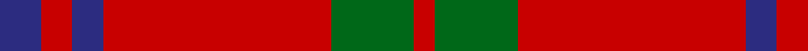
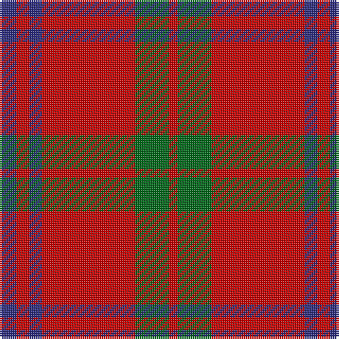

In pattern [BRBRGR](/patterns/brbrgr/).

This was sourced from register-of-tartans.  It is a [6 stripes tartan](/stripes/stripes6/).

Original link https://www.tartanregister.gov.uk/tartanDetails.aspx?ref=133

## Register references

External register numbers recorded for this tartan.

- Scottish Register of Tartans: [133](https://www.tartanregister.gov.uk/tartanDetails.aspx?ref=133)
- Scottish Tartans Authority (ITI): 2381
- Scottish Tartans World Register: 2381

## Thread count
DBa/8 Ra6 DBa6 Ra44 G16 Ra/4

## Palette
Each colour and its ΔE from the base-6 reference it is a variant of.

| Colour | Shade | Base | ΔE (OKLab) |
|---|---|---|---|
| DB | <code style="background-color:#202060;">#202060</code> `#202060` | B <code style="background-color:#2A418A;">#2A418A</code> | 0.11 |
| DBa | <code style="background-color:#2C2C80;">#2C2C80</code> `#2C2C80` | B <code style="background-color:#2A418A;">#2A418A</code> | 0.06 |
| DG | <code style="background-color:#003820;">#003820</code> `#003820` | G <code style="background-color:#006100;">#006100</code> | 0.15 |
| G | <code style="background-color:#006818;">#006818</code> `#006818` | G <code style="background-color:#006100;">#006100</code> | 0.02 |
| R | <code style="background-color:#C80000;">#C80000</code> `#C80000` | R <code style="background-color:#CC0000;">#CC0000</code> | 0.01 |
| Ra | <code style="background-color:#C80000;">#C80000</code> `#C80000` | R <code style="background-color:#CC0000;">#CC0000</code> | 0.01 |

# Sample pattern

## Nearest tartans

The nearest existing variants by ΔTartan distance.

1. [MacKintosh Plaid](/setts/s6/r16b6r2g6r2b1~b2c2c80-g285800-rc80000~x2/) — ΔT 0.77
1. [MacKintosh, Plaid](/setts/s6/r16b6r2g6r2b1~b304080-g008000-rc00000~x2/) — ΔT 0.82
1. [Auld Lang Syne (red) Tartan Tartan Number: 2402. Earliest known date: Threadcount and colours aren't 100% original. Generated manually. See products available Copyright © Blair Urquhart, Comrie, 2015](/setts/s7/r4g14r5k6r24g2r4~g006818-k101010-rc80000~x2/) — ΔT 0.89
1. [Auld Reekie](/setts/s6/b4r3b3r22g8r2~b000050-g003000-rc00000~x2/) — ΔT 0.92
1. [Grant of Lurg Artifact Tartan Tartan Number: 527. Earliest known date: pre 1859 Owned by the family Dunbar. Count not given. A plaid. Previously marked 'Unidentified' See products available Copyright © Blair Urquhart, Comrie, 2015](/setts/s6/b2r25g10r2b10r2~b2c2c80-g006818-rc80000~x2/) — ΔT 0.98
1. [Grant of Lurg](/setts/s6/b2r25g10r2b10r2~b304080-g008000-rc00000~x2/) — ΔT 1.01
1. [Crawford (Clan)](/setts/s7/r6w2r30g12r3g12r3~g006818-ra00048-we0e0e0~x2/) — ΔT 1.04
1. [Crawford](/setts/s7/r6w2r30g12r3g12r3~g004c00-rc80000-wd0d0d0/) — ΔT 1.05
1. [Crawford](/setts/s7/r6w2r30g12r3g12r3~g006818-ra00048-wc0c0c0~x2/) — ΔT 1.05
1. [Auld Reekie Trade Tartan Tartan Number: 2381. Earliest known date: Pre 1997 Produced by or for Barkraft Lt for use as a blanket or rug. See products available Copyright © Blair Urquhart, Comrie, 2015](/setts/s10/b4r3b3r22g8r2g8r22b3r3~b2c2c80-g006818-rc80000~x2/) — ΔT 1.12

## Neighbour map

Every grey dot is one of 15726 variants placed by the first two principal components of the ΔTartan feature space (44% of its variance). Red is this tartan; blue dots are its nearest — click one to open its page.

<svg viewBox="0 0 640 380" role="img" style="max-width:100%;height:auto;border:1px solid #e0e0e0;border-radius:4px;display:block" xmlns="http://www.w3.org/2000/svg"><image href="/nn/cloud.v1.png" width="640" height="380"/><a href="/setts/s6/r16b6r2g6r2b1~b2c2c80-g285800-rc80000~x2/"><circle cx="403.3" cy="203.0" r="4" fill="#3465a4"><title>MacKintosh Plaid</title></circle></a><a href="/setts/s6/r16b6r2g6r2b1~b304080-g008000-rc00000~x2/"><circle cx="403.1" cy="204.4" r="4" fill="#3465a4"><title>MacKintosh, Plaid</title></circle></a><a href="/setts/s7/r4g14r5k6r24g2r4~g006818-k101010-rc80000~x2/"><circle cx="395.2" cy="210.1" r="4" fill="#3465a4"><title>Auld Lang Syne (red) Tartan Tartan Number: 2402. Earliest known date: Threadcount and colours aren't 100% original. Generated manually. See products available Copyright © Blair Urquhart, Comrie, 2015</title></circle></a><a href="/setts/s6/b4r3b3r22g8r2~b000050-g003000-rc00000~x2/"><circle cx="400.2" cy="207.7" r="4" fill="#3465a4"><title>Auld Reekie</title></circle></a><a href="/setts/s6/b2r25g10r2b10r2~b2c2c80-g006818-rc80000~x2/"><circle cx="365.9" cy="206.3" r="4" fill="#3465a4"><title>Grant of Lurg Artifact Tartan Tartan Number: 527. Earliest known date: pre 1859 Owned by the family Dunbar. Count not given. A plaid. Previously marked 'Unidentified' See products available Copyright © Blair Urquhart, Comrie, 2015</title></circle></a><a href="/setts/s6/b2r25g10r2b10r2~b304080-g008000-rc00000~x2/"><circle cx="370.3" cy="208.9" r="4" fill="#3465a4"><title>Grant of Lurg</title></circle></a><a href="/setts/s7/r6w2r30g12r3g12r3~g006818-ra00048-we0e0e0~x2/"><circle cx="420.7" cy="203.3" r="4" fill="#3465a4"><title>Crawford (Clan)</title></circle></a><a href="/setts/s7/r6w2r30g12r3g12r3~g004c00-rc80000-wd0d0d0/"><circle cx="417.8" cy="197.9" r="4" fill="#3465a4"><title>Crawford</title></circle></a><a href="/setts/s7/r6w2r30g12r3g12r3~g006818-ra00048-wc0c0c0~x2/"><circle cx="426.8" cy="205.8" r="4" fill="#3465a4"><title>Crawford</title></circle></a><a href="/setts/s10/b4r3b3r22g8r2g8r22b3r3~b2c2c80-g006818-rc80000~x2/"><circle cx="425.1" cy="194.8" r="4" fill="#3465a4"><title>Auld Reekie Trade Tartan Tartan Number: 2381. Earliest known date: Pre 1997 Produced by or for Barkraft Lt for use as a blanket or rug. See products available Copyright © Blair Urquhart, Comrie, 2015</title></circle></a><circle cx="418.0" cy="211.2" r="5" fill="#c00000"/></svg>

ID: /setts/s6/b4r3b3r22g8r2~b2c2c80-g006818-rc80000~x2/
