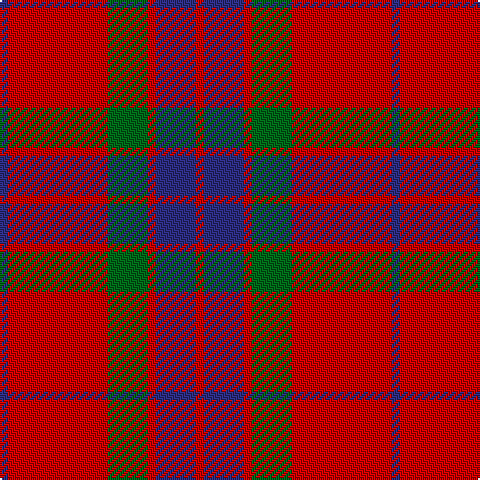

In pattern [BRGRBR](/patterns/brgrbr/).

This was sourced from house-of-tartan.  It is a [6 stripes tartan](/stripes/stripes6/).

Original link http://www.house-of-tartan.scotland.net/house/TartanViewjs.asp?colr=Def&tnam=527

## Thread count
DB/4 R50 G20 R4 DB20 R/4

## Palette
Each colour and its ΔE from the base-6 reference it is a variant of.

| Colour | Shade | Base | ΔE (OKLab) |
|---|---|---|---|
| DB | <code style="background-color:#2C2C80;">#2C2C80</code> `#2C2C80` | B <code style="background-color:#2A418A;">#2A418A</code> | 0.06 |
| G | <code style="background-color:#006818;">#006818</code> `#006818` | G <code style="background-color:#006100;">#006100</code> | 0.02 |
| R | <code style="background-color:#C80000;">#C80000</code> `#C80000` | R <code style="background-color:#CC0000;">#CC0000</code> | 0.01 |

# Sample pattern

## Nearest tartans

The nearest existing variants by ΔTartan distance.

1. [Grant of Lurg](/setts/s6/b4r50g20r4b20r4-b304080-g008000-rc00000/) — ΔT 0.41
1. [MacKintosh Plaid](/setts/s6/r32b12r4g12r4b2-b2c2c80-g285800-rc80000/) — ΔT 0.67
1. [MacKintosh, Plaid](/setts/s6/r32b12r4g12r4b2-b304080-g008000-rc00000/) — ΔT 0.71
1. [Robertson - 1988 (Corporate)](/setts/s7/r8b4r64b16r4g40r4-b1c0070-g006818-rc80000/) — ΔT 0.78
1. [Hugh Fraser of Boblainy](/setts/s5/r4r56g28b28r4-b304080-g008000-rc00000/) — ΔT 0.95
1. [Wotherspoon](/setts/s5/r12g8r54b45g6-b304080-g008000-rc00000/) — ΔT 0.97
1. [Auld Reekie](/setts/s6/b8r6b6r44g16r4-b2c2c80-g006818-rc80000/) — ΔT 0.98
1. [Grant of Lurg](/setts/s6/r4b20r4g20r50w4-b2c2c80-g006818-rc80000-wf8f8f8/) — ΔT 1.00
1. [Fraser of Boblainy, Hugh (Personal)](/setts/s5/b4r56g28b28r4-b2c2c80-g006818-rc80000/) — ΔT 1.02
1. [Wotherspoon Family Tartan Tartan Number: 741. Earliest known date: c.1941 This sett comes from the MacGregor-Hastie collection which is housed at the Scottish Tartans Society. It was obtained from Andersons in 1947, one of several designs produced between 1930 and 1950 for Septs and Families of Scottish lineage. Wotherspoons are recorded in the Lowlands of Scotland from the beginning of the 14th century. The Rev. John Witherspoon (1722-94), born in Yester, East Lothian, was President of 'Princeton University' in 1768 and took an active part in the American Revolution. See products available Copyright © Blair Urquhart, Comrie, 2015](/setts/s5/r12g8r54b45g6-b2c2c80-g006818-rc80000/) — ΔT 1.04

## Neighbour map

Every grey dot is one of 15726 variants placed by the first two principal components of the ΔTartan feature space (44% of its variance). Red is this tartan; blue dots are its nearest — click one to open its page.

<svg viewBox="0 0 640 380" role="img" style="max-width:100%;height:auto;border:1px solid #e0e0e0;border-radius:4px;display:block" xmlns="http://www.w3.org/2000/svg"><image href="/nn/cloud.v1.png" width="640" height="380"/><a href="/setts/s6/b4r50g20r4b20r4-b304080-g008000-rc00000/"><circle cx="370.9" cy="206.3" r="4" fill="#3465a4"><title>Grant of Lurg</title></circle></a><a href="/setts/s6/r32b12r4g12r4b2-b2c2c80-g285800-rc80000/"><circle cx="404.0" cy="199.8" r="4" fill="#3465a4"><title>MacKintosh Plaid</title></circle></a><a href="/setts/s6/r32b12r4g12r4b2-b304080-g008000-rc00000/"><circle cx="403.8" cy="201.4" r="4" fill="#3465a4"><title>MacKintosh, Plaid</title></circle></a><a href="/setts/s7/r8b4r64b16r4g40r4-b1c0070-g006818-rc80000/"><circle cx="375.8" cy="177.9" r="4" fill="#3465a4"><title>Robertson - 1988 (Corporate)</title></circle></a><a href="/setts/s5/r4r56g28b28r4-b304080-g008000-rc00000/"><circle cx="342.2" cy="222.3" r="4" fill="#3465a4"><title>Hugh Fraser of Boblainy</title></circle></a><a href="/setts/s5/r12g8r54b45g6-b304080-g008000-rc00000/"><circle cx="342.2" cy="240.0" r="4" fill="#3465a4"><title>Wotherspoon</title></circle></a><a href="/setts/s6/b8r6b6r44g16r4-b2c2c80-g006818-rc80000/"><circle cx="419.1" cy="207.7" r="4" fill="#3465a4"><title>Auld Reekie</title></circle></a><a href="/setts/s6/r4b20r4g20r50w4-b2c2c80-g006818-rc80000-wf8f8f8/"><circle cx="328.6" cy="180.1" r="4" fill="#3465a4"><title>Grant of Lurg</title></circle></a><a href="/setts/s5/b4r56g28b28r4-b2c2c80-g006818-rc80000/"><circle cx="319.4" cy="220.0" r="4" fill="#3465a4"><title>Fraser of Boblainy, Hugh (Personal)</title></circle></a><a href="/setts/s5/r12g8r54b45g6-b2c2c80-g006818-rc80000/"><circle cx="333.3" cy="235.2" r="4" fill="#3465a4"><title>Wotherspoon Family Tartan Tartan Number: 741. Earliest known date: c.1941 This sett comes from the MacGregor-Hastie collection which is housed at the Scottish Tartans Society. It was obtained from Andersons in 1947, one of several designs produced between 1930 and 1950 for Septs and Families of Scottish lineage. Wotherspoons are recorded in the Lowlands of Scotland from the beginning of the 14th century. The Rev. John Witherspoon (1722-94), born in Yester, East Lothian, was President of 'Princeton University' in 1768 and took an active part in the American Revolution. See products available Copyright © Blair Urquhart, Comrie, 2015</title></circle></a><circle cx="366.6" cy="203.4" r="5" fill="#c00000"/></svg>

ID: /setts/s6/b4r50g20r4b20r4-b2c2c80-g006818-rc80000/
