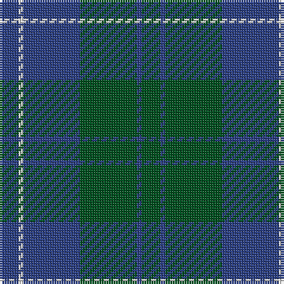

In pattern [BWBGBG](/patterns/bwbgbg/).

This was sourced from register-of-tartans.  It is a [6 stripes tartan](/stripes/stripes6/).

Original link https://www.tartanregister.gov.uk/tartanDetails.aspx?ref=4390

## Thread count
B/8 LN2 B24 G24 B2 G/8

## Palette
Each colour and its ΔE from the base-6 reference it is a variant of.

| Colour | Shade | Base | ΔE (OKLab) |
|---|---|---|---|
| B | <code style="background-color:#2C4084;">#2C4084</code> `#2C4084` | B <code style="background-color:#2A418A;">#2A418A</code> | 0.01 |
| G | <code style="background-color:#005020;">#005020</code> `#005020` | G <code style="background-color:#006100;">#006100</code> | 0.07 |
| LN | <code style="background-color:#E0E0E0;">#E0E0E0</code> `#E0E0E0` | W <code style="background-color:#F7F7F7;">#F7F7F7</code> | 0.07 |

# Sample pattern

## Nearest tartans

The nearest existing variants by ΔTartan distance.

1. [Hamilton Hunting](/setts/s5/b11g2b15g18w2~b2c4084-g005020-we0e0e0~x2/) — ΔT 0.96
1. [Sugiyama](/setts/s6/b7ba2b25ba10g21ba2~b2c4084-ba1c1c50-g408060~x2/) — ΔT 1.31
1. [Sugiyama Jogakuen University (Corp)](/setts/s6/b7ba2b25ba10g21ba2~b2c2c80-ba202060-g006818~x2/) — ΔT 1.33
1. [Barclay](/setts/s4/g1b16g16r1~b2c2c80-g006818-rc80000~x2/) — ΔT 1.44
1. [Barclay Htg (Clan)](/setts/s4/g1b16g16r1~b2c2c80-g006818-rc80000~x4/) — ΔT 1.44
1. [North Sea Commission](/setts/s5/b9ba3b1ba12y1~b5c8ca8-ba344054-ye8c000~x4/) — ΔT 1.49
1. [Unidentified No 17](/setts/s7/g10b2g2b6ba5b1ba2~b2c4084-ba3c82af-g005020~x2/) — ΔT 1.49
1. [Gammell (Brown) (Personal)](/setts/s8/b20g2b2g2b2g6ga15g2~b2c2c80-g604000-ga006818~x2/) — ΔT 1.51
1. [St. Andrews New Golf Club](/setts/s9/b4ba18r2ba2r2ba9g20ba3g4~b780078-ba003c64-g006818-r880000~x2/) — ΔT 1.53
1. [Devlin, Craig (Personal)](/setts/s6/g8w3b6ba11b30ba5~b5c5c5c-ba2c2c80-g006818-we0e0e0~x2/) — ΔT 1.54

## Neighbour map

Every grey dot is one of 15726 variants placed by the first two principal components of the ΔTartan feature space (44% of its variance). Red is this tartan; blue dots are its nearest — click one to open its page.

<svg viewBox="0 0 640 380" role="img" style="max-width:100%;height:auto;border:1px solid #e0e0e0;border-radius:4px;display:block" xmlns="http://www.w3.org/2000/svg"><image href="/nn/cloud.v1.png" width="640" height="380"/><a href="/setts/s5/b11g2b15g18w2~b2c4084-g005020-we0e0e0~x2/"><circle cx="363.5" cy="286.3" r="4" fill="#3465a4"><title>Hamilton Hunting</title></circle></a><a href="/setts/s6/b7ba2b25ba10g21ba2~b2c4084-ba1c1c50-g408060~x2/"><circle cx="343.2" cy="258.2" r="4" fill="#3465a4"><title>Sugiyama</title></circle></a><a href="/setts/s6/b7ba2b25ba10g21ba2~b2c2c80-ba202060-g006818~x2/"><circle cx="345.1" cy="261.8" r="4" fill="#3465a4"><title>Sugiyama Jogakuen University (Corp)</title></circle></a><a href="/setts/s4/g1b16g16r1~b2c2c80-g006818-rc80000~x2/"><circle cx="383.0" cy="252.8" r="4" fill="#3465a4"><title>Barclay</title></circle></a><a href="/setts/s4/g1b16g16r1~b2c2c80-g006818-rc80000~x4/"><circle cx="383.0" cy="252.8" r="4" fill="#3465a4"><title>Barclay Htg (Clan)</title></circle></a><a href="/setts/s5/b9ba3b1ba12y1~b5c8ca8-ba344054-ye8c000~x4/"><circle cx="396.1" cy="249.5" r="4" fill="#3465a4"><title>North Sea Commission</title></circle></a><a href="/setts/s7/g10b2g2b6ba5b1ba2~b2c4084-ba3c82af-g005020~x2/"><circle cx="306.6" cy="266.6" r="4" fill="#3465a4"><title>Unidentified No 17</title></circle></a><a href="/setts/s8/b20g2b2g2b2g6ga15g2~b2c2c80-g604000-ga006818~x2/"><circle cx="338.2" cy="230.9" r="4" fill="#3465a4"><title>Gammell (Brown) (Personal)</title></circle></a><a href="/setts/s9/b4ba18r2ba2r2ba9g20ba3g4~b780078-ba003c64-g006818-r880000~x2/"><circle cx="338.8" cy="223.7" r="4" fill="#3465a4"><title>St. Andrews New Golf Club</title></circle></a><a href="/setts/s6/g8w3b6ba11b30ba5~b5c5c5c-ba2c2c80-g006818-we0e0e0~x2/"><circle cx="356.0" cy="236.1" r="4" fill="#3465a4"><title>Devlin, Craig (Personal)</title></circle></a><circle cx="383.3" cy="262.2" r="5" fill="#c00000"/></svg>

ID: /setts/s6/b4w1b12g12b1g4~b2c4084-g005020-we0e0e0~x2/
