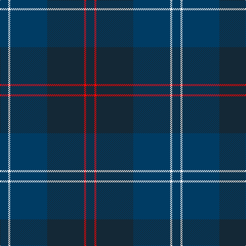

In pattern [BRBBWB](/patterns/brbbwb/).

This was sourced from register-of-tartans.  It is a [6 stripes tartan](/stripes/stripes6/).

Original link https://www.tartanregister.gov.uk/tartanDetails.aspx?ref=11288

## Thread count
DB/16 W4 DB72 DN72 R4 DN/16

## Palette
Each colour and its ΔE from the base-6 reference it is a variant of.

| Colour | Shade | Base | ΔE (OKLab) |
|---|---|---|---|
| DB | <code style="background-color:#003C64;">#003C64</code> `#003C64` | B <code style="background-color:#2A418A;">#2A418A</code> | 0.08 |
| DN | <code style="background-color:#142836;">#142836</code> `#142836` | B <code style="background-color:#2A418A;">#2A418A</code> | 0.16 |
| R | <code style="background-color:#FF0000;">#FF0000</code> `#FF0000` | R <code style="background-color:#CC0000;">#CC0000</code> | 0.11 |
| W | <code style="background-color:#FFFFFF;">#FFFFFF</code> `#FFFFFF` | W <code style="background-color:#F7F7F7;">#F7F7F7</code> | 0.02 |

# Sample pattern

## Nearest tartans

The nearest existing variants by ΔTartan distance.

1. [Edinburgh Monarchs](/setts/s8/b5ba4bb1ba14b14bb1b5y3x2~b14283c-ba202060-bb501400-yd09800/) — ΔT 1.08
1. [Edinburgh Monarchs (Corporate)](/setts/s8/b5ba4bb1ba14b14bb1b5y3x2~b1c3854-ba2c2c84-bb501400-yd09800/) — ΔT 1.25
1. [Longmuir (2014)](/setts/s6/b43g8b8ba21g10w2x2~b1c1c1c-ba003c64-g003820-wf8f4d0/) — ΔT 1.28
1. [Longmuir (2014)](/setts/s6/k43g8k8b21g10w2x2~b14283c-g003820-k101010-wfcfcfc/) — ΔT 1.53
1. [Peter of Lee Family Tartan Tartan Number: 1055. Earliest known date: 1988 Designed by Harry Lindley for E. Leslie Peter. The sett was accredited by the Scottish Tartans Society in 1988. See products available Copyright © Blair Urquhart, Comrie, 2015](/setts/s8/r4g3k2g38b30k3b3k3x2~b202060-g003820-k101010-rc80000/) — ΔT 1.64
1. [US Navy Edzell](/setts/s6/b104ba16w8ba66r3ba16~b003c64-ba2c2c80-rc80000-we0e0e0/) — ΔT 1.66
1. [St. George's (Birmingham) (School)](/setts/s7/r4b21w2b20ba21b2ba2x2~b003c64-ba2c2c80-rc80000-wfcfcfc/) — ΔT 1.70
1. [Craig Devlin (Dundee) (Personal)](/setts/s6/g8w3b6ba11b30ba5x2~b081736-ba172d60-g06392b-wddd5af/) — ΔT 1.71
1. [Monarchs](/setts/s6/b19k4ba1k4g9ba1x4~b2c2c80-ba680028-g005448-k101010/) — ΔT 1.75
1. [Java St Andrew Society hunting](/setts/s7/b50g26k9g4w2r2g10x2~b141e46-g003c14-k101010-rdc0000-we0e0e0/) — ΔT 1.80

## Neighbour map

Every grey dot is one of 15726 variants placed by the first two principal components of the ΔTartan feature space (44% of its variance). Red is this tartan; blue dots are its nearest — click one to open its page.

<svg viewBox="0 0 640 380" role="img" style="max-width:100%;height:auto;border:1px solid #e0e0e0;border-radius:4px;display:block" xmlns="http://www.w3.org/2000/svg"><image href="/nn/cloud.v1.png" width="640" height="380"/><a href="/setts/s8/b5ba4bb1ba14b14bb1b5y3x2~b14283c-ba202060-bb501400-yd09800/"><circle cx="385.1" cy="240.7" r="4" fill="#3465a4"><title>Edinburgh Monarchs</title></circle></a><a href="/setts/s8/b5ba4bb1ba14b14bb1b5y3x2~b1c3854-ba2c2c84-bb501400-yd09800/"><circle cx="381.9" cy="236.9" r="4" fill="#3465a4"><title>Edinburgh Monarchs (Corporate)</title></circle></a><a href="/setts/s6/b43g8b8ba21g10w2x2~b1c1c1c-ba003c64-g003820-wf8f4d0/"><circle cx="424.7" cy="238.6" r="4" fill="#3465a4"><title>Longmuir (2014)</title></circle></a><a href="/setts/s6/k43g8k8b21g10w2x2~b14283c-g003820-k101010-wfcfcfc/"><circle cx="421.0" cy="238.5" r="4" fill="#3465a4"><title>Longmuir (2014)</title></circle></a><a href="/setts/s8/r4g3k2g38b30k3b3k3x2~b202060-g003820-k101010-rc80000/"><circle cx="410.8" cy="202.5" r="4" fill="#3465a4"><title>Peter of Lee Family Tartan Tartan Number: 1055. Earliest known date: 1988 Designed by Harry Lindley for E. Leslie Peter. The sett was accredited by the Scottish Tartans Society in 1988. See products available Copyright © Blair Urquhart, Comrie, 2015</title></circle></a><a href="/setts/s6/b104ba16w8ba66r3ba16~b003c64-ba2c2c80-rc80000-we0e0e0/"><circle cx="456.7" cy="213.4" r="4" fill="#3465a4"><title>US Navy Edzell</title></circle></a><a href="/setts/s7/r4b21w2b20ba21b2ba2x2~b003c64-ba2c2c80-rc80000-wfcfcfc/"><circle cx="407.3" cy="247.0" r="4" fill="#3465a4"><title>St. George's (Birmingham) (School)</title></circle></a><a href="/setts/s6/g8w3b6ba11b30ba5x2~b081736-ba172d60-g06392b-wddd5af/"><circle cx="370.3" cy="254.2" r="4" fill="#3465a4"><title>Craig Devlin (Dundee) (Personal)</title></circle></a><a href="/setts/s6/b19k4ba1k4g9ba1x4~b2c2c80-ba680028-g005448-k101010/"><circle cx="378.7" cy="221.2" r="4" fill="#3465a4"><title>Monarchs</title></circle></a><a href="/setts/s7/b50g26k9g4w2r2g10x2~b141e46-g003c14-k101010-rdc0000-we0e0e0/"><circle cx="379.4" cy="184.3" r="4" fill="#3465a4"><title>Java St Andrew Society hunting</title></circle></a><circle cx="412.8" cy="237.3" r="5" fill="#c00000"/></svg>

ID: /setts/s6/b4w1b18ba18r1ba4x4~b003c64-ba142836-rff0000-wffffff/
