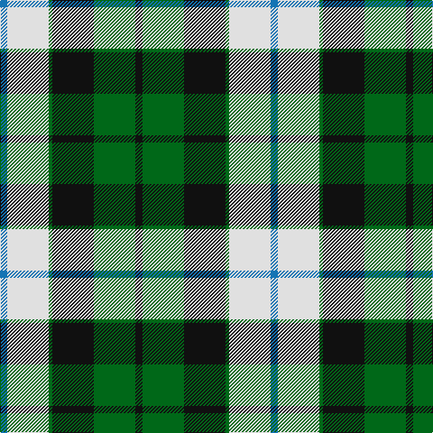

In pattern [BWGKGK](/patterns/bwgkgk/).

This was sourced from register-of-tartans.  It is a [6 stripes tartan](/stripes/stripes6/).

Original link https://www.tartanregister.gov.uk/tartanDetails.aspx?ref=2502

## Register references

External register numbers recorded for this tartan.

- Scottish Register of Tartans: [2502](https://www.tartanregister.gov.uk/tartanDetails.aspx?ref=2502)
- Scottish Tartans Authority (ITI): 7015

## Thread count
B/8 LN46 G4 K46 G46 K/8

## Palette
Each colour and its ΔE from the base-6 reference it is a variant of.

| Colour | Shade | Base | ΔE (OKLab) |
|---|---|---|---|
| B | <code style="background-color:#1474B4;">#1474B4</code> `#1474B4` | B <code style="background-color:#2A418A;">#2A418A</code> | 0.15 |
| G | <code style="background-color:#006818;">#006818</code> `#006818` | G <code style="background-color:#006100;">#006100</code> | 0.02 |
| K | <code style="background-color:#101010;">#101010</code> `#101010` | K <code style="background-color:#000000;">#000000</code> | 0.17 |
| LN | <code style="background-color:#E0E0E0;">#E0E0E0</code> `#E0E0E0` | W <code style="background-color:#F7F7F7;">#F7F7F7</code> | 0.07 |

# Sample pattern

## Nearest tartans

The nearest existing variants by ΔTartan distance.

1. [MacKay, Dress (Corporate)](/setts/s6/k4g14k14g2w14b3~b1474b4-g006818-k101010-we0e0e0~x2/) — ΔT 0.85
1. [Cape Breton (yellow stripes)](/setts/s7/y6k6g30k8w18k6y3~g789484-k000000-wc0c0c0-ye8c000~x2/) — ΔT 0.88
1. [Cape Breton](/setts/s7/y5k5g17k6ga24k6y3~g008000-ga808080-k000000-yf0c000~x2/) — ΔT 0.98
1. [Bannockbane Blue Trade Tartan Tartan Number: 665. Earliest known date: c.1984 A fashion pattern from the early 1970s. Other variants of the design appeared up to 1984. No place or family of the name is known and the pattern has no association with Bannockburn, or famous battle of 1314. Donald Broun may have been a designer with Edinburgh Woollen Mills. See products available Copyright © Blair Urquhart, Comrie, 2015](/setts/s8/b4y2b13w8y1k13y2k4~b5c8ca8-k101010-we0e0e0-ye8c000~x2/) — ΔT 0.99
1. [Dalveen (1981)](/setts/s8/g3ga2g10ga1w11k10ga2k3~g604000-ga006818-k101010-we0e0e0~x6/) — ΔT 1.06
1. [National Trust](/setts/s8/g2b8g8r3b1w12g2b1~b401000-g004010-r906030-we0e0e0~x2/) — ΔT 1.07
1. [MacRobart Dress (Personal)](/setts/s7/b8w33k15g17ba3g17ba3~b2c2c80-ba5c8ca8-g285800-k101010-we0e0e0~x2/) — ΔT 1.09
1. [Bannockbane Grey #1](/setts/s8/k4y2k13y1w8r13y2r4~k101010-r888888-wfcfcfc-ye8c000~x2/) — ΔT 1.14
1. [Bannockbane Hunting (MacBean and Bishop)](/setts/s8/g3r2g14r1w10ga14r2ga3~g002814-ga808080-rbe7832-we0e0e0~x2/) — ΔT 1.15
1. [Cape Breton District Tartan Tartan Number: 1883. Earliest known date: 1957 In 1907, Mrs Lillian Crewe Walsh of Glace Bay, Cape Breton, wrote a poem in praise of Cape Breton. This poem was given by Mrs Walsh to Mrs Grant in 1957 and the tartan designed to accord with the poem. Grey for our Cape Breton Steel, Green for our lofty See products available Copyright © Blair Urquhart, Comrie, 2015](/setts/s7/y5k5g17k6r24k6y3~g006818-k101010-r888888-ye8c000~x2/) — ΔT 1.16

## Neighbour map

Every grey dot is one of 15726 variants placed by the first two principal components of the ΔTartan feature space (44% of its variance). Red is this tartan; blue dots are its nearest — click one to open its page.

<svg viewBox="0 0 640 380" role="img" style="max-width:100%;height:auto;border:1px solid #e0e0e0;border-radius:4px;display:block" xmlns="http://www.w3.org/2000/svg"><image href="/nn/cloud.v1.png" width="640" height="380"/><a href="/setts/s6/k4g14k14g2w14b3~b1474b4-g006818-k101010-we0e0e0~x2/"><circle cx="116.9" cy="224.7" r="4" fill="#3465a4"><title>MacKay, Dress (Corporate)</title></circle></a><a href="/setts/s7/y6k6g30k8w18k6y3~g789484-k000000-wc0c0c0-ye8c000~x2/"><circle cx="145.2" cy="182.8" r="4" fill="#3465a4"><title>Cape Breton (yellow stripes)</title></circle></a><a href="/setts/s7/y5k5g17k6ga24k6y3~g008000-ga808080-k000000-yf0c000~x2/"><circle cx="129.5" cy="201.8" r="4" fill="#3465a4"><title>Cape Breton</title></circle></a><a href="/setts/s8/b4y2b13w8y1k13y2k4~b5c8ca8-k101010-we0e0e0-ye8c000~x2/"><circle cx="150.8" cy="174.4" r="4" fill="#3465a4"><title>Bannockbane Blue Trade Tartan Tartan Number: 665. Earliest known date: c.1984 A fashion pattern from the early 1970s. Other variants of the design appeared up to 1984. No place or family of the name is known and the pattern has no association with Bannockburn, or famous battle of 1314. Donald Broun may have been a designer with Edinburgh Woollen Mills. See products available Copyright © Blair Urquhart, Comrie, 2015</title></circle></a><a href="/setts/s8/g3ga2g10ga1w11k10ga2k3~g604000-ga006818-k101010-we0e0e0~x6/"><circle cx="123.2" cy="183.2" r="4" fill="#3465a4"><title>Dalveen (1981)</title></circle></a><a href="/setts/s8/g2b8g8r3b1w12g2b1~b401000-g004010-r906030-we0e0e0~x2/"><circle cx="141.1" cy="171.1" r="4" fill="#3465a4"><title>National Trust</title></circle></a><a href="/setts/s7/b8w33k15g17ba3g17ba3~b2c2c80-ba5c8ca8-g285800-k101010-we0e0e0~x2/"><circle cx="111.6" cy="176.1" r="4" fill="#3465a4"><title>MacRobart Dress (Personal)</title></circle></a><a href="/setts/s8/k4y2k13y1w8r13y2r4~k101010-r888888-wfcfcfc-ye8c000~x2/"><circle cx="149.4" cy="170.1" r="4" fill="#3465a4"><title>Bannockbane Grey #1</title></circle></a><a href="/setts/s8/g3r2g14r1w10ga14r2ga3~g002814-ga808080-rbe7832-we0e0e0~x2/"><circle cx="165.0" cy="168.1" r="4" fill="#3465a4"><title>Bannockbane Hunting (MacBean and Bishop)</title></circle></a><a href="/setts/s7/y5k5g17k6r24k6y3~g006818-k101010-r888888-ye8c000~x2/"><circle cx="149.6" cy="207.6" r="4" fill="#3465a4"><title>Cape Breton District Tartan Tartan Number: 1883. Earliest known date: 1957 In 1907, Mrs Lillian Crewe Walsh of Glace Bay, Cape Breton, wrote a poem in praise of Cape Breton. This poem was given by Mrs Walsh to Mrs Grant in 1957 and the tartan designed to accord with the poem. Grey for our Cape Breton Steel, Green for our lofty See products available Copyright © Blair Urquhart, Comrie, 2015</title></circle></a><circle cx="141.0" cy="197.0" r="5" fill="#c00000"/></svg>

ID: /setts/s6/b4w23g2k23g23k4~b1474b4-g006818-k101010-we0e0e0~x2/
