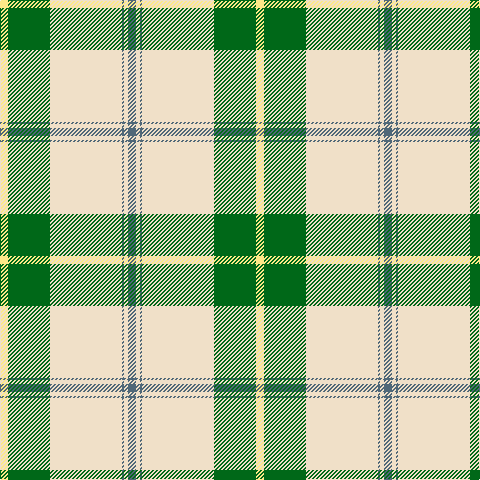

In pattern [BWBWGY](/patterns/bwbwgy/).

This was sourced from tartans-authority.  It is a [6 stripes tartan](/stripes/stripes6/).

Original link http://www.tartansauthority.com/tartan-ferret/display/7601/

## Attestations

This cloth appears in 2 source records; the oldest owns this page.

- March 2008 — Skye, Green (Dance) (tartans-authority, [record](http://www.tartansauthority.com/tartan-ferret/display/7601/))
- undated — Skye Green (register-of-tartans, [record](https://www.tartanregister.gov.uk/tartanDetails.aspx?ref=5625))

## Thread count
LY/8 G42 W72 N2 W4 N/8

## Palette
Each colour and its ΔE from the base-6 reference it is a variant of.

| Colour | Shade | Base | ΔE (OKLab) |
|---|---|---|---|
| G | <code style="background-color:#006818;">#006818</code> `#006818` | G <code style="background-color:#006100;">#006100</code> | 0.02 |
| LY | <code style="background-color:#FCE888;">#FCE888</code> `#FCE888` | Y <code style="background-color:#F2BF00;">#F2BF00</code> | 0.11 |
| N | <code style="background-color:#506878;">#506878</code> `#506878` | B <code style="background-color:#2A418A;">#2A418A</code> | 0.14 |
| W | <code style="background-color:#F0E0C8;">#F0E0C8</code> `#F0E0C8` | W <code style="background-color:#F7F7F7;">#F7F7F7</code> | 0.07 |

# Sample pattern

## Nearest tartans

The nearest existing variants by ΔTartan distance.

1. [Westfalia Dress (Corporate)](/setts/s6/w44g18w6g11b1r4~b003c64-g005c30-re86000-wf8f0e4~x2/) — ΔT 0.97
1. [MacGregor, Green](/setts/s6/w47g20w6g8k1r3~g008000-k000000-rc00000-we0e0e0~x2/) — ΔT 1.05
1. [MacGregor Dress Green Clan Tartan Tartan Number: 1577. Earliest known date: pre 1992 A dancers tartan. See products available Copyright © Blair Urquhart, Comrie, 2015](/setts/s6/w47g20w6g8k1r3~g006818-k101010-rc80000-we0e0e0~x2/) — ΔT 1.10
1. [MacGregor - 1975 (Dance, Green)](/setts/s6/w52g22w6g8k1r3~g006400-k000000-re87878-wf8f8f8~x2/) — ΔT 1.34
1. [Westfalia (Corporate)](/setts/s6/g44w18g6w11b1r4~b003c64-g005c30-re86000-wf8f0e4~x2/) — ΔT 1.43
1. [MacGregor Dress Green (Dance)](/setts/s6/w52g22w6g8k1r3~g004c00-k000000-re87878-wf8f8f8~x2/) — ΔT 1.43
1. [Longniddry Green Error (Dance)](/setts/s8/g42y1w2y1g5ga12w32g4~g006818-ga003820-wfcfcfc-ye8c000~x2/) — ΔT 1.53
1. [Pollock](/setts/s7/g3y16w4k6g28y1g3~g408060-k101010-wf8f8f8-yec8048~x4/) — ΔT 1.59
1. [Cunningham Dress Green (Dance) Fashion Tartan Tartan Number: 6532. Earliest known date: 01/01/1988 A dancers' tartan now woven by D C Dalgliesh of Selkirk /Threadcount and colours aren't 100% original. Generated manually./ See products available Copyright © Blair Urquhart, Comrie, 2015](/setts/s7/w2g1w20g20k1g1y2~g289c18-k101010-we0e0e0-ye8c000~x4/) — ΔT 1.59
1. [Oliver Dress Pink](/setts/s5/k5w2y36b47r3~b2888c4-k101010-rc80000-wfcfcfc-ye8c000~x2/) — ΔT 1.60

## Neighbour map

Every grey dot is one of 15726 variants placed by the first two principal components of the ΔTartan feature space (44% of its variance). Red is this tartan; blue dots are its nearest — click one to open its page.

<svg viewBox="0 0 640 380" role="img" style="max-width:100%;height:auto;border:1px solid #e0e0e0;border-radius:4px;display:block" xmlns="http://www.w3.org/2000/svg"><image href="/nn/cloud.v1.png" width="640" height="380"/><a href="/setts/s6/w44g18w6g11b1r4~b003c64-g005c30-re86000-wf8f0e4~x2/"><circle cx="357.9" cy="122.0" r="4" fill="#3465a4"><title>Westfalia Dress (Corporate)</title></circle></a><a href="/setts/s6/w47g20w6g8k1r3~g008000-k000000-rc00000-we0e0e0~x2/"><circle cx="395.1" cy="121.4" r="4" fill="#3465a4"><title>MacGregor, Green</title></circle></a><a href="/setts/s6/w47g20w6g8k1r3~g006818-k101010-rc80000-we0e0e0~x2/"><circle cx="391.2" cy="119.9" r="4" fill="#3465a4"><title>MacGregor Dress Green Clan Tartan Tartan Number: 1577. Earliest known date: pre 1992 A dancers tartan. See products available Copyright © Blair Urquhart, Comrie, 2015</title></circle></a><a href="/setts/s6/w52g22w6g8k1r3~g006400-k000000-re87878-wf8f8f8~x2/"><circle cx="387.2" cy="109.4" r="4" fill="#3465a4"><title>MacGregor - 1975 (Dance, Green)</title></circle></a><a href="/setts/s6/g44w18g6w11b1r4~b003c64-g005c30-re86000-wf8f0e4~x2/"><circle cx="360.5" cy="132.6" r="4" fill="#3465a4"><title>Westfalia (Corporate)</title></circle></a><a href="/setts/s6/w52g22w6g8k1r3~g004c00-k000000-re87878-wf8f8f8~x2/"><circle cx="383.4" cy="108.3" r="4" fill="#3465a4"><title>MacGregor Dress Green (Dance)</title></circle></a><a href="/setts/s8/g42y1w2y1g5ga12w32g4~g006818-ga003820-wfcfcfc-ye8c000~x2/"><circle cx="301.0" cy="107.3" r="4" fill="#3465a4"><title>Longniddry Green Error (Dance)</title></circle></a><a href="/setts/s7/g3y16w4k6g28y1g3~g408060-k101010-wf8f8f8-yec8048~x4/"><circle cx="335.9" cy="146.7" r="4" fill="#3465a4"><title>Pollock</title></circle></a><a href="/setts/s7/w2g1w20g20k1g1y2~g289c18-k101010-we0e0e0-ye8c000~x4/"><circle cx="309.3" cy="142.9" r="4" fill="#3465a4"><title>Cunningham Dress Green (Dance) Fashion Tartan Tartan Number: 6532. Earliest known date: 01/01/1988 A dancers' tartan now woven by D C Dalgliesh of Selkirk /Threadcount and colours aren't 100% original. Generated manually./ See products available Copyright © Blair Urquhart, Comrie, 2015</title></circle></a><a href="/setts/s5/k5w2y36b47r3~b2888c4-k101010-rc80000-wfcfcfc-ye8c000~x2/"><circle cx="287.9" cy="146.2" r="4" fill="#3465a4"><title>Oliver Dress Pink</title></circle></a><circle cx="335.3" cy="125.2" r="5" fill="#c00000"/></svg>

ID: /setts/s6/b4w2b1w36g21y4~b506878-g006818-wf0e0c8-yfce888~x2/
