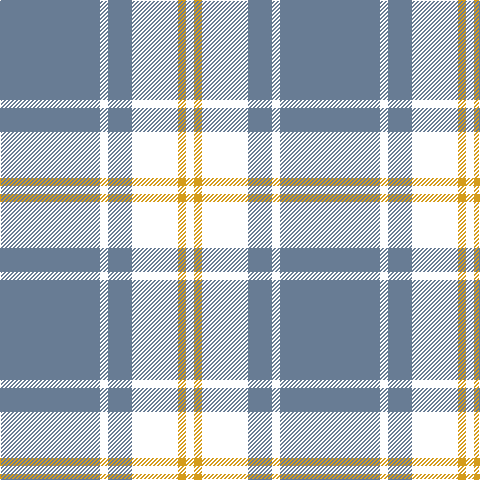

In pattern [BKBKYK](/patterns/bkbkyk/).

This was sourced from house-of-tartan.  It is a [6 stripes tartan](/stripes/stripes6/).

Original link http://www.house-of-tartan.scotland.net/house/TartanViewjs.asp?colr=Def&tnam=2256

## Thread count
B/100 T8 B24 T46 Y8 T/8

## Palette
Each colour and its ΔE from the base-6 reference it is a variant of.

| Colour | Shade | Base | ΔE (OKLab) |
|---|---|---|---|
| B | <code style="background-color:#687C94;">#687C94</code> `#687C94` | B <code style="background-color:#2A418A;">#2A418A</code> | 0.20 |
| Y | <code style="background-color:#D49C1C;">#D49C1C</code> `#D49C1C` | Y <code style="background-color:#F2BF00;">#F2BF00</code> | 0.10 |

# Sample pattern

## Nearest tartans

The nearest existing variants by ΔTartan distance.

1. [Lundy Reform](/setts/s7/k2w5k1w1k10r1k1~k101010-rc80000-wc0c0c0~x4/) — ΔT 0.87
1. [Glen Coe Trade Tartan Tartan Number: 1243. Earliest known date: Modern Many new designs have been given district names to promote their Scottish connections. However, these names should not be confused with the District tartans which have earned their title through 'use and wont' and not a little history. See products available Copyright © Blair Urquhart, Comrie, 2015](/setts/s5/k37w9k3g9w3~g003820-k101010-we0e0e0~x2/) — ΔT 0.87
1. [Glen Coe #1 (Fashion)](/setts/s5/k37w9k3g9w3~g006818-k101010-wfcfcfc~x2/) — ΔT 0.91
1. [Moffat (1984)](/setts/s7/k39r3k3r3k14r28ra3~k101010-r888888-rac80000~x2/) — ΔT 1.04
1. [DDB Canada (Fashion)](/setts/s7/k1r2k7r11k18y2k1~k101010-r888888-ye8c000~x2/) — ΔT 1.09
1. [West Point Regimental Tartan Tartan Number: 1130. Earliest known date: 1986 Wemyss means cave and probably originates from the caves beneath MacDuff castle. There is a long and interesting article on the family of Wemyss in William Anderson's 'The Scottish Nation' published by A Fullarton in 1874. See products available Copyright © Blair Urquhart, Comrie, 2015](/setts/s8/k13r1k1r1k4r10y1r1~k101010-r888888-ye8c000~x6/) — ΔT 1.18
1. [West Point](/setts/s8/k13r1k1r1k4r10y1r1~k101010-r888888-yccc018~x6/) — ΔT 1.18
1. [Glasgow Warriors](/setts/s7/k16w30wa36k10wa10k83wa6~k000000-wffffff-wa98c8e8/) — ΔT 1.27
1. [Glen Moy](/setts/s5/b37w9b3r9w3~b000050-rc00000-we0e0e0~x2/) — ΔT 1.30
1. [Ikelman No 1](/setts/s6/w8k16w2b2w1k1~b304080-k000030-we0e0e0~x4/) — ΔT 1.32

## Neighbour map

Every grey dot is one of 15726 variants placed by the first two principal components of the ΔTartan feature space (44% of its variance). Red is this tartan; blue dots are its nearest — click one to open its page.

<svg viewBox="0 0 640 380" role="img" style="max-width:100%;height:auto;border:1px solid #e0e0e0;border-radius:4px;display:block" xmlns="http://www.w3.org/2000/svg"><image href="/nn/cloud.v1.png" width="640" height="380"/><a href="/setts/s7/k2w5k1w1k10r1k1~k101010-rc80000-wc0c0c0~x4/"><circle cx="374.8" cy="202.4" r="4" fill="#3465a4"><title>Lundy Reform</title></circle></a><a href="/setts/s5/k37w9k3g9w3~g003820-k101010-we0e0e0~x2/"><circle cx="370.7" cy="213.3" r="4" fill="#3465a4"><title>Glen Coe Trade Tartan Tartan Number: 1243. Earliest known date: Modern Many new designs have been given district names to promote their Scottish connections. However, these names should not be confused with the District tartans which have earned their title through 'use and wont' and not a little history. See products available Copyright © Blair Urquhart, Comrie, 2015</title></circle></a><a href="/setts/s5/k37w9k3g9w3~g006818-k101010-wfcfcfc~x2/"><circle cx="361.3" cy="208.9" r="4" fill="#3465a4"><title>Glen Coe #1 (Fashion)</title></circle></a><a href="/setts/s7/k39r3k3r3k14r28ra3~k101010-r888888-rac80000~x2/"><circle cx="370.6" cy="202.2" r="4" fill="#3465a4"><title>Moffat (1984)</title></circle></a><a href="/setts/s7/k1r2k7r11k18y2k1~k101010-r888888-ye8c000~x2/"><circle cx="393.2" cy="192.4" r="4" fill="#3465a4"><title>DDB Canada (Fashion)</title></circle></a><a href="/setts/s8/k13r1k1r1k4r10y1r1~k101010-r888888-ye8c000~x6/"><circle cx="348.6" cy="186.1" r="4" fill="#3465a4"><title>West Point Regimental Tartan Tartan Number: 1130. Earliest known date: 1986 Wemyss means cave and probably originates from the caves beneath MacDuff castle. There is a long and interesting article on the family of Wemyss in William Anderson's 'The Scottish Nation' published by A Fullarton in 1874. See products available Copyright © Blair Urquhart, Comrie, 2015</title></circle></a><a href="/setts/s8/k13r1k1r1k4r10y1r1~k101010-r888888-yccc018~x6/"><circle cx="349.1" cy="186.5" r="4" fill="#3465a4"><title>West Point</title></circle></a><a href="/setts/s7/k16w30wa36k10wa10k83wa6~k000000-wffffff-wa98c8e8/"><circle cx="288.0" cy="192.3" r="4" fill="#3465a4"><title>Glasgow Warriors</title></circle></a><a href="/setts/s5/b37w9b3r9w3~b000050-rc00000-we0e0e0~x2/"><circle cx="366.2" cy="208.3" r="4" fill="#3465a4"><title>Glen Moy</title></circle></a><a href="/setts/s6/w8k16w2b2w1k1~b304080-k000030-we0e0e0~x4/"><circle cx="322.5" cy="181.7" r="4" fill="#3465a4"><title>Ikelman No 1</title></circle></a><circle cx="367.4" cy="203.6" r="5" fill="#c00000"/></svg>

ID: /setts/s6/b50k4b12k23y4k4~b687c94-k000000-yd49c1c~x2/
