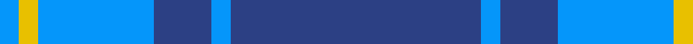
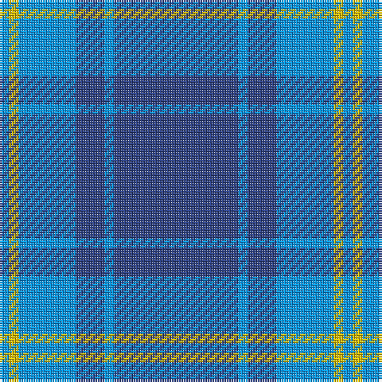

In pattern [BBBBYB](/patterns/bbbbyb/).

This was sourced from register-of-tartans.  It is a [6 stripes tartan](/stripes/stripes6/).

Original link https://www.tartanregister.gov.uk/tartanDetails.aspx?ref=1689

## Thread count
B/4 Y4 B24 Ba12 B4 Ba/52

## Palette
Each colour and its ΔE from the base-6 reference it is a variant of.

| Colour | Shade | Base | ΔE (OKLab) |
|---|---|---|---|
| B | <code style="background-color:#0596FA;">#0596FA</code> `#0596FA` | B <code style="background-color:#2C4084;">#2C4084</code> | 0.28 |
| Ba | <code style="background-color:#2C4084;">#2C4084</code> `#2C4084` | B <code style="background-color:#2C4084;">#2C4084</code> | 0.00 |
| Y | <code style="background-color:#E8C000;">#E8C000</code> `#E8C000` | Y <code style="background-color:#E8C000;">#E8C000</code> | 0.00 |

# Sample pattern

ID: /setts/s6/b52ba4b12ba24y4ba4-b2c4084-ba0596fa-ye8c000/
