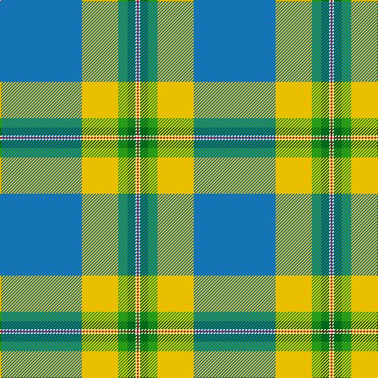

**Bands:** [RWGGYB](/stripes/rwggyb/) · **Stripes:** [R W G G LY B](/stripes/stripes6/) R W G G LY B

This was sourced from tartans-authority.  It is a [6 band tartan](/bands/bands6/).

Original link http://www.tartansauthority.com/tartan-ferret/display/10310/

## Thread count
B/104 Y46 G12 Ga10 LN2 R/2

## Palette
Each colour and its ΔE from the base-6 reference it is a variant of.

| Colour | Shade | Base | ΔE (OKLab) |
|---|---|---|---|
| B | <code style="background-color:#1474B4;">#1474B4</code> `#1474B4` | B <code style="background-color:#2A418A;">#2A418A</code> | 0.15 |
| G | <code style="background-color:#289C18;">#289C18</code> `#289C18` | G <code style="background-color:#006100;">#006100</code> | 0.19 |
| Ga | <code style="background-color:#006818;">#006818</code> `#006818` | G <code style="background-color:#006100;">#006100</code> | 0.02 |
| LN | <code style="background-color:#E0E0E0;">#E0E0E0</code> `#E0E0E0` | W <code style="background-color:#F7F7F7;">#F7F7F7</code> | 0.07 |
| R | <code style="background-color:#C80000;">#C80000</code> `#C80000` | R <code style="background-color:#CC0000;">#CC0000</code> | 0.01 |
| Y | <code style="background-color:#E8C000;">#E8C000</code> `#E8C000` | Y <code style="background-color:#F2BF00;">#F2BF00</code> | 0.02 |

# Sample pattern

## Nearest tartans

The nearest existing variants by ΔTartan distance.

1. [Wells (2014)](/setts/s7/dt50g25ly3lb8r1w1r1~x2/) — ΔT 1.36
1. [Ascension Island Heritage Trust](/setts/s7/r8t45w1o4k11g6r4~x2/) — ΔT 1.40
1. [Pincock Name Tartan Tartan Number: 10323. Earliest known date: 1st Sept. 2010 For Dougie Pincock, first and present Director of Sgoil Chiuil Na Gaidheltachd The National Centre of Excellence in Traditional Music. Based on the Anderson tartan, his mother's maiden name. See products available Copyright © Blair Urquhart, Comrie, 2015](/setts/s7/r2w1lb50t24g12k1k1~x2/) — ΔT 1.45
1. [McGuinness, Tam (Personal)](/setts/s5/lo2db4g60p30w1~x2/) — ΔT 1.49
1. [Cadenhead (2015)](/setts/s9/lb54dy4o4g12m4g8w1g8db6~x2/) — ΔT 1.54
1. [Pincock (Name)](/setts/s7/r2w1lb50t24g12k1ly1~x2/) — ΔT 1.57
1. [Macmillan Cancer Support](/setts/s9/p4g24dg6lg4dg4lg4dg44lo1w4/) — ΔT 1.62
1. [Nickel Lodge Centennial (Corporate)](/setts/s9/o36ly2o1ly2o4dt12w8dy2dg12~x2/) — ΔT 1.72
1. [Norris (1998)](/setts/s6/k2w1g5r1t18r2~x2/) — ΔT 1.72
1. [College of New Caledonia](/setts/s6/db52lo23g6dg5w1r1~x2/) — ΔT 1.75

## Neighbour map

Every grey dot is one of 14299 variants placed by the first two principal components of the ΔTartan feature space (44% of its variance). Red is this tartan; blue dots are its nearest — click one to open its page.

<svg viewBox="0 0 640 380" role="img" style="max-width:100%;height:auto;border:1px solid #e0e0e0;border-radius:4px;display:block" xmlns="http://www.w3.org/2000/svg"><image href="/nn/cloud.v1.png" width="640" height="380"/><a href="/setts/s7/dt50g25ly3lb8r1w1r1~x2/"><circle cx="345.7" cy="91.5" r="4" fill="#3465a4"><title>Wells (2014)</title></circle></a><a href="/setts/s7/r8t45w1o4k11g6r4~x2/"><circle cx="335.7" cy="91.9" r="4" fill="#3465a4"><title>Ascension Island Heritage Trust</title></circle></a><a href="/setts/s7/r2w1lb50t24g12k1k1~x2/"><circle cx="319.3" cy="71.1" r="4" fill="#3465a4"><title>Pincock Name Tartan Tartan Number: 10323. Earliest known date: 1st Sept. 2010 For Dougie Pincock, first and present Director of Sgoil Chiuil Na Gaidheltachd The National Centre of Excellence in Traditional Music. Based on the Anderson tartan, his mother's maiden name. See products available Copyright © Blair Urquhart, Comrie, 2015</title></circle></a><a href="/setts/s5/lo2db4g60p30w1~x2/"><circle cx="383.4" cy="113.4" r="4" fill="#3465a4"><title>McGuinness, Tam (Personal)</title></circle></a><a href="/setts/s9/lb54dy4o4g12m4g8w1g8db6~x2/"><circle cx="296.0" cy="51.6" r="4" fill="#3465a4"><title>Cadenhead (2015)</title></circle></a><a href="/setts/s7/r2w1lb50t24g12k1ly1~x2/"><circle cx="328.3" cy="75.1" r="4" fill="#3465a4"><title>Pincock (Name)</title></circle></a><a href="/setts/s9/p4g24dg6lg4dg4lg4dg44lo1w4/"><circle cx="331.9" cy="91.2" r="4" fill="#3465a4"><title>Macmillan Cancer Support</title></circle></a><a href="/setts/s9/o36ly2o1ly2o4dt12w8dy2dg12~x2/"><circle cx="290.8" cy="94.4" r="4" fill="#3465a4"><title>Nickel Lodge Centennial (Corporate)</title></circle></a><a href="/setts/s6/k2w1g5r1t18r2~x2/"><circle cx="340.6" cy="134.1" r="4" fill="#3465a4"><title>Norris (1998)</title></circle></a><a href="/setts/s6/db52lo23g6dg5w1r1~x2/"><circle cx="358.3" cy="90.0" r="4" fill="#3465a4"><title>College of New Caledonia</title></circle></a><circle cx="357.6" cy="96.0" r="5" fill="#c00000"/></svg>

ID: /setts/s6/b52ly23g6g5w1r1~x2/
