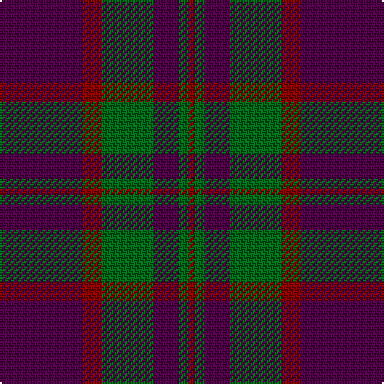

In pattern [BRGBGR](/patterns/brgbgr/).

This was sourced from tartans-authority.  It is a [6 stripes tartan](/stripes/stripes6/).

Original link http://www.tartansauthority.com/tartan-ferret/display/2410/

## Thread count
DP/52 DR12 G32 DP16 G6 DR/4

## Palette
Each colour and its ΔE from the base-6 reference it is a variant of.

| Colour | Shade | Base | ΔE (OKLab) |
|---|---|---|---|
| DP | <code style="background-color:#500048;">#500048</code> `#500048` | B <code style="background-color:#2C4084;">#2C4084</code> | 0.17 |
| DR | <code style="background-color:#880000;">#880000</code> `#880000` | R <code style="background-color:#C80000;">#C80000</code> | 0.14 |
| G | <code style="background-color:#006818;">#006818</code> `#006818` | G <code style="background-color:#006400;">#006400</code> | 0.02 |

# Sample pattern

ID: /setts/s6/b52r12g32b16g6r4-b500048-g006818-r880000/
