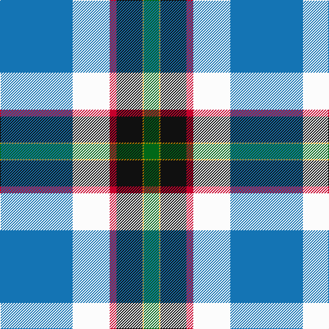

This page is one **sett** — a single exact thread-count. It belongs to the [tartan](/tartans/b53w27r5k19lo1g11/)
(the same proportion at any scale), whose colour order is pattern [BWRKYG](/stripes/bwrkyg/).

Sourced from tartans-authority.  It is a [6 stripe tartan](/stripes/stripes6/).

Original link http://www.tartansauthority.com/tartan-ferret/display/10412/

## Register references

External register numbers recorded for this tartan.

- Scottish Register of Tartans: [10412](https://www.tartanregister.gov.uk/tartanDetails?ref=10412)
- Scottish Tartans Authority (ITI): 10412

## Thread count
B/106 W54 R10 K38 DY2 G/22

## Palette

Palette: <strong>Tartan Register</strong>
<table><thead><tr><th>Colour</th><th>Threads</th><th>Shade</th><th>Base</th><th>OKLCh</th></tr></thead><tbody><tr><td>B/</td><td style="text-align:right;font-variant-numeric:tabular-nums">106</td><td><code style="background-color:#1474B4;">#1474B4</code> <small style="color:#888">#1474B4</small></td><td>B <code style="background-color:#2A418A;">#2A418A</code></td><td><small style="color:#888">oklch(54.0% 0.129 245.1)</small></td></tr><tr><td>W</td><td style="text-align:right;font-variant-numeric:tabular-nums">54</td><td><code style="background-color:#FCFCFC;">#FCFCFC</code> <small style="color:#888">#FCFCFC</small></td><td>W <code style="background-color:#F7F7F7;">#F7F7F7</code></td><td><small style="color:#888">oklch(99.1% 0.000 89.9)</small></td></tr><tr><td>R</td><td style="text-align:right;font-variant-numeric:tabular-nums">10</td><td><code style="background-color:#C8002C;">#C8002C</code> <small style="color:#888">#C8002C</small></td><td>R <code style="background-color:#CC0000;">#CC0000</code></td><td><small style="color:#888">oklch(52.6% 0.212 22.0)</small></td></tr><tr><td>K</td><td style="text-align:right;font-variant-numeric:tabular-nums">38</td><td><code style="background-color:#101010;">#101010</code> <small style="color:#888">#101010</small></td><td>K <code style="background-color:#000000;">#000000</code></td><td><small style="color:#888">oklch(17.3% 0.000 89.9)</small></td></tr><tr><td>DY</td><td style="text-align:right;font-variant-numeric:tabular-nums">2</td><td><code style="background-color:#BC8C00;">#BC8C00</code> <small style="color:#888">#BC8C00</small></td><td>Y <code style="background-color:#F2BF00;">#F2BF00</code></td><td><small style="color:#888">oklch(66.8% 0.137 84.1)</small></td></tr><tr><td>G/</td><td style="text-align:right;font-variant-numeric:tabular-nums">22</td><td><code style="background-color:#006818;">#006818</code> <small style="color:#888">#006818</small></td><td>G <code style="background-color:#006100;">#006100</code></td><td><small style="color:#888">oklch(45.0% 0.142 145.0)</small></td></tr></tbody></table>

# Sample pattern

## Nearest tartans

The nearest existing variants by ΔTartan distance, with this tartan at the top so the swatches line up against it.

ΔTartan

Tartan

Sett

—

<a href="/ttd/edit/#slug=b53w27r5k19lo1g11~x2">Crookstoun (Personal)</a> <a class="nn-out" href="/setts/s6/b53w27r5k19lo1g11~x2/" title="open its dictionary page">↗</a>

0.80

<a href="/ttd/edit/#slug=t53w27r5k19lo1dg11~x2">Crookstoun, James (West Lothian) (Personal)</a> <a class="nn-out" href="/setts/s6/t53w27r5k19lo1dg11~x2/" title="open its dictionary page">↗</a>

1.28

<a href="/ttd/edit/#slug=db74g54r44w2p15ly10">Palazzo Bloise (Personal)</a> <a class="nn-out" href="/setts/s6/db74g54r44w2p15ly10/" title="open its dictionary page">↗</a>

1.31

<a href="/ttd/edit/#slug=b37k12o17r3o17k1ly3~x2">Berger-MacLaren</a> <a class="nn-out" href="/setts/s7/b37k12o17r3o17k1ly3~x2/" title="open its dictionary page">↗</a>

1.35

<a href="/ttd/edit/#slug=lb49dt25g16dt4lbi3r8lo4lb18lo1dt9~x2">State Seal of Hawaii (Fashion)</a> <a class="nn-out" href="/setts/s10/lb49dt25g16dt4lbi3r8lo4lb18lo1dt9~x2/" title="open its dictionary page">↗</a>

1.57

<a href="/ttd/edit/#slug=w3k2t30k5r5ly5t5db12w1~x2">Wiegratz Alba (Personal)</a> <a class="nn-out" href="/setts/s9/w3k2t30k5r5ly5t5db12w1~x2/" title="open its dictionary page">↗</a>

1.60

<a href="/ttd/edit/#slug=r2w6k12db36o12ly1~x2">Alan Stone Family (Personal)</a> <a class="nn-out" href="/setts/s6/r2w6k12db36o12ly1~x2/" title="open its dictionary page">↗</a>

1.67

<a href="/ttd/edit/#slug=g4ly2g24w12db26r1~x2">Vancouver Centennial</a> <a class="nn-out" href="/setts/s6/g4ly2g24w12db26r1~x2/" title="open its dictionary page">↗</a>

1.70

<a href="/ttd/edit/#slug=w50k1dp14g14w2dp2w2k4ly2db30~x2">MacBeth Dress (Dance)</a> <a class="nn-out" href="/setts/s10/w50k1dp14g14w2dp2w2k4ly2db30~x2/" title="open its dictionary page">↗</a>

1.72

<a href="/ttd/edit/#slug=w10db2w1db35g10lo3g10r4~x2">Sandelin (Personal)</a> <a class="nn-out" href="/setts/s8/w10db2w1db35g10lo3g10r4~x2/" title="open its dictionary page">↗</a>

1.76

<a href="/ttd/edit/#slug=lb16ly3lb9b14lb1b8k32r1w4~x2">Wrens (WRNS) (Military)</a> <a class="nn-out" href="/setts/s9/lb16ly3lb9b14lb1b8k32r1w4~x2/" title="open its dictionary page">↗</a>

## Neighbour map

Every grey dot is one of 14359 variants placed by the first two principal components of the ΔTartan feature space (44% of its variance). Red is this tartan; blue dots are its nearest — click one to open its page.

<svg viewBox="0 0 640 380" role="img" style="max-width:100%;height:auto;border:1px solid #e0e0e0;border-radius:4px;display:block" xmlns="http://www.w3.org/2000/svg"><image href="/nn/cloud.v1.png" width="640" height="380"/><a href="/setts/s6/t53w27r5k19lo1dg11~x2/"><circle cx="221.5" cy="96.5" r="4" fill="#3465a4"><title>Crookstoun, James (West Lothian) (Personal)</title></circle></a><a href="/setts/s6/db74g54r44w2p15ly10/"><circle cx="162.7" cy="118.8" r="4" fill="#3465a4"><title>Palazzo Bloise (Personal)</title></circle></a><a href="/setts/s7/b37k12o17r3o17k1ly3~x2/"><circle cx="232.7" cy="123.8" r="4" fill="#3465a4"><title>Berger-MacLaren</title></circle></a><a href="/setts/s10/lb49dt25g16dt4lbi3r8lo4lb18lo1dt9~x2/"><circle cx="247.0" cy="75.6" r="4" fill="#3465a4"><title>State Seal of Hawaii (Fashion)</title></circle></a><a href="/setts/s9/w3k2t30k5r5ly5t5db12w1~x2/"><circle cx="244.6" cy="93.8" r="4" fill="#3465a4"><title>Wiegratz Alba (Personal)</title></circle></a><a href="/setts/s6/r2w6k12db36o12ly1~x2/"><circle cx="268.9" cy="114.7" r="4" fill="#3465a4"><title>Alan Stone Family (Personal)</title></circle></a><a href="/setts/s6/g4ly2g24w12db26r1~x2/"><circle cx="193.7" cy="142.4" r="4" fill="#3465a4"><title>Vancouver Centennial</title></circle></a><a href="/setts/s10/w50k1dp14g14w2dp2w2k4ly2db30~x2/"><circle cx="221.0" cy="43.6" r="4" fill="#3465a4"><title>MacBeth Dress (Dance)</title></circle></a><a href="/setts/s8/w10db2w1db35g10lo3g10r4~x2/"><circle cx="273.1" cy="113.0" r="4" fill="#3465a4"><title>Sandelin (Personal)</title></circle></a><a href="/setts/s9/lb16ly3lb9b14lb1b8k32r1w4~x2/"><circle cx="149.6" cy="93.4" r="4" fill="#3465a4"><title>Wrens (WRNS) (Military)</title></circle></a><circle cx="212.6" cy="98.5" r="5" fill="#c00000"/></svg>

ID: /setts/s6/b53w27r5k19lo1g11~x2/
