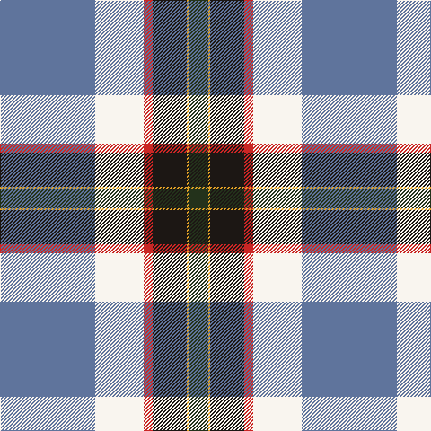

In pattern [BWRKYG](/patterns/bwrkyg/).

This was sourced from register-of-tartans.  It is a [6 stripes tartan](/stripes/stripes6/).

Original link https://www.tartanregister.gov.uk/tartanDetails.aspx?ref=10412

## Thread count
B/106 W54 R10 Ka38 Y2 K/22

## Palette
Each colour and its ΔE from the base-6 reference it is a variant of.

| Colour | Shade | Base | ΔE (OKLab) |
|---|---|---|---|
| B | <code style="background-color:#5F749C;">#5F749C</code> `#5F749C` | B <code style="background-color:#2A418A;">#2A418A</code> | 0.17 |
| K | <code style="background-color:#23321B;">#23321B</code> `#23321B` | G <code style="background-color:#006100;">#006100</code> | 0.16 |
| Ka | <code style="background-color:#1C1714;">#1C1714</code> `#1C1714` | K <code style="background-color:#000000;">#000000</code> | 0.21 |
| R | <code style="background-color:#CA2625;">#CA2625</code> `#CA2625` | R <code style="background-color:#CC0000;">#CC0000</code> | 0.02 |
| W | <code style="background-color:#F9F5EF;">#F9F5EF</code> `#F9F5EF` | W <code style="background-color:#F7F7F7;">#F7F7F7</code> | 0.01 |
| Y | <code style="background-color:#E0A126;">#E0A126</code> `#E0A126` | Y <code style="background-color:#F2BF00;">#F2BF00</code> | 0.08 |

# Sample pattern

## Nearest tartans

The nearest existing variants by ΔTartan distance.

1. [Crookstoun (Personal)](/setts/s6/b53w27r5k19y1g11x2~b1474b4-g006818-k101010-rc8002c-wfcfcfc-ybc8c00/) — ΔT 0.80
1. [Berger-MacLaren](/setts/s7/b37k12r17ra3r17k1y3x2~b007fff-k101010-rac7f24-racc1100-yffe303/) — ΔT 1.22
1. [Palazzo Bloise (Personal)](/setts/s6/b74g54r44w2ba15y10~b0000cd-baaa00ff-g008b00-re3170d-wffffff-yffe600/) — ΔT 1.23
1. [State Seal of Hawaii (Fashion)](/setts/s10/w49b25g16b4wa3r8y4w18y1b9x2~b003c64-g006818-rc80000-w98c8e8-wae8ccb8-ybc8c00/) — ΔT 1.47
1. [Wiegratz Alba (Personal)](/setts/s9/w3k2b30k5r5y5b5ba12w1x2~b608c9c-ba1c1c50-k101010-rc80000-we0e0e0-ye8c000/) — ΔT 1.50
1. [SOBHD](/setts/s8/r3w30b10k3ba15g2ba3g1x2~b2c3c98-ba640064-g208414-k101010-rc80000-we0e0e0/) — ΔT 1.50
1. [S.O.B.H.D. (Corporate)](/setts/s8/r3w30b10k3ba15g2ba3g1x2~b2c3c98-ba640064-g208414-k101010-rc80000-wf0e4cc/) — ΔT 1.51
1. [Stone, Alan (Personal)](/setts/s6/r2w6k12b36ra12y1x2~b485074-k101010-rc80000-ra888888-we0e0e0-ye8c000/) — ΔT 1.53
1. [MacBeth Dress (Dance)](/setts/s10/w50k1b14g14w2b2w2k4y2ba30x2~b780078-ba2c2c80-g006818-k101010-we0e0e0-ye8c000/) — ΔT 1.55
1. [Alan Stone Family (Personal)](/setts/s6/r2w6k12b36ra12y1x2~b27408b-k101010-rb0171f-ra8c8c8c-wffffff-ycdad00/) — ΔT 1.62

## Neighbour map

Every grey dot is one of 15726 variants placed by the first two principal components of the ΔTartan feature space (44% of its variance). Red is this tartan; blue dots are its nearest — click one to open its page.

<svg viewBox="0 0 640 380" role="img" style="max-width:100%;height:auto;border:1px solid #e0e0e0;border-radius:4px;display:block" xmlns="http://www.w3.org/2000/svg"><image href="/nn/cloud.v1.png" width="640" height="380"/><a href="/setts/s6/b53w27r5k19y1g11x2~b1474b4-g006818-k101010-rc8002c-wfcfcfc-ybc8c00/"><circle cx="210.1" cy="99.0" r="4" fill="#3465a4"><title>Crookstoun (Personal)</title></circle></a><a href="/setts/s7/b37k12r17ra3r17k1y3x2~b007fff-k101010-rac7f24-racc1100-yffe303/"><circle cx="230.6" cy="123.6" r="4" fill="#3465a4"><title>Berger-MacLaren</title></circle></a><a href="/setts/s6/b74g54r44w2ba15y10~b0000cd-baaa00ff-g008b00-re3170d-wffffff-yffe600/"><circle cx="160.2" cy="118.3" r="4" fill="#3465a4"><title>Palazzo Bloise (Personal)</title></circle></a><a href="/setts/s10/w49b25g16b4wa3r8y4w18y1b9x2~b003c64-g006818-rc80000-w98c8e8-wae8ccb8-ybc8c00/"><circle cx="245.0" cy="74.7" r="4" fill="#3465a4"><title>State Seal of Hawaii (Fashion)</title></circle></a><a href="/setts/s9/w3k2b30k5r5y5b5ba12w1x2~b608c9c-ba1c1c50-k101010-rc80000-we0e0e0-ye8c000/"><circle cx="247.6" cy="91.4" r="4" fill="#3465a4"><title>Wiegratz Alba (Personal)</title></circle></a><a href="/setts/s8/r3w30b10k3ba15g2ba3g1x2~b2c3c98-ba640064-g208414-k101010-rc80000-we0e0e0/"><circle cx="203.8" cy="79.1" r="4" fill="#3465a4"><title>SOBHD</title></circle></a><a href="/setts/s8/r3w30b10k3ba15g2ba3g1x2~b2c3c98-ba640064-g208414-k101010-rc80000-wf0e4cc/"><circle cx="202.3" cy="77.4" r="4" fill="#3465a4"><title>S.O.B.H.D. (Corporate)</title></circle></a><a href="/setts/s6/r2w6k12b36ra12y1x2~b485074-k101010-rc80000-ra888888-we0e0e0-ye8c000/"><circle cx="283.9" cy="117.8" r="4" fill="#3465a4"><title>Stone, Alan (Personal)</title></circle></a><a href="/setts/s10/w50k1b14g14w2b2w2k4y2ba30x2~b780078-ba2c2c80-g006818-k101010-we0e0e0-ye8c000/"><circle cx="219.3" cy="44.8" r="4" fill="#3465a4"><title>MacBeth Dress (Dance)</title></circle></a><a href="/setts/s6/r2w6k12b36ra12y1x2~b27408b-k101010-rb0171f-ra8c8c8c-wffffff-ycdad00/"><circle cx="266.6" cy="114.1" r="4" fill="#3465a4"><title>Alan Stone Family (Personal)</title></circle></a><circle cx="219.9" cy="97.4" r="5" fill="#c00000"/></svg>

ID: /setts/s6/b53w27r5k19y1g11x2~b5f749c-g23321b-k1c1714-rca2625-wf9f5ef-ye0a126/
