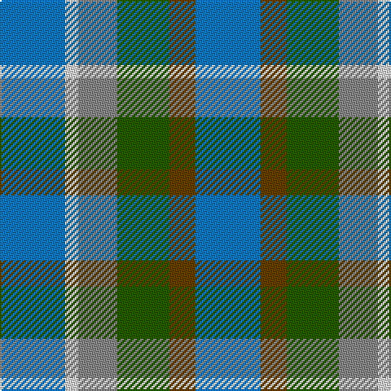

**Bands:** [BGGRWB](/stripes/bggrwb/) · **Stripes:** [B DY DG O W B](/stripes/stripes6/) B DY DG O W B

This was sourced from tartans-authority.  It is a [6 band tartan](/bands/bands6/).

Original link http://www.tartansauthority.com/tartan-ferret/display/10431/

## Thread count
B/40 LN8 N24 G32 T16 B/40

## Palette
Each colour and its ΔE from the base-6 reference it is a variant of.

| Colour | Shade | Base | ΔE (OKLab) |
|---|---|---|---|
| B | <code style="background-color:#1474B4;">#1474B4</code> `#1474B4` | B <code style="background-color:#2A418A;">#2A418A</code> | 0.15 |
| G | <code style="background-color:#285800;">#285800</code> `#285800` | G <code style="background-color:#006100;">#006100</code> | 0.03 |
| LN | <code style="background-color:#E0E0E0;">#E0E0E0</code> `#E0E0E0` | W <code style="background-color:#F7F7F7;">#F7F7F7</code> | 0.07 |
| N | <code style="background-color:#888888;">#888888</code> `#888888` | R <code style="background-color:#CC0000;">#CC0000</code> | 0.24 |
| T | <code style="background-color:#604000;">#604000</code> `#604000` | G <code style="background-color:#006100;">#006100</code> | 0.14 |

# Sample pattern

## Nearest tartans

The nearest existing variants by ΔTartan distance.

1. [Fox-Eves Wedding (Personal)](/setts/s6/r9b6dt13b21o18w4~x2/) — ΔT 1.58
1. [Mounth, The](/setts/s9/dp2g13b12w3b10w3b12o13g2~x2/) — ΔT 1.62
1. [Unnamed, No 29](/setts/s6/db3g11t2db11b6g3~x2/) — ΔT 1.62
1. [Unidentified No 29](/setts/s6/db3dg11t2db11b6dg3~x2/) — ΔT 1.75
1. [Glen Erin](/setts/s8/db16g8b8g8db16r3do3y3~x2/) — ΔT 1.82
1. [Blue](/setts/s6/n14r4n14t15db13w3~x2/) — ΔT 1.82
1. [Styrian](/setts/s8/o16dg29n19g8n19dg29o16r4~x2/) — ΔT 1.82
1. [Breon (Personal)](/setts/s5/b25g25k6dt10r6~x2/) — ΔT 1.84
1. [MacKay - 1800 (Reay Coat) (Artefact)](/setts/s7/dy9g9ly2g9dy9b9dy3~x2/) — ΔT 1.94
1. [Tennant (Yules)](/setts/s7/r1db7g7db7g7dy7r1~x8/) — ΔT 1.96

## Neighbour map

Every grey dot is one of 14313 variants placed by the first two principal components of the ΔTartan feature space (44% of its variance). Red is this tartan; blue dots are its nearest — click one to open its page.

<svg viewBox="0 0 640 380" role="img" style="max-width:100%;height:auto;border:1px solid #e0e0e0;border-radius:4px;display:block" xmlns="http://www.w3.org/2000/svg"><image href="/nn/cloud.v1.png" width="640" height="380"/><a href="/setts/s6/r9b6dt13b21o18w4~x2/"><circle cx="131.6" cy="257.1" r="4" fill="#3465a4"><title>Fox-Eves Wedding (Personal)</title></circle></a><a href="/setts/s9/dp2g13b12w3b10w3b12o13g2~x2/"><circle cx="194.2" cy="221.9" r="4" fill="#3465a4"><title>Mounth, The</title></circle></a><a href="/setts/s6/db3g11t2db11b6g3~x2/"><circle cx="198.4" cy="273.1" r="4" fill="#3465a4"><title>Unnamed, No 29</title></circle></a><a href="/setts/s6/db3dg11t2db11b6dg3~x2/"><circle cx="212.5" cy="284.7" r="4" fill="#3465a4"><title>Unidentified No 29</title></circle></a><a href="/setts/s8/db16g8b8g8db16r3do3y3~x2/"><circle cx="202.6" cy="238.9" r="4" fill="#3465a4"><title>Glen Erin</title></circle></a><a href="/setts/s6/n14r4n14t15db13w3~x2/"><circle cx="147.9" cy="261.9" r="4" fill="#3465a4"><title>Blue</title></circle></a><a href="/setts/s8/o16dg29n19g8n19dg29o16r4~x2/"><circle cx="195.0" cy="266.5" r="4" fill="#3465a4"><title>Styrian</title></circle></a><a href="/setts/s5/b25g25k6dt10r6~x2/"><circle cx="137.0" cy="275.4" r="4" fill="#3465a4"><title>Breon (Personal)</title></circle></a><a href="/setts/s7/dy9g9ly2g9dy9b9dy3~x2/"><circle cx="211.1" cy="313.2" r="4" fill="#3465a4"><title>MacKay - 1800 (Reay Coat) (Artefact)</title></circle></a><a href="/setts/s7/r1db7g7db7g7dy7r1~x8/"><circle cx="208.2" cy="280.4" r="4" fill="#3465a4"><title>Tennant (Yules)</title></circle></a><circle cx="199.1" cy="285.2" r="5" fill="#c00000"/></svg>

ID: /setts/s6/b5dy2dg4o3w1b5~x8/
