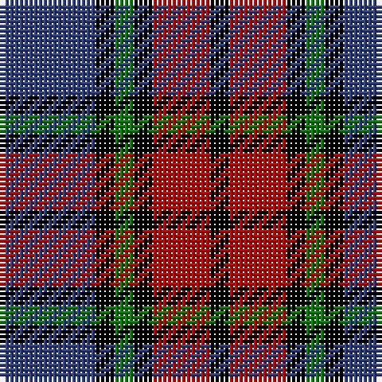

In pattern [BKGKRK](/patterns/bkgkrk/).

This was sourced from weddslist.  It is a [6 stripes tartan](/stripes/stripes6/).

Original link http://www.weddslist.com/cgi-bin/tartans/pg.pl?source=sts

## Thread count
B/20 K4 G4 K4 R12 K/4

## Palette
Each colour and its ΔE from the base-6 reference it is a variant of.

| Colour | Shade | Base | ΔE (OKLab) |
|---|---|---|---|
| B | <code style="background-color:#304080;">#304080</code> `#304080` | B <code style="background-color:#2A418A;">#2A418A</code> | 0.02 |
| G | <code style="background-color:#008000;">#008000</code> `#008000` | G <code style="background-color:#006100;">#006100</code> | 0.10 |
| K | <code style="background-color:#000000;">#000000</code> `#000000` | K <code style="background-color:#000000;">#000000</code> | 0.00 |
| R | <code style="background-color:#C00000;">#C00000</code> `#C00000` | R <code style="background-color:#CC0000;">#CC0000</code> | 0.03 |

# Sample pattern

## Nearest tartans

The nearest existing variants by ΔTartan distance.

1. [Clerk](/setts/s6/b5k1g1k1r3k1x4~b2c4084-g005020-k101010-rdc0000/) — ΔT 0.95
1. [Gipsy Fancy Tartan Tartan Number: 1137. Earliest known date: 1847 The story goes that both name and design were inspired by the well known free-booter and composer of 'MacPhersons Rant, James MacPherson, who claimed to be the natural son of MacPherson of Invereshee by a gipsy woman. See products available Copyright © Blair Urquhart, Comrie, 2015](/setts/s9/k1r1b5r1w1r1k5r1k1x2~b2c2c80-k101010-rc80000-we0e0e0/) — ΔT 1.01
1. [Dunbog Primary (School)](/setts/s6/r12b3g5b16y2g2x2~b000048-g447438-rc80000-ye8c000/) — ΔT 1.01
1. [University of Notre Dame](/setts/s6/r5b35k25b8y10r5x2~b2c2c80-k101010-rc80000-yfccc00/) — ΔT 1.05
1. [Clerk Family Tartan Tartan Number: 326. Earliest known date: 1847 Also referred to as Clark. See products available Copyright © Blair Urquhart, Comrie, 2015](/setts/s6/b5k1g1k1r3k1x4~b2c2c80-g006818-k101010-rc80000/) — ΔT 1.06
1. [Baillie](/setts/s7/b3k1b8k6g8k1w2x2~b800080-g008000-k000000-we0e0e0/) — ΔT 1.08
1. [MacTavish #2](/setts/s6/b1r6ba1b3k3b1x8~b5c8ca8-ba1c0070-k101010-r880000/) — ΔT 1.11
1. [Edinburgh International Conference Centre](/setts/s6/r4b19r3k20ra24b3x2~b304080-k000000-r806050-ra906030/) — ΔT 1.12
1. [Unidentified #65](/setts/s6/g3k20ka20r20k3r3x2~g005020-k000028-ka101010-rdc0000/) — ΔT 1.14
1. [Gipsy](/setts/s9/k1r1b5r1w1r1k5r1k1x2~b304080-k000000-rc00000-we0e0e0/) — ΔT 1.14

## Neighbour map

Every grey dot is one of 15726 variants placed by the first two principal components of the ΔTartan feature space (44% of its variance). Red is this tartan; blue dots are its nearest — click one to open its page.

<svg viewBox="0 0 640 380" role="img" style="max-width:100%;height:auto;border:1px solid #e0e0e0;border-radius:4px;display:block" xmlns="http://www.w3.org/2000/svg"><image href="/nn/cloud.v1.png" width="640" height="380"/><a href="/setts/s6/b5k1g1k1r3k1x4~b2c4084-g005020-k101010-rdc0000/"><circle cx="193.3" cy="241.2" r="4" fill="#3465a4"><title>Clerk</title></circle></a><a href="/setts/s9/k1r1b5r1w1r1k5r1k1x2~b2c2c80-k101010-rc80000-we0e0e0/"><circle cx="179.8" cy="207.7" r="4" fill="#3465a4"><title>Gipsy Fancy Tartan Tartan Number: 1137. Earliest known date: 1847 The story goes that both name and design were inspired by the well known free-booter and composer of 'MacPhersons Rant, James MacPherson, who claimed to be the natural son of MacPherson of Invereshee by a gipsy woman. See products available Copyright © Blair Urquhart, Comrie, 2015</title></circle></a><a href="/setts/s6/r12b3g5b16y2g2x2~b000048-g447438-rc80000-ye8c000/"><circle cx="221.4" cy="212.4" r="4" fill="#3465a4"><title>Dunbog Primary (School)</title></circle></a><a href="/setts/s6/r5b35k25b8y10r5x2~b2c2c80-k101010-rc80000-yfccc00/"><circle cx="218.2" cy="223.1" r="4" fill="#3465a4"><title>University of Notre Dame</title></circle></a><a href="/setts/s6/b5k1g1k1r3k1x4~b2c2c80-g006818-k101010-rc80000/"><circle cx="198.0" cy="243.9" r="4" fill="#3465a4"><title>Clerk Family Tartan Tartan Number: 326. Earliest known date: 1847 Also referred to as Clark. See products available Copyright © Blair Urquhart, Comrie, 2015</title></circle></a><a href="/setts/s7/b3k1b8k6g8k1w2x2~b800080-g008000-k000000-we0e0e0/"><circle cx="145.2" cy="209.9" r="4" fill="#3465a4"><title>Baillie</title></circle></a><a href="/setts/s6/b1r6ba1b3k3b1x8~b5c8ca8-ba1c0070-k101010-r880000/"><circle cx="190.7" cy="234.6" r="4" fill="#3465a4"><title>MacTavish #2</title></circle></a><a href="/setts/s6/r4b19r3k20ra24b3x2~b304080-k000000-r806050-ra906030/"><circle cx="150.3" cy="222.6" r="4" fill="#3465a4"><title>Edinburgh International Conference Centre</title></circle></a><a href="/setts/s6/g3k20ka20r20k3r3x2~g005020-k000028-ka101010-rdc0000/"><circle cx="162.7" cy="227.6" r="4" fill="#3465a4"><title>Unidentified #65</title></circle></a><a href="/setts/s9/k1r1b5r1w1r1k5r1k1x2~b304080-k000000-rc00000-we0e0e0/"><circle cx="161.5" cy="203.8" r="4" fill="#3465a4"><title>Gipsy</title></circle></a><circle cx="169.6" cy="234.6" r="5" fill="#c00000"/></svg>

ID: /setts/s6/b5k1g1k1r3k1x4~b304080-g008000-k000000-rc00000/
