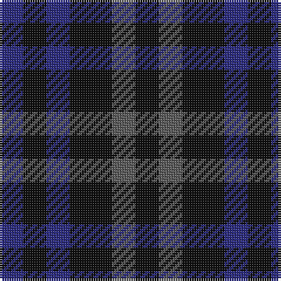

In pattern [BKBKBK](/patterns/bkbkbk/).

This was sourced from tartans-authority.  It is a [6 stripes tartan](/stripes/stripes6/).

Original link http://www.tartansauthority.com/tartan-ferret/display/10047/

## Thread count
DB/10 K10 DB10 K18 N10 K/10

## Palette
Each colour and its ΔE from the base-6 reference it is a variant of.

| Colour | Shade | Base | ΔE (OKLab) |
|---|---|---|---|
| DB | <code style="background-color:#2C2C80;">#2C2C80</code> `#2C2C80` | B <code style="background-color:#2A418A;">#2A418A</code> | 0.06 |
| K | <code style="background-color:#101010;">#101010</code> `#101010` | K <code style="background-color:#000000;">#000000</code> | 0.17 |
| N | <code style="background-color:#5C5C5C;">#5C5C5C</code> `#5C5C5C` | B <code style="background-color:#2A418A;">#2A418A</code> | 0.15 |

# Sample pattern

## Nearest tartans

The nearest existing variants by ΔTartan distance.

1. [Charles Rennie Mackintosh](/setts/s6/b5ba5b9bb5b5bb5~b1e1e1e-ba32313a-bb5900ce~x2/) — ΔT 0.92
1. [Wandering Shepherd (Personal)](/setts/s5/b2k2g2b1k1~b2c2c80-g006818-k101010~x20/) — ΔT 1.97
1. [Sutherland 42nd](/setts/s6/b1k1b3k3g3k1~b2c4084-g005020-k101010~x4/) — ΔT 2.22
1. [Sheffield High School](/setts/s6/b12g8ba4g8b12ba5~b003c64-ba2888c4-g006818/) — ΔT 2.39
1. [Daks (Black)](/setts/s5/g3k6ga4k6r3~g808080-ga604000-k101010-rb03000~x2/) — ΔT 2.46
1. [Unidentified No 63](/setts/s7/k3g4k1g4k3b4k1~b2c4084-g005020-k101010~x2/) — ΔT 2.49
1. [Wilson's No.209](/setts/s4/g4b5g4ba2~b440044-ba2888c4-g006818~x2/) — ΔT 2.50
1. [Millarkie, Will (Personal)](/setts/s8/k15b10k15r7k15w5k15b10~b2c2c80-k101010-r880000-we0e0e0/) — ΔT 2.54
1. [Allen, Nicholas (Personal)](/setts/s3/b1k2r1~b003c64-k101010-rc80000~x42/) — ΔT 2.65
1. [Barwell](/setts/s4/g1b3g3r1~b202060-g003820-r880000~x4/) — ΔT 2.66

## Neighbour map

Every grey dot is one of 15726 variants placed by the first two principal components of the ΔTartan feature space (44% of its variance). Red is this tartan; blue dots are its nearest — click one to open its page.

<svg viewBox="0 0 640 380" role="img" style="max-width:100%;height:auto;border:1px solid #e0e0e0;border-radius:4px;display:block" xmlns="http://www.w3.org/2000/svg"><image href="/nn/cloud.v1.png" width="640" height="380"/><a href="/setts/s6/b5ba5b9bb5b5bb5~b1e1e1e-ba32313a-bb5900ce~x2/"><circle cx="241.8" cy="366.0" r="4" fill="#3465a4"><title>Charles Rennie Mackintosh</title></circle></a><a href="/setts/s5/b2k2g2b1k1~b2c2c80-g006818-k101010~x20/"><circle cx="151.8" cy="366.0" r="4" fill="#3465a4"><title>Wandering Shepherd (Personal)</title></circle></a><a href="/setts/s6/b1k1b3k3g3k1~b2c4084-g005020-k101010~x4/"><circle cx="231.0" cy="340.3" r="4" fill="#3465a4"><title>Sutherland 42nd</title></circle></a><a href="/setts/s6/b12g8ba4g8b12ba5~b003c64-ba2888c4-g006818/"><circle cx="239.5" cy="356.0" r="4" fill="#3465a4"><title>Sheffield High School</title></circle></a><a href="/setts/s5/g3k6ga4k6r3~g808080-ga604000-k101010-rb03000~x2/"><circle cx="183.3" cy="347.9" r="4" fill="#3465a4"><title>Daks (Black)</title></circle></a><a href="/setts/s7/k3g4k1g4k3b4k1~b2c4084-g005020-k101010~x2/"><circle cx="232.8" cy="334.8" r="4" fill="#3465a4"><title>Unidentified No 63</title></circle></a><a href="/setts/s4/g4b5g4ba2~b440044-ba2888c4-g006818~x2/"><circle cx="215.1" cy="366.0" r="4" fill="#3465a4"><title>Wilson's No.209</title></circle></a><a href="/setts/s8/k15b10k15r7k15w5k15b10~b2c2c80-k101010-r880000-we0e0e0/"><circle cx="260.7" cy="317.7" r="4" fill="#3465a4"><title>Millarkie, Will (Personal)</title></circle></a><a href="/setts/s3/b1k2r1~b003c64-k101010-rc80000~x42/"><circle cx="205.9" cy="366.0" r="4" fill="#3465a4"><title>Allen, Nicholas (Personal)</title></circle></a><a href="/setts/s4/g1b3g3r1~b202060-g003820-r880000~x4/"><circle cx="332.6" cy="366.0" r="4" fill="#3465a4"><title>Barwell</title></circle></a><circle cx="252.4" cy="366.0" r="5" fill="#c00000"/></svg>

ID: /setts/s6/b5k5b5k9ba5k5~b2c2c80-ba5c5c5c-k101010~x2/
