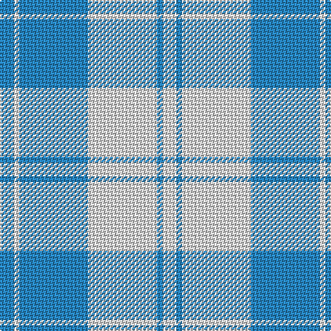

In pattern [BWBWBW](/patterns/bwbwbw/).

This was sourced from house-of-tartan.  It is a [6 stripes tartan](/stripes/stripes6/).

Original link http://www.house-of-tartan.scotland.net/house/TartanViewjs.asp?colr=Def&tnam=4820

## Thread count
B/10 LN4 B50 LN50 B4 LN/10

## Palette
Each colour and its ΔE from the base-6 reference it is a variant of.

| Colour | Shade | Base | ΔE (OKLab) |
|---|---|---|---|
| B | <code style="background-color:#2888C4;">#2888C4</code> `#2888C4` | B <code style="background-color:#2A418A;">#2A418A</code> | 0.21 |
| LN | <code style="background-color:#E0E0E0;">#E0E0E0</code> `#E0E0E0` | W <code style="background-color:#F7F7F7;">#F7F7F7</code> | 0.07 |

# Sample pattern

## Nearest tartans

The nearest existing variants by ΔTartan distance.

1. [Erskine, Lt Blue (Dance)](/setts/s6/b6w2b29w29b2w6x2~b2888c4-wfcfcfc/) — ΔT 0.99
1. [Erskine, Grey](/setts/s6/b6w2b25w25b2w6x2~b505050-wc0c0c0/) — ΔT 1.82
1. [Louise Beveridge (Personal)](/setts/s5/w40wa25b16w8b4x2~b003c64-w98c8e8-wae0e0e0/) — ΔT 1.94
1. [Erskine, dress](/setts/s6/b6w2b29w29b2w6x2~b304080-we0e0e0/) — ΔT 1.97
1. [Unidentified, Plaid Barbie's Moss](/setts/s6/b3w3b20w20b20w3x2~b8080d0-we0e0e0/) — ΔT 1.99
1. [MacPherson Turquoise Dress Tartan Tartan Number: 8183. Earliest known date: Threadcount and colours aren't 100% original. Generated manually. See products available Copyright © Blair Urquhart, Comrie, 2015](/setts/s7/w4k2w26b23w3b8ba3x2~b2888c4-ba8c008c-k101010-we0e0e0/) — ΔT 2.00
1. [MacLachlan (Chief's Dress) Blue](/setts/s8/b6y2b21y2b6y24b2y6x2~b6840fc-ye8c000/) — ΔT 2.14
1. [Legary (Name)](/setts/s6/y5b15w5b5w40y3x2~b1c1c50-w98c8e8-ye8c000/) — ΔT 2.21
1. [Buchanan, dress Blue](/setts/s6/w5b16w5b16w33r3x2~b304080-rc00000-we0e0e0/) — ΔT 2.21
1. [St. John's (Corporate)](/setts/s7/w2b1w15ba12w1y3b1x6~b1c0070-ba2888c4-we0e0e0-ye8c000/) — ΔT 2.25

## Neighbour map

Every grey dot is one of 15726 variants placed by the first two principal components of the ΔTartan feature space (44% of its variance). Red is this tartan; blue dots are its nearest — click one to open its page.

<svg viewBox="0 0 640 380" role="img" style="max-width:100%;height:auto;border:1px solid #e0e0e0;border-radius:4px;display:block" xmlns="http://www.w3.org/2000/svg"><image href="/nn/cloud.v1.png" width="640" height="380"/><a href="/setts/s6/b6w2b29w29b2w6x2~b2888c4-wfcfcfc/"><circle cx="341.2" cy="206.4" r="4" fill="#3465a4"><title>Erskine, Lt Blue (Dance)</title></circle></a><a href="/setts/s6/b6w2b25w25b2w6x2~b505050-wc0c0c0/"><circle cx="355.1" cy="225.3" r="4" fill="#3465a4"><title>Erskine, Grey</title></circle></a><a href="/setts/s5/w40wa25b16w8b4x2~b003c64-w98c8e8-wae0e0e0/"><circle cx="259.7" cy="234.4" r="4" fill="#3465a4"><title>Louise Beveridge (Personal)</title></circle></a><a href="/setts/s6/b6w2b29w29b2w6x2~b304080-we0e0e0/"><circle cx="330.2" cy="204.0" r="4" fill="#3465a4"><title>Erskine, dress</title></circle></a><a href="/setts/s6/b3w3b20w20b20w3x2~b8080d0-we0e0e0/"><circle cx="399.3" cy="271.2" r="4" fill="#3465a4"><title>Unidentified, Plaid Barbie's Moss</title></circle></a><a href="/setts/s7/w4k2w26b23w3b8ba3x2~b2888c4-ba8c008c-k101010-we0e0e0/"><circle cx="276.2" cy="174.0" r="4" fill="#3465a4"><title>MacPherson Turquoise Dress Tartan Tartan Number: 8183. Earliest known date: Threadcount and colours aren't 100% original. Generated manually. See products available Copyright © Blair Urquhart, Comrie, 2015</title></circle></a><a href="/setts/s8/b6y2b21y2b6y24b2y6x2~b6840fc-ye8c000/"><circle cx="324.4" cy="195.6" r="4" fill="#3465a4"><title>MacLachlan (Chief's Dress) Blue</title></circle></a><a href="/setts/s6/y5b15w5b5w40y3x2~b1c1c50-w98c8e8-ye8c000/"><circle cx="340.9" cy="184.6" r="4" fill="#3465a4"><title>Legary (Name)</title></circle></a><a href="/setts/s6/w5b16w5b16w33r3x2~b304080-rc00000-we0e0e0/"><circle cx="297.3" cy="207.5" r="4" fill="#3465a4"><title>Buchanan, dress Blue</title></circle></a><a href="/setts/s7/w2b1w15ba12w1y3b1x6~b1c0070-ba2888c4-we0e0e0-ye8c000/"><circle cx="285.2" cy="155.6" r="4" fill="#3465a4"><title>St. John's (Corporate)</title></circle></a><circle cx="363.2" cy="224.9" r="5" fill="#c00000"/></svg>

ID: /setts/s6/b5w2b25w25b2w5x2~b2888c4-we0e0e0/
