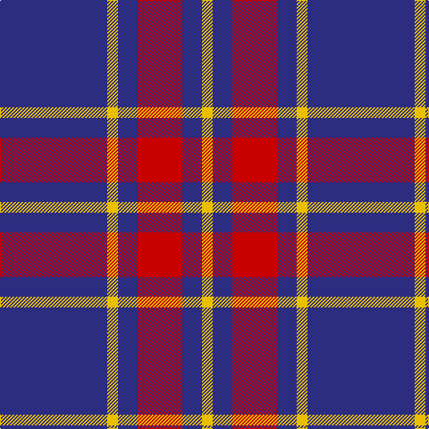

In pattern [BYBRBY](/patterns/bybrby/).

This was sourced from tartans-authority.  It is a [6 stripes tartan](/stripes/stripes6/).

Original link http://www.tartansauthority.com/tartan-ferret/display/5890/

## Thread count
DB/120 Y12 DB22 R50 DB22 Y/12

## Palette
Each colour and its ΔE from the base-6 reference it is a variant of.

| Colour | Shade | Base | ΔE (OKLab) |
|---|---|---|---|
| DB | <code style="background-color:#2C2C80;">#2C2C80</code> `#2C2C80` | B <code style="background-color:#2A418A;">#2A418A</code> | 0.06 |
| R | <code style="background-color:#C80000;">#C80000</code> `#C80000` | R <code style="background-color:#CC0000;">#CC0000</code> | 0.01 |
| Y | <code style="background-color:#E8C000;">#E8C000</code> `#E8C000` | Y <code style="background-color:#F2BF00;">#F2BF00</code> | 0.02 |

# Sample pattern

## Nearest tartans

The nearest existing variants by ΔTartan distance.

1. [BC Corps of Commissionaires, The](/setts/s7/b12w1r3w1r3w1b6~b202060-ra00000-wc0c0c0~x4/) — ΔT 0.72
1. [BC Corps of Commissionaires](/setts/s7/b12w1r3w1r3w1b6~b141e46-r800028-we0e0e0~x4/) — ΔT 0.98
1. [MacQueen variant](/setts/s6/b2r7b2r7b22y2~b2c4084-rdc0000-ye8c000~x2/) — ΔT 1.06
1. [Glen Moy Trade Tartan Tartan Number: 635. Earliest known date: pre 1992 Its mainly Sheep farming in Glen Moy. Off the beaten track, its a very quiet area of the Angus glens close to Cortachy castle and great for walking if you like it to yourself! Its also close to Glen Clova which is the busiest glen around here with some fantastic mountains for walking and taking photos. See products available Copyright © Blair Urquhart, Comrie, 2015](/setts/s5/b37w9b3r9w3~b202060-rc80000-we0e0e0~x2/) — ΔT 1.07
1. [Coronation (1936) #2](/setts/s7/b11w1r12b6r1b6w1~b2c2c80-rc80000-wfcfcfc~x4/) — ΔT 1.16
1. [Edinburgh TIC (Corporate)](/setts/s8/b32r3b3r4w3r5b4r7~b2c2c80-rc8002c-we0e0e0~x2/) — ΔT 1.17
1. [Glen Moy](/setts/s5/b13w3b1r3w1~b1c0070-rc80000-wc0c0c0~x6/) — ΔT 1.23
1. [MacQueen, variant](/setts/s6/b2r7b2r7b22y2~b304080-rc00000-yf0c000~x2/) — ΔT 1.24
1. [Laing of Archiestown](/setts/s5/b19r2w2r2k2~b304080-k000000-rc00000-we0e0e0~x4/) — ΔT 1.31
1. [Laing of Archiestown](/setts/s5/b8r1w1r1k1~b2c2c80-k101010-rc80000-wfcfcfc~x8/) — ΔT 1.32

## Neighbour map

Every grey dot is one of 15726 variants placed by the first two principal components of the ΔTartan feature space (44% of its variance). Red is this tartan; blue dots are its nearest — click one to open its page.

<svg viewBox="0 0 640 380" role="img" style="max-width:100%;height:auto;border:1px solid #e0e0e0;border-radius:4px;display:block" xmlns="http://www.w3.org/2000/svg"><image href="/nn/cloud.v1.png" width="640" height="380"/><a href="/setts/s7/b12w1r3w1r3w1b6~b202060-ra00000-wc0c0c0~x4/"><circle cx="404.8" cy="211.8" r="4" fill="#3465a4"><title>BC Corps of Commissionaires, The</title></circle></a><a href="/setts/s7/b12w1r3w1r3w1b6~b141e46-r800028-we0e0e0~x4/"><circle cx="393.7" cy="210.4" r="4" fill="#3465a4"><title>BC Corps of Commissionaires</title></circle></a><a href="/setts/s6/b2r7b2r7b22y2~b2c4084-rdc0000-ye8c000~x2/"><circle cx="393.4" cy="210.8" r="4" fill="#3465a4"><title>MacQueen variant</title></circle></a><a href="/setts/s5/b37w9b3r9w3~b202060-rc80000-we0e0e0~x2/"><circle cx="375.8" cy="205.4" r="4" fill="#3465a4"><title>Glen Moy Trade Tartan Tartan Number: 635. Earliest known date: pre 1992 Its mainly Sheep farming in Glen Moy. Off the beaten track, its a very quiet area of the Angus glens close to Cortachy castle and great for walking if you like it to yourself! Its also close to Glen Clova which is the busiest glen around here with some fantastic mountains for walking and taking photos. See products available Copyright © Blair Urquhart, Comrie, 2015</title></circle></a><a href="/setts/s7/b11w1r12b6r1b6w1~b2c2c80-rc80000-wfcfcfc~x4/"><circle cx="360.3" cy="213.7" r="4" fill="#3465a4"><title>Coronation (1936) #2</title></circle></a><a href="/setts/s8/b32r3b3r4w3r5b4r7~b2c2c80-rc8002c-we0e0e0~x2/"><circle cx="410.8" cy="189.3" r="4" fill="#3465a4"><title>Edinburgh TIC (Corporate)</title></circle></a><a href="/setts/s5/b13w3b1r3w1~b1c0070-rc80000-wc0c0c0~x6/"><circle cx="393.0" cy="206.9" r="4" fill="#3465a4"><title>Glen Moy</title></circle></a><a href="/setts/s6/b2r7b2r7b22y2~b304080-rc00000-yf0c000~x2/"><circle cx="406.5" cy="217.4" r="4" fill="#3465a4"><title>MacQueen, variant</title></circle></a><a href="/setts/s5/b19r2w2r2k2~b304080-k000000-rc00000-we0e0e0~x4/"><circle cx="412.7" cy="197.8" r="4" fill="#3465a4"><title>Laing of Archiestown</title></circle></a><a href="/setts/s5/b8r1w1r1k1~b2c2c80-k101010-rc80000-wfcfcfc~x8/"><circle cx="367.9" cy="203.4" r="4" fill="#3465a4"><title>Laing of Archiestown</title></circle></a><circle cx="408.9" cy="220.0" r="5" fill="#c00000"/></svg>

ID: /setts/s6/b60y6b11r25b11y6~b2c2c80-rc80000-ye8c000~x2/
