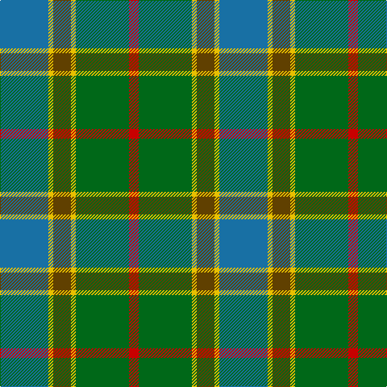

In pattern [BYGYGR](/patterns/bygygr/).

This was sourced from register-of-tartans.  It is a [6 stripes tartan](/stripes/stripes6/).

Original link https://www.tartanregister.gov.uk/tartanDetails.aspx?ref=4866

## Thread count
B/60 Y6 T22 Y6 G66 R/12

## Palette
Each colour and its ΔE from the base-6 reference it is a variant of.

| Colour | Shade | Base | ΔE (OKLab) |
|---|---|---|---|
| B | <code style="background-color:#1870A4;">#1870A4</code> `#1870A4` | B <code style="background-color:#2C4084;">#2C4084</code> | 0.14 |
| G | <code style="background-color:#006818;">#006818</code> `#006818` | G <code style="background-color:#006400;">#006400</code> | 0.02 |
| R | <code style="background-color:#C80000;">#C80000</code> `#C80000` | R <code style="background-color:#C80000;">#C80000</code> | 0.00 |
| T | <code style="background-color:#604000;">#604000</code> `#604000` | G <code style="background-color:#006400;">#006400</code> | 0.14 |
| Y | <code style="background-color:#E8C000;">#E8C000</code> `#E8C000` | Y <code style="background-color:#E8C000;">#E8C000</code> | 0.00 |

# Sample pattern

## Nearest tartans

The nearest existing variants by ΔTartan distance.

1. [Wellington (Lochcarron)](/setts/s5/k18y12b44g56ya4-b0c585c-g408060-k101010-y9ca8b0-yae8c000/) — ΔT 0.88
1. [Alvis of Lee Personal Tartan Tartan Number: 643. Earliest known date: 1985 Designed for the Baron of Lee See products available Copyright © Blair Urquhart, Comrie, 2015](/setts/s5/b9w4g36ba36r4-b202060-ba5c8ca8-g006818-rc80000-we0e0e0/) — ΔT 1.01
1. [City of Vancouver (Commemorative)](/setts/s6/g8y4g48w24ga48r4-g006818-ga408060-r880000-wc0c0c0-yd09800/) — ΔT 1.03
1. [Montrose (1983)](/setts/s6/g12y6g52k20b60w6-b5c5c5c-g004c2c-k101010-wc0c0c0-ybca010/) — ΔT 1.07
1. [Strange Of Balcaskie](/setts/s7/g64r14g14r32b64y6r16-b304080-g008000-r806050-yf0c000/) — ΔT 1.10
1. [Scottish Power (Corporate)](/setts/s8/g10ga64b10k20g16r6g16b6-b6c0070-g005448-ga408060-k101010-r880000/) — ΔT 1.11
1. [Graeme Heckenberg Hunting](/setts/s7/b6g26y2r6y2b20ya2-b1f3d7a-g4d7326-r761a1a-y8397a7-yafaa706/) — ΔT 1.12
1. [Simple Technology (Corporate)](/setts/s5/r6g56b18ga36w6-b2c2c80-g006818-ga003820-rc80000-we0e0e0/) — ΔT 1.17
1. [Alvis of Lee (Personal)](/setts/s5/b9w4g36ba36r4-b1c0070-ba5c8ca8-g228b22-rc80000-we0e0e0/) — ΔT 1.17
1. [Corey (Name)](/setts/s5/b64g32ga6y8gb56-b1474b4-g604000-ga006818-gb003820-yd87c00/) — ΔT 1.17

## Neighbour map

Every grey dot is one of 15726 variants placed by the first two principal components of the ΔTartan feature space (44% of its variance). Red is this tartan; blue dots are its nearest — click one to open its page.

<svg viewBox="0 0 640 380" role="img" style="max-width:100%;height:auto;border:1px solid #e0e0e0;border-radius:4px;display:block" xmlns="http://www.w3.org/2000/svg"><image href="/nn/cloud.v1.png" width="640" height="380"/><a href="/setts/s5/k18y12b44g56ya4-b0c585c-g408060-k101010-y9ca8b0-yae8c000/"><circle cx="226.8" cy="215.9" r="4" fill="#3465a4"><title>Wellington (Lochcarron)</title></circle></a><a href="/setts/s5/b9w4g36ba36r4-b202060-ba5c8ca8-g006818-rc80000-we0e0e0/"><circle cx="216.2" cy="215.6" r="4" fill="#3465a4"><title>Alvis of Lee Personal Tartan Tartan Number: 643. Earliest known date: 1985 Designed for the Baron of Lee See products available Copyright © Blair Urquhart, Comrie, 2015</title></circle></a><a href="/setts/s6/g8y4g48w24ga48r4-g006818-ga408060-r880000-wc0c0c0-yd09800/"><circle cx="242.7" cy="208.5" r="4" fill="#3465a4"><title>City of Vancouver (Commemorative)</title></circle></a><a href="/setts/s6/g12y6g52k20b60w6-b5c5c5c-g004c2c-k101010-wc0c0c0-ybca010/"><circle cx="250.6" cy="221.6" r="4" fill="#3465a4"><title>Montrose (1983)</title></circle></a><a href="/setts/s7/g64r14g14r32b64y6r16-b304080-g008000-r806050-yf0c000/"><circle cx="234.7" cy="229.6" r="4" fill="#3465a4"><title>Strange Of Balcaskie</title></circle></a><a href="/setts/s8/g10ga64b10k20g16r6g16b6-b6c0070-g005448-ga408060-k101010-r880000/"><circle cx="238.9" cy="190.8" r="4" fill="#3465a4"><title>Scottish Power (Corporate)</title></circle></a><a href="/setts/s7/b6g26y2r6y2b20ya2-b1f3d7a-g4d7326-r761a1a-y8397a7-yafaa706/"><circle cx="257.5" cy="185.4" r="4" fill="#3465a4"><title>Graeme Heckenberg Hunting</title></circle></a><a href="/setts/s5/r6g56b18ga36w6-b2c2c80-g006818-ga003820-rc80000-we0e0e0/"><circle cx="231.4" cy="226.9" r="4" fill="#3465a4"><title>Simple Technology (Corporate)</title></circle></a><a href="/setts/s5/b9w4g36ba36r4-b1c0070-ba5c8ca8-g228b22-rc80000-we0e0e0/"><circle cx="210.3" cy="212.6" r="4" fill="#3465a4"><title>Alvis of Lee (Personal)</title></circle></a><a href="/setts/s5/b64g32ga6y8gb56-b1474b4-g604000-ga006818-gb003820-yd87c00/"><circle cx="214.1" cy="232.0" r="4" fill="#3465a4"><title>Corey (Name)</title></circle></a><circle cx="213.0" cy="203.8" r="5" fill="#c00000"/></svg>

ID: /setts/s6/b60y6g22y6ga66r12-b1870a4-g604000-ga006818-rc80000-ye8c000/
