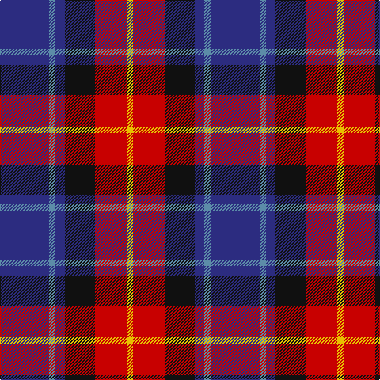

In pattern [BBBKRY](/patterns/bbbkry/).

This was sourced from register-of-tartans.  It is a [6 stripes tartan](/stripes/stripes6/).

Original link https://www.tartanregister.gov.uk/tartanDetails.aspx?ref=1180

## Thread count
DB/62 B8 DB12 K38 R40 Y/8

## Palette
Each colour and its ΔE from the base-6 reference it is a variant of.

| Colour | Shade | Base | ΔE (OKLab) |
|---|---|---|---|
| B | <code style="background-color:#5C8CA8;">#5C8CA8</code> `#5C8CA8` | B <code style="background-color:#2C4084;">#2C4084</code> | 0.23 |
| DB | <code style="background-color:#2C2C80;">#2C2C80</code> `#2C2C80` | B <code style="background-color:#2C4084;">#2C4084</code> | 0.05 |
| K | <code style="background-color:#101010;">#101010</code> `#101010` | K <code style="background-color:#000000;">#000000</code> | 0.17 |
| R | <code style="background-color:#C80000;">#C80000</code> `#C80000` | R <code style="background-color:#C80000;">#C80000</code> | 0.00 |
| Y | <code style="background-color:#E8C000;">#E8C000</code> `#E8C000` | Y <code style="background-color:#E8C000;">#E8C000</code> | 0.00 |

# Sample pattern

## Nearest tartans

The nearest existing variants by ΔTartan distance.

1. [Fife](/setts/s6/b62ba8b12k38r40y8-b304080-ba5480b0-k000000-rc00000-yf0c000/) — ΔT 0.69
1. [Dunbog Primary School Corporate Tartan Tartan Number: 954. Earliest known date: 1985 C. Armstrong is a pupil at the school. See products available Copyright © Blair Urquhart, Comrie, 2015](/setts/s6/r24b6g10ba32y4g4-b2c2c80-ba202060-g006818-rc80000-ye8c000/) — ΔT 0.86
1. [Trinity College, Toronto Uni. (Corp](/setts/s5/k16r32b16ba80y16-b5c8ca8-ba1c1c50-k101010-rc80000-ybc8c00/) — ΔT 0.97
1. [Dunbog, Primary School](/setts/s6/r24b6g10ba32y4g4-b304080-ba000050-g008000-rc00000-yf0c000/) — ΔT 1.04
1. [Clinton (Personal)](/setts/s8/w10b12r36k16ba10k8b54w6-b2c2c80-ba7878a8-k101010-rd40000-we0e0e0/) — ΔT 1.04
1. [Stovell (2015)](/setts/s6/b90r36g48k12w12k12-b202060-g005020-k101010-rb03000-wf8f4d0/) — ΔT 1.06
1. [Wilson's, No 111](/setts/s5/b38w4g24ba6k8-b800080-ba5480b0-g008000-k000000-we0e0e0/) — ΔT 1.09
1. [Thom(p)son's, Fancy](/setts/s6/r12ra48b12ba24k24ba6-b304080-ba5480b0-k000000-rc00000-ra806050/) — ΔT 1.10
1. [Le Mirage (Corporate?)](/setts/s10/b36ba15r25w5k6b35ba15r7w5k6-b1c1c50-ba2c2c80-k101010-rc80000-we0e0e0/) — ΔT 1.16
1. [Open Championship (1998)](/setts/s6/w4b40ba4bb30r18w4-b1c0070-ba5c5c5c-bb1c1c1c-r880000-wc0c0c0/) — ΔT 1.17

## Neighbour map

Every grey dot is one of 15726 variants placed by the first two principal components of the ΔTartan feature space (44% of its variance). Red is this tartan; blue dots are its nearest — click one to open its page.

<svg viewBox="0 0 640 380" role="img" style="max-width:100%;height:auto;border:1px solid #e0e0e0;border-radius:4px;display:block" xmlns="http://www.w3.org/2000/svg"><image href="/nn/cloud.v1.png" width="640" height="380"/><a href="/setts/s6/b62ba8b12k38r40y8-b304080-ba5480b0-k000000-rc00000-yf0c000/"><circle cx="168.9" cy="202.3" r="4" fill="#3465a4"><title>Fife</title></circle></a><a href="/setts/s6/r24b6g10ba32y4g4-b2c2c80-ba202060-g006818-rc80000-ye8c000/"><circle cx="177.9" cy="198.2" r="4" fill="#3465a4"><title>Dunbog Primary School Corporate Tartan Tartan Number: 954. Earliest known date: 1985 C. Armstrong is a pupil at the school. See products available Copyright © Blair Urquhart, Comrie, 2015</title></circle></a><a href="/setts/s5/k16r32b16ba80y16-b5c8ca8-ba1c1c50-k101010-rc80000-ybc8c00/"><circle cx="204.1" cy="228.3" r="4" fill="#3465a4"><title>Trinity College, Toronto Uni. (Corp</title></circle></a><a href="/setts/s6/r24b6g10ba32y4g4-b304080-ba000050-g008000-rc00000-yf0c000/"><circle cx="157.1" cy="193.2" r="4" fill="#3465a4"><title>Dunbog, Primary School</title></circle></a><a href="/setts/s8/w10b12r36k16ba10k8b54w6-b2c2c80-ba7878a8-k101010-rd40000-we0e0e0/"><circle cx="169.7" cy="170.1" r="4" fill="#3465a4"><title>Clinton (Personal)</title></circle></a><a href="/setts/s6/b90r36g48k12w12k12-b202060-g005020-k101010-rb03000-wf8f4d0/"><circle cx="178.9" cy="208.3" r="4" fill="#3465a4"><title>Stovell (2015)</title></circle></a><a href="/setts/s5/b38w4g24ba6k8-b800080-ba5480b0-g008000-k000000-we0e0e0/"><circle cx="206.8" cy="191.8" r="4" fill="#3465a4"><title>Wilson's, No 111</title></circle></a><a href="/setts/s6/r12ra48b12ba24k24ba6-b304080-ba5480b0-k000000-rc00000-ra806050/"><circle cx="132.6" cy="210.0" r="4" fill="#3465a4"><title>Thom(p)son's, Fancy</title></circle></a><a href="/setts/s10/b36ba15r25w5k6b35ba15r7w5k6-b1c1c50-ba2c2c80-k101010-rc80000-we0e0e0/"><circle cx="182.0" cy="190.0" r="4" fill="#3465a4"><title>Le Mirage (Corporate?)</title></circle></a><a href="/setts/s6/w4b40ba4bb30r18w4-b1c0070-ba5c5c5c-bb1c1c1c-r880000-wc0c0c0/"><circle cx="201.4" cy="200.1" r="4" fill="#3465a4"><title>Open Championship (1998)</title></circle></a><circle cx="186.2" cy="208.1" r="5" fill="#c00000"/></svg>

ID: /setts/s6/b62ba8b12k38r40y8-b2c2c80-ba5c8ca8-k101010-rc80000-ye8c000/
