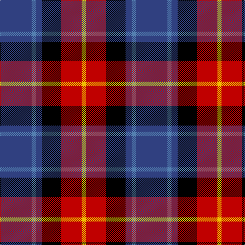

In pattern [BBBKRY](/patterns/bbbkry/).

This was sourced from weddslist.  It is a [6 stripes tartan](/stripes/stripes6/).

Original link http://www.weddslist.com/cgi-bin/tartans/pg.pl?source=sts

## Thread count
B/62 Ba8 B12 K38 R40 Y/8

## Palette
Each colour and its ΔE from the base-6 reference it is a variant of.

| Colour | Shade | Base | ΔE (OKLab) |
|---|---|---|---|
| B | <code style="background-color:#304080;">#304080</code> `#304080` | B <code style="background-color:#2A418A;">#2A418A</code> | 0.02 |
| Ba | <code style="background-color:#5480B0;">#5480B0</code> `#5480B0` | B <code style="background-color:#2A418A;">#2A418A</code> | 0.19 |
| K | <code style="background-color:#000000;">#000000</code> `#000000` | K <code style="background-color:#000000;">#000000</code> | 0.00 |
| R | <code style="background-color:#C00000;">#C00000</code> `#C00000` | R <code style="background-color:#CC0000;">#CC0000</code> | 0.03 |
| Y | <code style="background-color:#F0C000;">#F0C000</code> `#F0C000` | Y <code style="background-color:#F2BF00;">#F2BF00</code> | 0.00 |

# Sample pattern

## Nearest tartans

The nearest existing variants by ΔTartan distance.

1. [Fife (McGill)](/setts/s6/b62ba8b12k38r40y8-b2c2c80-ba5c8ca8-k101010-rc80000-ye8c000/) — ΔT 0.69
1. [Dunbog, Primary School](/setts/s6/r24b6g10ba32y4g4-b304080-ba000050-g008000-rc00000-yf0c000/) — ΔT 0.75
1. [Novotel, The](/setts/s5/k6r22ka52g22ra6-g503c14-k101010-ka000028-rdc0000-rafa4b00/) — ΔT 0.96
1. [Wilson's, No 111](/setts/s5/b38w4g24ba6k8-b800080-ba5480b0-g008000-k000000-we0e0e0/) — ΔT 1.01
1. [Dunbog Primary (School)](/setts/s6/r24b6g10b32y4g4-b000048-g447438-rc80000-ye8c000/) — ΔT 1.07
1. [Dunbog Primary School Corporate Tartan Tartan Number: 954. Earliest known date: 1985 C. Armstrong is a pupil at the school. See products available Copyright © Blair Urquhart, Comrie, 2015](/setts/s6/r24b6g10ba32y4g4-b2c2c80-ba202060-g006818-rc80000-ye8c000/) — ΔT 1.09
1. [Jewell of Kernow (Personal)](/setts/s6/w12k58r58b14k6ra6-b600060-k101010-r888888-rac80000-we0e0e0/) — ΔT 1.12
1. [Thom(p)son's, Fancy](/setts/s6/r12ra48b12ba24k24ba6-b304080-ba5480b0-k000000-rc00000-ra806050/) — ΔT 1.12
1. [University of Notre Dame](/setts/s6/r10b70k50b16y20r10-b2c2c80-k101010-rc80000-yfccc00/) — ΔT 1.12
1. [Trinity College, Toronto Uni. (Corp](/setts/s5/k16r32b16ba80y16-b5c8ca8-ba1c1c50-k101010-rc80000-ybc8c00/) — ΔT 1.14

## Neighbour map

Every grey dot is one of 15726 variants placed by the first two principal components of the ΔTartan feature space (44% of its variance). Red is this tartan; blue dots are its nearest — click one to open its page.

<svg viewBox="0 0 640 380" role="img" style="max-width:100%;height:auto;border:1px solid #e0e0e0;border-radius:4px;display:block" xmlns="http://www.w3.org/2000/svg"><image href="/nn/cloud.v1.png" width="640" height="380"/><a href="/setts/s6/b62ba8b12k38r40y8-b2c2c80-ba5c8ca8-k101010-rc80000-ye8c000/"><circle cx="186.2" cy="208.1" r="4" fill="#3465a4"><title>Fife (McGill)</title></circle></a><a href="/setts/s6/r24b6g10ba32y4g4-b304080-ba000050-g008000-rc00000-yf0c000/"><circle cx="157.1" cy="193.2" r="4" fill="#3465a4"><title>Dunbog, Primary School</title></circle></a><a href="/setts/s5/k6r22ka52g22ra6-g503c14-k101010-ka000028-rdc0000-rafa4b00/"><circle cx="213.3" cy="207.9" r="4" fill="#3465a4"><title>Novotel, The</title></circle></a><a href="/setts/s5/b38w4g24ba6k8-b800080-ba5480b0-g008000-k000000-we0e0e0/"><circle cx="206.8" cy="191.8" r="4" fill="#3465a4"><title>Wilson's, No 111</title></circle></a><a href="/setts/s6/r24b6g10b32y4g4-b000048-g447438-rc80000-ye8c000/"><circle cx="222.1" cy="210.0" r="4" fill="#3465a4"><title>Dunbog Primary (School)</title></circle></a><a href="/setts/s6/r24b6g10ba32y4g4-b2c2c80-ba202060-g006818-rc80000-ye8c000/"><circle cx="177.9" cy="198.2" r="4" fill="#3465a4"><title>Dunbog Primary School Corporate Tartan Tartan Number: 954. Earliest known date: 1985 C. Armstrong is a pupil at the school. See products available Copyright © Blair Urquhart, Comrie, 2015</title></circle></a><a href="/setts/s6/w12k58r58b14k6ra6-b600060-k101010-r888888-rac80000-we0e0e0/"><circle cx="185.9" cy="177.7" r="4" fill="#3465a4"><title>Jewell of Kernow (Personal)</title></circle></a><a href="/setts/s6/r12ra48b12ba24k24ba6-b304080-ba5480b0-k000000-rc00000-ra806050/"><circle cx="132.6" cy="210.0" r="4" fill="#3465a4"><title>Thom(p)son's, Fancy</title></circle></a><a href="/setts/s6/r10b70k50b16y20r10-b2c2c80-k101010-rc80000-yfccc00/"><circle cx="218.9" cy="221.0" r="4" fill="#3465a4"><title>University of Notre Dame</title></circle></a><a href="/setts/s5/k16r32b16ba80y16-b5c8ca8-ba1c1c50-k101010-rc80000-ybc8c00/"><circle cx="204.1" cy="228.3" r="4" fill="#3465a4"><title>Trinity College, Toronto Uni. (Corp</title></circle></a><circle cx="168.9" cy="202.3" r="5" fill="#c00000"/></svg>

ID: /setts/s6/b62ba8b12k38r40y8-b304080-ba5480b0-k000000-rc00000-yf0c000/
