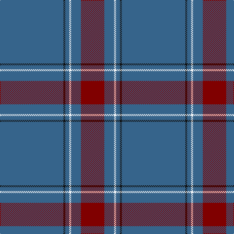

In pattern [BKBKBR](/patterns/bkbkbr/).

This was sourced from register-of-tartans.  It is a [6 stripes tartan](/stripes/stripes6/).

Original link https://www.tartanregister.gov.uk/tartanDetails.aspx?ref=10200

## Thread count
B/130 K4 B8 DN4 B20 DR/48

## Palette
Each colour and its ΔE from the base-6 reference it is a variant of.

| Colour | Shade | Base | ΔE (OKLab) |
|---|---|---|---|
| B | <code style="background-color:#36648B;">#36648B</code> `#36648B` | B <code style="background-color:#2A418A;">#2A418A</code> | 0.11 |
| DR | <code style="background-color:#800000;">#800000</code> `#800000` | R <code style="background-color:#CC0000;">#CC0000</code> | 0.17 |
| K | <code style="background-color:#101010;">#101010</code> `#101010` | K <code style="background-color:#000000;">#000000</code> | 0.17 |

# Sample pattern

## Nearest tartans

The nearest existing variants by ΔTartan distance.

1. [Norsemen (Corporate)](/setts/s6/b65k2b4y2b10r24~b506880-k101010-r880000-ya0a0a0~x2/) — ΔT 1.11
1. [Highland Autumn (Fashion)](/setts/s8/r2b2k2b28k8b9k1y2~b5c5c5c-k101010-r880000-ybc8c00~x2/) — ΔT 1.24
1. [St. Giles Cathedral (Corporate)](/setts/s6/b2ba2w1ba18w2r2~b202060-ba5c5c5c-r880000-wc0c0c0~x4/) — ΔT 1.26
1. [London Scottish Rugby Club](/setts/s6/r5b40w1b13g8k4~b003c64-g006818-k101010-rc80000-we0e0e0~x2/) — ΔT 1.41
1. [Munster Ancestry](/setts/s8/b4ba48b21ba14y3ba6b1ya3~b332c2c-ba146a99-yc4950c-yae7b205~x2/) — ΔT 1.48
1. [Salvation Army Hunting Corporate Tartan Tartan Number: 150. Earliest known date: 1983 Designed to be ready for the Perth Citadel Corps Centenary. The hunting version replaces red with green. See products available Copyright © Blair Urquhart, Comrie, 2015](/setts/s7/b40g8k1y2k1g8b5~b2c2c80-g006818-k101010-ye8c000~x4/) — ΔT 1.51
1. [St Giles, Check](/setts/s7/b3g1w1g25w1g1ba3~b304080-ba800080-g808080-we0e0e0~x2/) — ΔT 1.56
1. [Wilson](/setts/s6/b48g14r3g2r3g2~b304080-g008000-rc00000~x2/) — ΔT 1.60
1. [Wilson #2](/setts/s6/b48g14r3g2r3g2~b2c4084-g005020-rdc0000~x2/) — ΔT 1.62
1. [Royal Conservatoire of Scotland](/setts/s8/b11ba13g11ba7b11g3b90ba11~b3c82af-ba440044-g604000/) — ΔT 1.63

## Neighbour map

Every grey dot is one of 15726 variants placed by the first two principal components of the ΔTartan feature space (44% of its variance). Red is this tartan; blue dots are its nearest — click one to open its page.

<svg viewBox="0 0 640 380" role="img" style="max-width:100%;height:auto;border:1px solid #e0e0e0;border-radius:4px;display:block" xmlns="http://www.w3.org/2000/svg"><image href="/nn/cloud.v1.png" width="640" height="380"/><a href="/setts/s6/b65k2b4y2b10r24~b506880-k101010-r880000-ya0a0a0~x2/"><circle cx="579.3" cy="182.0" r="4" fill="#3465a4"><title>Norsemen (Corporate)</title></circle></a><a href="/setts/s8/r2b2k2b28k8b9k1y2~b5c5c5c-k101010-r880000-ybc8c00~x2/"><circle cx="517.3" cy="163.1" r="4" fill="#3465a4"><title>Highland Autumn (Fashion)</title></circle></a><a href="/setts/s6/b2ba2w1ba18w2r2~b202060-ba5c5c5c-r880000-wc0c0c0~x4/"><circle cx="521.0" cy="184.1" r="4" fill="#3465a4"><title>St. Giles Cathedral (Corporate)</title></circle></a><a href="/setts/s6/r5b40w1b13g8k4~b003c64-g006818-k101010-rc80000-we0e0e0~x2/"><circle cx="522.9" cy="166.6" r="4" fill="#3465a4"><title>London Scottish Rugby Club</title></circle></a><a href="/setts/s8/b4ba48b21ba14y3ba6b1ya3~b332c2c-ba146a99-yc4950c-yae7b205~x2/"><circle cx="502.3" cy="152.3" r="4" fill="#3465a4"><title>Munster Ancestry</title></circle></a><a href="/setts/s7/b40g8k1y2k1g8b5~b2c2c80-g006818-k101010-ye8c000~x4/"><circle cx="501.1" cy="149.7" r="4" fill="#3465a4"><title>Salvation Army Hunting Corporate Tartan Tartan Number: 150. Earliest known date: 1983 Designed to be ready for the Perth Citadel Corps Centenary. The hunting version replaces red with green. See products available Copyright © Blair Urquhart, Comrie, 2015</title></circle></a><a href="/setts/s7/b3g1w1g25w1g1ba3~b304080-ba800080-g808080-we0e0e0~x2/"><circle cx="574.1" cy="152.4" r="4" fill="#3465a4"><title>St Giles, Check</title></circle></a><a href="/setts/s6/b48g14r3g2r3g2~b304080-g008000-rc00000~x2/"><circle cx="488.3" cy="186.8" r="4" fill="#3465a4"><title>Wilson</title></circle></a><a href="/setts/s6/b48g14r3g2r3g2~b2c4084-g005020-rdc0000~x2/"><circle cx="519.0" cy="200.1" r="4" fill="#3465a4"><title>Wilson #2</title></circle></a><a href="/setts/s8/b11ba13g11ba7b11g3b90ba11~b3c82af-ba440044-g604000/"><circle cx="512.5" cy="163.8" r="4" fill="#3465a4"><title>Royal Conservatoire of Scotland</title></circle></a><circle cx="551.4" cy="174.9" r="5" fill="#c00000"/></svg>

ID: /setts/s6/b65k2b4ka2b10r24~b36648b-k101010-ka000000-r800000~x2/
