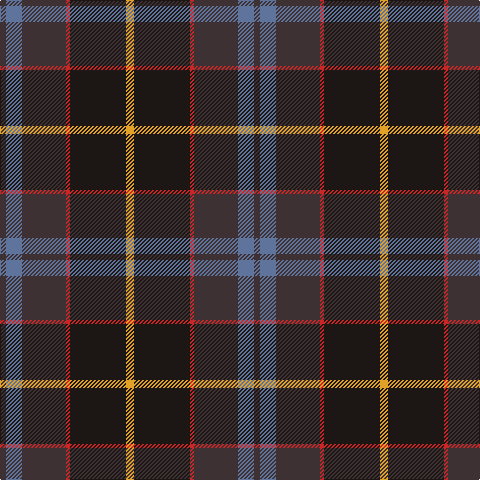

In pattern [BBBRKY](/patterns/bbbrky/).

This was sourced from register-of-tartans.  It is a [6 stripes tartan](/stripes/stripes6/).

Original link https://www.tartanregister.gov.uk/tartanDetails.aspx?ref=10391

## Thread count
T/6 B16 T44 R4 K56 Y/8

## Palette
Each colour and its ΔE from the base-6 reference it is a variant of.

| Colour | Shade | Base | ΔE (OKLab) |
|---|---|---|---|
| B | <code style="background-color:#5F749C;">#5F749C</code> `#5F749C` | B <code style="background-color:#2C4084;">#2C4084</code> | 0.17 |
| K | <code style="background-color:#1C1714;">#1C1714</code> `#1C1714` | K <code style="background-color:#000000;">#000000</code> | 0.21 |
| R | <code style="background-color:#CA2625;">#CA2625</code> `#CA2625` | R <code style="background-color:#C80000;">#C80000</code> | 0.03 |
| T | <code style="background-color:#3D3134;">#3D3134</code> `#3D3134` | B <code style="background-color:#2C4084;">#2C4084</code> | 0.14 |
| Y | <code style="background-color:#E0A126;">#E0A126</code> `#E0A126` | Y <code style="background-color:#E8C000;">#E8C000</code> | 0.08 |

# Sample pattern

ID: /setts/s6/b6ba16b44r4k56y8-b3d3134-ba5f749c-k1c1714-rca2625-ye0a126/
