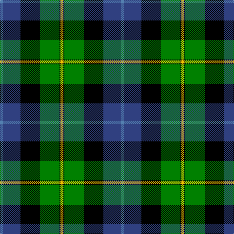

In pattern [BBKGKY](/patterns/bbkgky/).

This was sourced from weddslist.  It is a [6 stripes tartan](/stripes/stripes6/).

Original link http://www.weddslist.com/cgi-bin/tartans/pg.pl?source=sts

## Thread count
Ba/6 B36 K40 G40 K2 Y/6

## Palette
Each colour and its ΔE from the base-6 reference it is a variant of.

| Colour | Shade | Base | ΔE (OKLab) |
|---|---|---|---|
| B | <code style="background-color:#304080;">#304080</code> `#304080` | B <code style="background-color:#2C4084;">#2C4084</code> | 0.01 |
| Ba | <code style="background-color:#5480B0;">#5480B0</code> `#5480B0` | B <code style="background-color:#2C4084;">#2C4084</code> | 0.20 |
| G | <code style="background-color:#008000;">#008000</code> `#008000` | G <code style="background-color:#006400;">#006400</code> | 0.09 |
| K | <code style="background-color:#000000;">#000000</code> `#000000` | K <code style="background-color:#000000;">#000000</code> | 0.00 |
| Y | <code style="background-color:#F0C000;">#F0C000</code> `#F0C000` | Y <code style="background-color:#E8C000;">#E8C000</code> | 0.01 |

# Sample pattern

## Nearest tartans

The nearest existing variants by ΔTartan distance.

1. [Wilson's, No 221](/setts/s6/b2ba28r4k28g28r2-b5480b0-ba304080-g008000-k000000-rc00000/) — ΔT 0.67
1. [MacWilliam](/setts/s6/r4g24k20ra2b32ra4-b304080-g008000-k000000-r806050-rac00000/) — ΔT 0.81
1. [Russell, or Mitchell or Hunter or Galbraith](/setts/s6/k4g24k24r2b24w4-b304080-g008000-k000000-rc00000-we0e0e0/) — ΔT 0.83
1. [New York, Firemen's Pipe Band](/setts/s6/k14w3g42k36b40ba10-b304080-ba5480b0-g008000-k000000-we0e0e0/) — ΔT 0.84
1. [Whitson](/setts/s8/w8k2g36k34b26r2b6r2-b304080-g008000-k000000-rc00000-we0e0e0/) — ΔT 0.87
1. [MacCaskill](/setts/s7/k4r2g30k30b30y2k4-b304080-g008000-k000000-rc00000-yf0c000/) — ΔT 0.92
1. [Forsyth](/setts/s6/k8g44y4k32b36r8-b304080-g008000-k000000-rc00000-yf0c000/) — ΔT 0.98
1. [Forsyth (1795)](/setts/s6/k8g44y4k32b36r8-b1474b4-g007800-k000000-rc80000-ye8c000/) — ΔT 1.00
1. [MacFadzean, MacPhedran](/setts/s7/g6b24w2k24g26r4g4-b304080-g008000-k000000-rc00000-we0e0e0/) — ΔT 1.02
1. [MacPhadran](/setts/s7/g6b24y2k24g26r4g4-b304080-g008000-k000000-rc00000-yb0b0b0/) — ΔT 1.02

## Neighbour map

Every grey dot is one of 15726 variants placed by the first two principal components of the ΔTartan feature space (44% of its variance). Red is this tartan; blue dots are its nearest — click one to open its page.

<svg viewBox="0 0 640 380" role="img" style="max-width:100%;height:auto;border:1px solid #e0e0e0;border-radius:4px;display:block" xmlns="http://www.w3.org/2000/svg"><image href="/nn/cloud.v1.png" width="640" height="380"/><a href="/setts/s6/b2ba28r4k28g28r2-b5480b0-ba304080-g008000-k000000-rc00000/"><circle cx="137.1" cy="180.1" r="4" fill="#3465a4"><title>Wilson's, No 221</title></circle></a><a href="/setts/s6/r4g24k20ra2b32ra4-b304080-g008000-k000000-r806050-rac00000/"><circle cx="166.0" cy="177.6" r="4" fill="#3465a4"><title>MacWilliam</title></circle></a><a href="/setts/s6/k4g24k24r2b24w4-b304080-g008000-k000000-rc00000-we0e0e0/"><circle cx="132.3" cy="189.4" r="4" fill="#3465a4"><title>Russell, or Mitchell or Hunter or Galbraith</title></circle></a><a href="/setts/s6/k14w3g42k36b40ba10-b304080-ba5480b0-g008000-k000000-we0e0e0/"><circle cx="128.4" cy="197.2" r="4" fill="#3465a4"><title>New York, Firemen's Pipe Band</title></circle></a><a href="/setts/s8/w8k2g36k34b26r2b6r2-b304080-g008000-k000000-rc00000-we0e0e0/"><circle cx="137.8" cy="143.2" r="4" fill="#3465a4"><title>Whitson</title></circle></a><a href="/setts/s7/k4r2g30k30b30y2k4-b304080-g008000-k000000-rc00000-yf0c000/"><circle cx="173.4" cy="165.8" r="4" fill="#3465a4"><title>MacCaskill</title></circle></a><a href="/setts/s6/k8g44y4k32b36r8-b304080-g008000-k000000-rc00000-yf0c000/"><circle cx="123.2" cy="196.1" r="4" fill="#3465a4"><title>Forsyth</title></circle></a><a href="/setts/s6/k8g44y4k32b36r8-b1474b4-g007800-k000000-rc80000-ye8c000/"><circle cx="116.9" cy="194.4" r="4" fill="#3465a4"><title>Forsyth (1795)</title></circle></a><a href="/setts/s7/g6b24w2k24g26r4g4-b304080-g008000-k000000-rc00000-we0e0e0/"><circle cx="162.5" cy="177.8" r="4" fill="#3465a4"><title>MacFadzean, MacPhedran</title></circle></a><a href="/setts/s7/g6b24y2k24g26r4g4-b304080-g008000-k000000-rc00000-yb0b0b0/"><circle cx="164.5" cy="178.8" r="4" fill="#3465a4"><title>MacPhadran</title></circle></a><circle cx="143.9" cy="169.0" r="5" fill="#c00000"/></svg>

ID: /setts/s6/b6ba36k40g40k2y6-b5480b0-ba304080-g008000-k000000-yf0c000/
