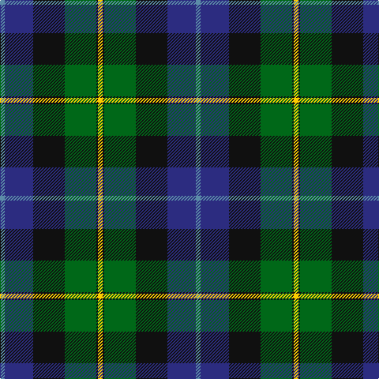

In pattern [BBKGKY](/patterns/bbkgky/).

This was sourced from tartans-authority.  It is a [6 stripes tartan](/stripes/stripes6/).

Original link http://www.tartansauthority.com/tartan-ferret/display/65/

## Thread count
B/6 DB36 K40 G40 K2 Y/6

## Palette
Each colour and its ΔE from the base-6 reference it is a variant of.

| Colour | Shade | Base | ΔE (OKLab) |
|---|---|---|---|
| B | <code style="background-color:#5C8CA8;">#5C8CA8</code> `#5C8CA8` | B <code style="background-color:#2A418A;">#2A418A</code> | 0.23 |
| DB | <code style="background-color:#2C2C80;">#2C2C80</code> `#2C2C80` | B <code style="background-color:#2A418A;">#2A418A</code> | 0.06 |
| G | <code style="background-color:#006818;">#006818</code> `#006818` | G <code style="background-color:#006100;">#006100</code> | 0.02 |
| K | <code style="background-color:#101010;">#101010</code> `#101010` | K <code style="background-color:#000000;">#000000</code> | 0.17 |
| Y | <code style="background-color:#FCCC00;">#FCCC00</code> `#FCCC00` | Y <code style="background-color:#F2BF00;">#F2BF00</code> | 0.04 |

# Sample pattern

## Nearest tartans

The nearest existing variants by ΔTartan distance.

1. [MacCormick](/setts/s7/w6k2g40k32b40k2y6-b2c2c80-g006818-k101010-we0e0e0-ye8c000/) — ΔT 0.66
1. [MacWilliam (Clan)](/setts/s6/g8ga48k40r4b64r8-b1474b4-g604000-ga006818-k101010-rc80000/) — ΔT 0.81
1. [Ferguson - 1830 of Atholl (Clan)](/setts/s7/b36k20g12r8g12k2w4-b202060-g006818-k101010-rc80000-wfcfcfc/) — ΔT 0.82
1. [Russell Clan Tartan Tartan Number: 1094. Earliest known date: c.1815 It seems certain that the tartan was first known as Galbraith. William Wilson and Sons of Bannockburn recorded the pattern as Russell in their pattern book of 1847, although it was named Hunter in the earlier book of 1819. See products available Copyright © Blair Urquhart, Comrie, 2015](/setts/s6/k4g24k24r2b24w4-b2c2c80-g006818-k101010-rc80000-we0e0e0/) — ΔT 0.83
1. [MacWilliam](/setts/s6/r4g24k20ra2b32ra4-b304080-g008000-k000000-r806050-rac00000/) — ΔT 0.86
1. [New York Firemen's Pipe Band Corporate Tartan Tartan Number: 60. Earliest known date: 1964 Nothing See products available Copyright © Blair Urquhart, Comrie, 2015](/setts/s6/k14w3g42k36b40ba10-b2c2c80-ba5c8ca8-g006818-k101010-we0e0e0/) — ΔT 0.88
1. [Whitson #2](/setts/s8/w8k2g36k34b26r2b6r2-b2c4084-g005020-k101010-rdc0000-we0e0e0/) — ΔT 0.88
1. [New York Fire Department Pipe Band](/setts/s6/k16w4g52k44b44wa12-b2c2c80-g006818-k101010-wf8f8f8-waa8ace8/) — ΔT 0.93
1. [Russell or Mitchell or Hunter or Galbraith](/setts/s6/k4g24k24r2b24w4-b2c4084-g005020-k101010-rdc0000-we0e0e0/) — ΔT 0.94
1. [Naysmith (Name)](/setts/s6/r12b64k36g56k2w4-b2c2c80-g006818-k101010-rc80000-w98c8e8/) — ΔT 0.99

## Neighbour map

Every grey dot is one of 15726 variants placed by the first two principal components of the ΔTartan feature space (44% of its variance). Red is this tartan; blue dots are its nearest — click one to open its page.

<svg viewBox="0 0 640 380" role="img" style="max-width:100%;height:auto;border:1px solid #e0e0e0;border-radius:4px;display:block" xmlns="http://www.w3.org/2000/svg"><image href="/nn/cloud.v1.png" width="640" height="380"/><a href="/setts/s7/w6k2g40k32b40k2y6-b2c2c80-g006818-k101010-we0e0e0-ye8c000/"><circle cx="166.8" cy="157.7" r="4" fill="#3465a4"><title>MacCormick</title></circle></a><a href="/setts/s6/g8ga48k40r4b64r8-b1474b4-g604000-ga006818-k101010-rc80000/"><circle cx="188.9" cy="187.6" r="4" fill="#3465a4"><title>MacWilliam (Clan)</title></circle></a><a href="/setts/s7/b36k20g12r8g12k2w4-b202060-g006818-k101010-rc80000-wfcfcfc/"><circle cx="185.1" cy="172.7" r="4" fill="#3465a4"><title>Ferguson - 1830 of Atholl (Clan)</title></circle></a><a href="/setts/s6/k4g24k24r2b24w4-b2c2c80-g006818-k101010-rc80000-we0e0e0/"><circle cx="163.8" cy="201.0" r="4" fill="#3465a4"><title>Russell Clan Tartan Tartan Number: 1094. Earliest known date: c.1815 It seems certain that the tartan was first known as Galbraith. William Wilson and Sons of Bannockburn recorded the pattern as Russell in their pattern book of 1847, although it was named Hunter in the earlier book of 1819. See products available Copyright © Blair Urquhart, Comrie, 2015</title></circle></a><a href="/setts/s6/r4g24k20ra2b32ra4-b304080-g008000-k000000-r806050-rac00000/"><circle cx="166.0" cy="177.6" r="4" fill="#3465a4"><title>MacWilliam</title></circle></a><a href="/setts/s6/k14w3g42k36b40ba10-b2c2c80-ba5c8ca8-g006818-k101010-we0e0e0/"><circle cx="166.3" cy="211.6" r="4" fill="#3465a4"><title>New York Firemen's Pipe Band Corporate Tartan Tartan Number: 60. Earliest known date: 1964 Nothing See products available Copyright © Blair Urquhart, Comrie, 2015</title></circle></a><a href="/setts/s8/w8k2g36k34b26r2b6r2-b2c4084-g005020-k101010-rdc0000-we0e0e0/"><circle cx="173.5" cy="157.2" r="4" fill="#3465a4"><title>Whitson #2</title></circle></a><a href="/setts/s6/k16w4g52k44b44wa12-b2c2c80-g006818-k101010-wf8f8f8-waa8ace8/"><circle cx="149.5" cy="206.3" r="4" fill="#3465a4"><title>New York Fire Department Pipe Band</title></circle></a><a href="/setts/s6/k4g24k24r2b24w4-b2c4084-g005020-k101010-rdc0000-we0e0e0/"><circle cx="176.0" cy="206.9" r="4" fill="#3465a4"><title>Russell or Mitchell or Hunter or Galbraith</title></circle></a><a href="/setts/s6/r12b64k36g56k2w4-b2c2c80-g006818-k101010-rc80000-w98c8e8/"><circle cx="229.2" cy="162.8" r="4" fill="#3465a4"><title>Naysmith (Name)</title></circle></a><circle cx="174.8" cy="180.5" r="5" fill="#c00000"/></svg>

ID: /setts/s6/b6ba36k40g40k2y6-b5c8ca8-ba2c2c80-g006818-k101010-yfccc00/
