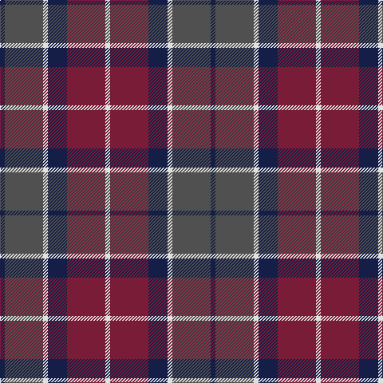

In pattern [BBWBRW](/patterns/bbwbrw/).

This was sourced from register-of-tartans.  It is a [6 stripes tartan](/stripes/stripes6/).

Original link https://www.tartanregister.gov.uk/tartanDetails.aspx?ref=5905

## Thread count
DB/6 N48 LN6 DB24 DR48 LN/6

## Palette
Each colour and its ΔE from the base-6 reference it is a variant of.

| Colour | Shade | Base | ΔE (OKLab) |
|---|---|---|---|
| DB | <code style="background-color:#141E46;">#141E46</code> `#141E46` | B <code style="background-color:#2C4084;">#2C4084</code> | 0.15 |
| DR | <code style="background-color:#781C38;">#781C38</code> `#781C38` | R <code style="background-color:#C80000;">#C80000</code> | 0.17 |
| LN | <code style="background-color:#E0E0E0;">#E0E0E0</code> `#E0E0E0` | W <code style="background-color:#F4F4F0;">#F4F4F0</code> | 0.06 |
| N | <code style="background-color:#505050;">#505050</code> `#505050` | B <code style="background-color:#2C4084;">#2C4084</code> | 0.12 |

# Sample pattern

ID: /setts/s6/b6ba48w6b24r48w6-b141e46-ba505050-r781c38-we0e0e0/
