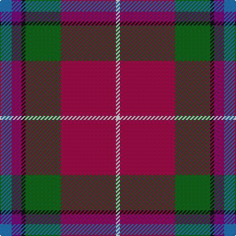

In pattern [BBKGRW](/patterns/bbkgrw/).

This was sourced from tartans-authority.  It is a [6 stripes tartan](/stripes/stripes6/).

Original link http://www.tartansauthority.com/tartan-ferret/display/10243/

## Thread count
B/12 P10 K4 G36 R56 LN/4

## Palette
Each colour and its ΔE from the base-6 reference it is a variant of.

| Colour | Shade | Base | ΔE (OKLab) |
|---|---|---|---|
| B | <code style="background-color:#1474B4;">#1474B4</code> `#1474B4` | B <code style="background-color:#2A418A;">#2A418A</code> | 0.15 |
| G | <code style="background-color:#006818;">#006818</code> `#006818` | G <code style="background-color:#006100;">#006100</code> | 0.02 |
| K | <code style="background-color:#101010;">#101010</code> `#101010` | K <code style="background-color:#000000;">#000000</code> | 0.17 |
| LN | <code style="background-color:#E0E0E0;">#E0E0E0</code> `#E0E0E0` | W <code style="background-color:#F7F7F7;">#F7F7F7</code> | 0.07 |
| P | <code style="background-color:#780078;">#780078</code> `#780078` | B <code style="background-color:#2A418A;">#2A418A</code> | 0.17 |
| R | <code style="background-color:#A00048;">#A00048</code> `#A00048` | R <code style="background-color:#CC0000;">#CC0000</code> | 0.12 |

# Sample pattern

## Nearest tartans

The nearest existing variants by ΔTartan distance.

1. [Pubcrawlers, The](/setts/s7/w3r4g2r22b5ra16y3x2~b1e1e1e-g1b3b1d-r846247-ra680d0d-wdfdfdf-ydfaf00/) — ΔT 1.01
1. [Gordon of Abergeldie (Portrait)](/setts/s6/r63w4k4b18y4g50x2~b780078-g005830-k101010-rc80000-wfcfcfc-yd8b000/) — ΔT 1.02
1. [MacLeod Society of Scotland](/setts/s6/g3ga3r22k5b22y2x2~b2c2c80-g006818-ga289c18-k101010-rc80000-ye8c000/) — ΔT 1.02
1. [Hewitt (Name)](/setts/s7/r30b12k3g12y2g3w2x2~b2c2c80-g006818-k101010-rc80000-we0e0e0-ye8c000/) — ΔT 1.09
1. [Traill Clan/Family Weavers Tartan Tartan Number: 3093. Earliest known date: 2002 The Traill tartan is for anyone tracing their ancestry to the Scottish 'Traills' - Traill of Blebo and descendants in Orkney and elsewhere. Blue is poor. See products available Copyright © Blair Urquhart, Comrie, 2015](/setts/s7/r16y2g7y2b24k2ga2x2~b1474b4-g604000-ga006818-k101010-r800000-ye8c000/) — ΔT 1.14
1. [Hewitt](/setts/s7/r30b12k6g12y2g3w2x2~b2c4084-g005020-k101010-rdc0000-we0e0e0-ye8c000/) — ΔT 1.17
1. [Dundhuin](/setts/s6/y6r5k2g18ra28w2x2~g6a8a67-k1c1714-r905966-ra9d2123-wf9f5ef-y99a3ba/) — ΔT 1.18
1. [Scottish American Society of Michigan (Official)](/setts/s6/r48b16y5g17w8k3x2~b5f749c-g23321b-k000000-rb62531-wf9f5ef-ye0a126/) — ΔT 1.19
1. [Moray of Abercairney Clan Tartan Tartan Number: 51. Earliest known date: 1735 The sett is derived from the portrait of James, 14th Laird, painted about 1735. Historians have made different interpretations of the tartan. The tartan is similar to other Perthshire setts but not to the Clan Murray tartan. See products available Copyright © Blair Urquhart, Comrie, 2015](/setts/s9/b3ba1k1r12ra1g9r1ba1b3x4~b2c2c80-ba2888c4-g006818-k101010-rc80000-rad05054/) — ΔT 1.19
1. [Traill (Personal)](/setts/s7/r16y2g7y2b24k2ga2x2~b2888c4-g604000-ga289c18-k101010-rc80000-ye8c000/) — ΔT 1.23

## Neighbour map

Every grey dot is one of 15726 variants placed by the first two principal components of the ΔTartan feature space (44% of its variance). Red is this tartan; blue dots are its nearest — click one to open its page.

<svg viewBox="0 0 640 380" role="img" style="max-width:100%;height:auto;border:1px solid #e0e0e0;border-radius:4px;display:block" xmlns="http://www.w3.org/2000/svg"><image href="/nn/cloud.v1.png" width="640" height="380"/><a href="/setts/s7/w3r4g2r22b5ra16y3x2~b1e1e1e-g1b3b1d-r846247-ra680d0d-wdfdfdf-ydfaf00/"><circle cx="237.0" cy="161.8" r="4" fill="#3465a4"><title>Pubcrawlers, The</title></circle></a><a href="/setts/s6/r63w4k4b18y4g50x2~b780078-g005830-k101010-rc80000-wfcfcfc-yd8b000/"><circle cx="241.7" cy="141.0" r="4" fill="#3465a4"><title>Gordon of Abergeldie (Portrait)</title></circle></a><a href="/setts/s6/g3ga3r22k5b22y2x2~b2c2c80-g006818-ga289c18-k101010-rc80000-ye8c000/"><circle cx="186.5" cy="157.5" r="4" fill="#3465a4"><title>MacLeod Society of Scotland</title></circle></a><a href="/setts/s7/r30b12k3g12y2g3w2x2~b2c2c80-g006818-k101010-rc80000-we0e0e0-ye8c000/"><circle cx="229.9" cy="130.2" r="4" fill="#3465a4"><title>Hewitt (Name)</title></circle></a><a href="/setts/s7/r16y2g7y2b24k2ga2x2~b1474b4-g604000-ga006818-k101010-r800000-ye8c000/"><circle cx="209.9" cy="149.2" r="4" fill="#3465a4"><title>Traill Clan/Family Weavers Tartan Tartan Number: 3093. Earliest known date: 2002 The Traill tartan is for anyone tracing their ancestry to the Scottish 'Traills' - Traill of Blebo and descendants in Orkney and elsewhere. Blue is poor. See products available Copyright © Blair Urquhart, Comrie, 2015</title></circle></a><a href="/setts/s7/r30b12k6g12y2g3w2x2~b2c4084-g005020-k101010-rdc0000-we0e0e0-ye8c000/"><circle cx="206.7" cy="132.0" r="4" fill="#3465a4"><title>Hewitt</title></circle></a><a href="/setts/s6/y6r5k2g18ra28w2x2~g6a8a67-k1c1714-r905966-ra9d2123-wf9f5ef-y99a3ba/"><circle cx="257.5" cy="159.2" r="4" fill="#3465a4"><title>Dundhuin</title></circle></a><a href="/setts/s6/r48b16y5g17w8k3x2~b5f749c-g23321b-k000000-rb62531-wf9f5ef-ye0a126/"><circle cx="231.4" cy="136.6" r="4" fill="#3465a4"><title>Scottish American Society of Michigan (Official)</title></circle></a><a href="/setts/s9/b3ba1k1r12ra1g9r1ba1b3x4~b2c2c80-ba2888c4-g006818-k101010-rc80000-rad05054/"><circle cx="200.0" cy="130.4" r="4" fill="#3465a4"><title>Moray of Abercairney Clan Tartan Tartan Number: 51. Earliest known date: 1735 The sett is derived from the portrait of James, 14th Laird, painted about 1735. Historians have made different interpretations of the tartan. The tartan is similar to other Perthshire setts but not to the Clan Murray tartan. See products available Copyright © Blair Urquhart, Comrie, 2015</title></circle></a><a href="/setts/s7/r16y2g7y2b24k2ga2x2~b2888c4-g604000-ga289c18-k101010-rc80000-ye8c000/"><circle cx="201.5" cy="140.0" r="4" fill="#3465a4"><title>Traill (Personal)</title></circle></a><circle cx="238.8" cy="155.7" r="5" fill="#c00000"/></svg>

ID: /setts/s6/b6ba5k2g18r28w2x2~b1474b4-ba780078-g006818-k101010-ra00048-we0e0e0/
