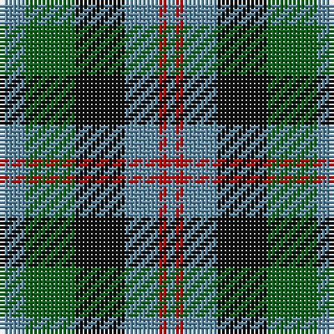

In pattern [BGKBRB](/patterns/bgkbrb/).

This was sourced from house-of-tartan.  It is a [6 stripes tartan](/stripes/stripes6/).

Original link http://www.house-of-tartan.scotland.net/house/TartanViewjs.asp?colr=Def&tnam=154

## Thread count
B/6 G12 K12 B8 R2 B/2

## Palette
Each colour and its ΔE from the base-6 reference it is a variant of.

| Colour | Shade | Base | ΔE (OKLab) |
|---|---|---|---|
| B | <code style="background-color:#5C8CA8;">#5C8CA8</code> `#5C8CA8` | B <code style="background-color:#2C4084;">#2C4084</code> | 0.23 |
| G | <code style="background-color:#006818;">#006818</code> `#006818` | G <code style="background-color:#006400;">#006400</code> | 0.02 |
| K | <code style="background-color:#101010;">#101010</code> `#101010` | K <code style="background-color:#000000;">#000000</code> | 0.17 |
| R | <code style="background-color:#C80000;">#C80000</code> `#C80000` | R <code style="background-color:#C80000;">#C80000</code> | 0.00 |

# Sample pattern

## Nearest tartans

The nearest existing variants by ΔTartan distance.

1. [Waterloo](/setts/s6/g6ga12k12g8r2g2-g789484-ga003820-k101010-rc80000/) — ΔT 0.49
1. [Wellington or Waterloo](/setts/s6/b6g24k28b22r6b6-b3c82af-g005020-k101010-rdc0000/) — ΔT 0.68
1. [Melville](/setts/s6/k8w4g26k26ga24k4-g408060-ga608c9c-k101010-wfcfcfc/) — ΔT 0.71
1. [Morrison Society](/setts/s6/k6g28k28g4b28r6-b1474b4-g006818-k101010-rc80000/) — ΔT 0.77
1. [Fletcher of Dunans](/setts/s7/b20k6b20k28r4g28r10-b1870a4-g006818-k101010-rc80000/) — ΔT 0.79
1. [Tennant](/setts/s7/r4b28g28b28g28ba28r4-b304080-ba401000-g008000-rc00000/) — ΔT 0.98
1. [Blaylock Annandale](/setts/s7/g48b12w6k12b24k30g8-b1f5aba-g10712e-k101010-w9eafdb/) — ΔT 0.99
1. [Redland](/setts/s6/g52w7g9k35b35k7-b2c2c80-g006818-k101010-w98c8e8/) — ΔT 1.05
1. [Gunn - 1810 (Clan)](/setts/s6/r8g24k24g4b24g6-b1c0070-g006818-k101010-rc80000/) — ΔT 1.06
1. [Wellington, or Waterloo](/setts/s6/b6g12k12b8r2b2-b5480b0-g008000-k000000-rc00000/) — ΔT 1.07

## Neighbour map

Every grey dot is one of 15726 variants placed by the first two principal components of the ΔTartan feature space (44% of its variance). Red is this tartan; blue dots are its nearest — click one to open its page.

<svg viewBox="0 0 640 380" role="img" style="max-width:100%;height:auto;border:1px solid #e0e0e0;border-radius:4px;display:block" xmlns="http://www.w3.org/2000/svg"><image href="/nn/cloud.v1.png" width="640" height="380"/><a href="/setts/s6/g6ga12k12g8r2g2-g789484-ga003820-k101010-rc80000/"><circle cx="155.3" cy="252.6" r="4" fill="#3465a4"><title>Waterloo</title></circle></a><a href="/setts/s6/b6g24k28b22r6b6-b3c82af-g005020-k101010-rdc0000/"><circle cx="146.9" cy="261.8" r="4" fill="#3465a4"><title>Wellington or Waterloo</title></circle></a><a href="/setts/s6/k8w4g26k26ga24k4-g408060-ga608c9c-k101010-wfcfcfc/"><circle cx="164.1" cy="237.3" r="4" fill="#3465a4"><title>Melville</title></circle></a><a href="/setts/s6/k6g28k28g4b28r6-b1474b4-g006818-k101010-rc80000/"><circle cx="159.7" cy="244.3" r="4" fill="#3465a4"><title>Morrison Society</title></circle></a><a href="/setts/s7/b20k6b20k28r4g28r10-b1870a4-g006818-k101010-rc80000/"><circle cx="138.8" cy="247.8" r="4" fill="#3465a4"><title>Fletcher of Dunans</title></circle></a><a href="/setts/s7/r4b28g28b28g28ba28r4-b304080-ba401000-g008000-rc00000/"><circle cx="177.8" cy="261.4" r="4" fill="#3465a4"><title>Tennant</title></circle></a><a href="/setts/s7/g48b12w6k12b24k30g8-b1f5aba-g10712e-k101010-w9eafdb/"><circle cx="185.9" cy="232.5" r="4" fill="#3465a4"><title>Blaylock Annandale</title></circle></a><a href="/setts/s6/g52w7g9k35b35k7-b2c2c80-g006818-k101010-w98c8e8/"><circle cx="204.3" cy="243.0" r="4" fill="#3465a4"><title>Redland</title></circle></a><a href="/setts/s6/r8g24k24g4b24g6-b1c0070-g006818-k101010-rc80000/"><circle cx="164.8" cy="260.4" r="4" fill="#3465a4"><title>Gunn - 1810 (Clan)</title></circle></a><a href="/setts/s6/b6g12k12b8r2b2-b5480b0-g008000-k000000-rc00000/"><circle cx="126.0" cy="243.8" r="4" fill="#3465a4"><title>Wellington, or Waterloo</title></circle></a><circle cx="154.5" cy="253.7" r="5" fill="#c00000"/></svg>

ID: /setts/s6/b6g12k12b8r2b2-b5c8ca8-g006818-k101010-rc80000/
