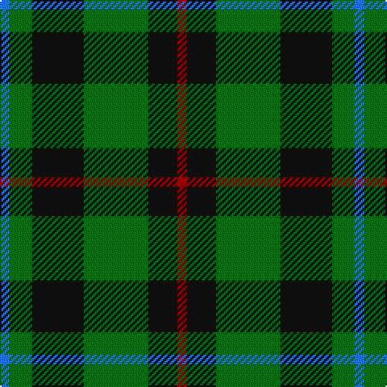

In pattern [BGKGKR](/patterns/bgkgkr/).

This was sourced from tartans-authority.  It is a [6 stripes tartan](/stripes/stripes6/).

Original link http://www.tartansauthority.com/tartan-ferret/display/2646/

## Thread count
B/6 G14 K32 G40 K18 DR/6

## Palette
Each colour and its ΔE from the base-6 reference it is a variant of.

| Colour | Shade | Base | ΔE (OKLab) |
|---|---|---|---|
| B | <code style="background-color:#2474E8;">#2474E8</code> `#2474E8` | B <code style="background-color:#2A418A;">#2A418A</code> | 0.19 |
| DR | <code style="background-color:#880000;">#880000</code> `#880000` | R <code style="background-color:#CC0000;">#CC0000</code> | 0.15 |
| G | <code style="background-color:#006818;">#006818</code> `#006818` | G <code style="background-color:#006100;">#006100</code> | 0.02 |
| K | <code style="background-color:#101010;">#101010</code> `#101010` | K <code style="background-color:#000000;">#000000</code> | 0.17 |

# Sample pattern

## Nearest tartans

The nearest existing variants by ΔTartan distance.

1. [Sinclair Hunting](/setts/s7/g12r4g26k12w4k32r6-g005020-k101010-r960028-we0e0e0/) — ΔT 0.95
1. [Salvation Army Htg (Corporate)](/setts/s7/b20g32k4y8k4g32b16-b1c1c50-g285800-k101010-ycca800/) — ΔT 0.96
1. [Menteith District Tartan Tartan Number: 929. Earliest known date: Mid 19th century Menteith lies in the upper reaches of the River Forth. The tartan is similar to the Graham of Mentieth sett recorded by Logan in 1831. The proportions of colours are quite distinct, however, and the azure stipe in the family tartan is replaced by white in the district. The Menteith district tartan was rescued from oblivion in 1941 by Graeme Menteith who wrote to MacGregor-Hastie about it. (STS archives) See products available Copyright © Blair Urquhart, Comrie, 2015](/setts/s6/g18w2g12k14b14k2-b2c2c80-g006818-k101010-we0e0e0/) — ΔT 0.98
1. [Menteith](/setts/s6/g36w4g24k28b28k4-b1c0070-g006818-k101010-wc0c0c0/) — ΔT 1.00
1. [Trafalgar (Fashion)](/setts/s6/g6b2g16b14k6y2-b2c2c80-g006818-k101010-ye8c000/) — ΔT 1.02
1. [Cameron Hunting](/setts/s7/r6g20r6g28b32g6y4-b000052-g11450d-raa0000-yaaaa00/) — ΔT 1.03
1. [Cameron Hunting](/setts/s7/r3g10r3g14b16g3y2-b000052-g11450d-raa0000-yaaaa00/) — ΔT 1.03
1. [Wcwm 1045](/setts/s6/g4b16g4k6g24r4-b346488-g004c00-k000000-r8c0000/) — ΔT 1.05
1. [Cameron Hunting](/setts/s7/r3g10r3g14b16g3y2-b000064-g004c00-rc80000-yffc800/) — ΔT 1.11
1. [MacCallum Clan Tartan Tartan Number: 767. Earliest known date: 1893 D. W. Stewart wrote, "It is believed that the family (MacCallum), having lost trace of the old sett 50 or 60 years ago (i.e. 1832 - 1843), had the modern design prepared from the recollection of old people in Argyllshire; but the recovery of the original design shows that considerable deviation had been made." 'Old and Rare Scottish Tartans' recorded just 45 tartans, specially woven in silk, of particular interest or antiquity. Copies of the book are now valuable collectors items. See products available Copyright © Blair Urquhart, Comrie, 2015](/setts/s7/g16k4b2g8k12ba12k2-b5c8ca8-ba2c2c80-g006818-k101010/) — ΔT 1.12

## Neighbour map

Every grey dot is one of 15726 variants placed by the first two principal components of the ΔTartan feature space (44% of its variance). Red is this tartan; blue dots are its nearest — click one to open its page.

<svg viewBox="0 0 640 380" role="img" style="max-width:100%;height:auto;border:1px solid #e0e0e0;border-radius:4px;display:block" xmlns="http://www.w3.org/2000/svg"><image href="/nn/cloud.v1.png" width="640" height="380"/><a href="/setts/s7/g12r4g26k12w4k32r6-g005020-k101010-r960028-we0e0e0/"><circle cx="251.4" cy="234.9" r="4" fill="#3465a4"><title>Sinclair Hunting</title></circle></a><a href="/setts/s7/b20g32k4y8k4g32b16-b1c1c50-g285800-k101010-ycca800/"><circle cx="293.6" cy="247.9" r="4" fill="#3465a4"><title>Salvation Army Htg (Corporate)</title></circle></a><a href="/setts/s6/g18w2g12k14b14k2-b2c2c80-g006818-k101010-we0e0e0/"><circle cx="231.3" cy="250.8" r="4" fill="#3465a4"><title>Menteith District Tartan Tartan Number: 929. Earliest known date: Mid 19th century Menteith lies in the upper reaches of the River Forth. The tartan is similar to the Graham of Mentieth sett recorded by Logan in 1831. The proportions of colours are quite distinct, however, and the azure stipe in the family tartan is replaced by white in the district. The Menteith district tartan was rescued from oblivion in 1941 by Graeme Menteith who wrote to MacGregor-Hastie about it. (STS archives) See products available Copyright © Blair Urquhart, Comrie, 2015</title></circle></a><a href="/setts/s6/g36w4g24k28b28k4-b1c0070-g006818-k101010-wc0c0c0/"><circle cx="230.3" cy="251.2" r="4" fill="#3465a4"><title>Menteith</title></circle></a><a href="/setts/s6/g6b2g16b14k6y2-b2c2c80-g006818-k101010-ye8c000/"><circle cx="246.1" cy="243.8" r="4" fill="#3465a4"><title>Trafalgar (Fashion)</title></circle></a><a href="/setts/s7/r6g20r6g28b32g6y4-b000052-g11450d-raa0000-yaaaa00/"><circle cx="283.0" cy="237.6" r="4" fill="#3465a4"><title>Cameron Hunting</title></circle></a><a href="/setts/s7/r3g10r3g14b16g3y2-b000052-g11450d-raa0000-yaaaa00/"><circle cx="283.0" cy="237.6" r="4" fill="#3465a4"><title>Cameron Hunting</title></circle></a><a href="/setts/s6/g4b16g4k6g24r4-b346488-g004c00-k000000-r8c0000/"><circle cx="292.2" cy="255.0" r="4" fill="#3465a4"><title>Wcwm 1045</title></circle></a><a href="/setts/s7/r3g10r3g14b16g3y2-b000064-g004c00-rc80000-yffc800/"><circle cx="261.3" cy="227.6" r="4" fill="#3465a4"><title>Cameron Hunting</title></circle></a><a href="/setts/s7/g16k4b2g8k12ba12k2-b5c8ca8-ba2c2c80-g006818-k101010/"><circle cx="218.8" cy="250.0" r="4" fill="#3465a4"><title>MacCallum Clan Tartan Tartan Number: 767. Earliest known date: 1893 D. W. Stewart wrote, &quot;It is believed that the family (MacCallum), having lost trace of the old sett 50 or 60 years ago (i.e. 1832 - 1843), had the modern design prepared from the recollection of old people in Argyllshire; but the recovery of the original design shows that considerable deviation had been made.&quot; 'Old and Rare Scottish Tartans' recorded just 45 tartans, specially woven in silk, of particular interest or antiquity. Copies of the book are now valuable collectors items. See products available Copyright © Blair Urquhart, Comrie, 2015</title></circle></a><circle cx="250.2" cy="259.6" r="5" fill="#c00000"/></svg>

ID: /setts/s6/b6g14k32g40k18r6-b2474e8-g006818-k101010-r880000/
