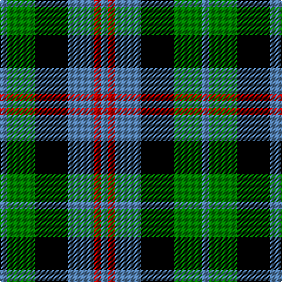

In pattern [BGKBRB](/patterns/bgkbrb/).

This was sourced from weddslist.  It is a [6 stripes tartan](/stripes/stripes6/).

Original link http://www.weddslist.com/cgi-bin/tartans/pg.pl?source=sts

## Thread count
B/6 G24 K28 B22 R6 B/6

## Palette
Each colour and its ΔE from the base-6 reference it is a variant of.

| Colour | Shade | Base | ΔE (OKLab) |
|---|---|---|---|
| B | <code style="background-color:#5480B0;">#5480B0</code> `#5480B0` | B <code style="background-color:#2C4084;">#2C4084</code> | 0.20 |
| G | <code style="background-color:#008000;">#008000</code> `#008000` | G <code style="background-color:#006400;">#006400</code> | 0.09 |
| K | <code style="background-color:#000000;">#000000</code> `#000000` | K <code style="background-color:#000000;">#000000</code> | 0.00 |
| R | <code style="background-color:#C00000;">#C00000</code> `#C00000` | R <code style="background-color:#C80000;">#C80000</code> | 0.02 |

# Sample pattern

## Nearest tartans

The nearest existing variants by ΔTartan distance.

1. [Wellington, or Waterloo](/setts/s6/b6g12k12b8r2b2-b5480b0-g008000-k000000-rc00000/) — ΔT 0.46
1. [Lennie](/setts/s6/g4b16k18ba4g20k4-b800080-ba5480b0-g008000-k000000/) — ΔT 0.72
1. [Campbell, The White Stripe](/setts/s6/b4k4b24k22g24w4-b304080-g008000-k000000-we0e0e0/) — ΔT 0.78
1. [Murray](/setts/s6/b4k4b24k16g22r4-b304080-g008000-k000000-rc00000/) — ΔT 0.81
1. [Unnamed, No 26](/setts/s6/w4b4g22k20b20w3-b304080-g008000-k000000-we0e0e0/) — ΔT 0.88
1. [Melville](/setts/s6/k8w4g26k26ga24k4-g408060-ga608c9c-k101010-wfcfcfc/) — ΔT 0.92
1. [Herd/Hurd](/setts/s6/b6g24k26w4b26w6-b2c2c80-g006818-k101010-wfcfcfc/) — ΔT 0.95
1. [Fletcher #2](/setts/s7/b20k6b20k28r4g28k8-b1474b4-g007800-k000000-rc80000/) — ΔT 0.95
1. [MacKay](/setts/s6/g2b10g2k10g12y2-b304080-g008000-k000000-yf0c000/) — ΔT 0.97
1. [Morrison](/setts/s6/k6g28k28g4b28r6-b304080-g008000-k000000-rc00000/) — ΔT 1.00

## Neighbour map

Every grey dot is one of 15726 variants placed by the first two principal components of the ΔTartan feature space (44% of its variance). Red is this tartan; blue dots are its nearest — click one to open its page.

<svg viewBox="0 0 640 380" role="img" style="max-width:100%;height:auto;border:1px solid #e0e0e0;border-radius:4px;display:block" xmlns="http://www.w3.org/2000/svg"><image href="/nn/cloud.v1.png" width="640" height="380"/><a href="/setts/s6/b6g12k12b8r2b2-b5480b0-g008000-k000000-rc00000/"><circle cx="126.0" cy="243.8" r="4" fill="#3465a4"><title>Wellington, or Waterloo</title></circle></a><a href="/setts/s6/g4b16k18ba4g20k4-b800080-ba5480b0-g008000-k000000/"><circle cx="124.6" cy="244.4" r="4" fill="#3465a4"><title>Lennie</title></circle></a><a href="/setts/s6/b4k4b24k22g24w4-b304080-g008000-k000000-we0e0e0/"><circle cx="126.2" cy="235.3" r="4" fill="#3465a4"><title>Campbell, The White Stripe</title></circle></a><a href="/setts/s6/b4k4b24k16g22r4-b304080-g008000-k000000-rc00000/"><circle cx="149.3" cy="238.9" r="4" fill="#3465a4"><title>Murray</title></circle></a><a href="/setts/s6/w4b4g22k20b20w3-b304080-g008000-k000000-we0e0e0/"><circle cx="114.6" cy="224.1" r="4" fill="#3465a4"><title>Unnamed, No 26</title></circle></a><a href="/setts/s6/k8w4g26k26ga24k4-g408060-ga608c9c-k101010-wfcfcfc/"><circle cx="164.1" cy="237.3" r="4" fill="#3465a4"><title>Melville</title></circle></a><a href="/setts/s6/b6g24k26w4b26w6-b2c2c80-g006818-k101010-wfcfcfc/"><circle cx="123.0" cy="235.5" r="4" fill="#3465a4"><title>Herd/Hurd</title></circle></a><a href="/setts/s7/b20k6b20k28r4g28k8-b1474b4-g007800-k000000-rc80000/"><circle cx="128.4" cy="237.6" r="4" fill="#3465a4"><title>Fletcher #2</title></circle></a><a href="/setts/s6/g2b10g2k10g12y2-b304080-g008000-k000000-yf0c000/"><circle cx="154.3" cy="237.3" r="4" fill="#3465a4"><title>MacKay</title></circle></a><a href="/setts/s6/k6g28k28g4b28r6-b304080-g008000-k000000-rc00000/"><circle cx="133.8" cy="234.5" r="4" fill="#3465a4"><title>Morrison</title></circle></a><circle cx="113.2" cy="248.3" r="5" fill="#c00000"/></svg>

ID: /setts/s6/b6g24k28b22r6b6-b5480b0-g008000-k000000-rc00000/
