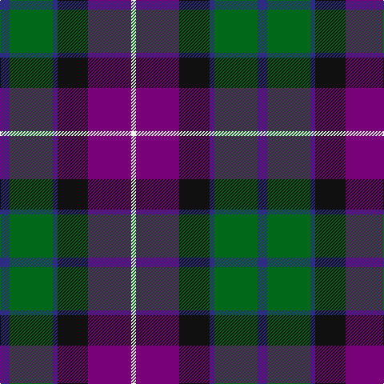

In pattern [BGBKBW](/patterns/bgbkbw/).

This was sourced from register-of-tartans.  It is a [6 stripes tartan](/stripes/stripes6/).

Original link https://www.tartanregister.gov.uk/tartanDetails.aspx?ref=1444

## Attestations

This cloth appears in 2 source records; the oldest owns this page.

- 01/05/2005 — Gold Brothers (register-of-tartans, [record](https://www.tartanregister.gov.uk/tartanDetails.aspx?ref=1444))
- 2005 May — Freedom (Fashion) (tartans-authority, [record](http://www.tartansauthority.com/tartan-ferret/display/6865/))

## Thread count
DB/12 G54 DB6 K38 P54 W/6

## Palette
Each colour and its ΔE from the base-6 reference it is a variant of.

| Colour | Shade | Base | ΔE (OKLab) |
|---|---|---|---|
| DB | <code style="background-color:#2C2C80;">#2C2C80</code> `#2C2C80` | B <code style="background-color:#2A418A;">#2A418A</code> | 0.06 |
| G | <code style="background-color:#006818;">#006818</code> `#006818` | G <code style="background-color:#006100;">#006100</code> | 0.02 |
| K | <code style="background-color:#101010;">#101010</code> `#101010` | K <code style="background-color:#000000;">#000000</code> | 0.17 |
| P | <code style="background-color:#780078;">#780078</code> `#780078` | B <code style="background-color:#2A418A;">#2A418A</code> | 0.17 |
| W | <code style="background-color:#F8F8F8;">#F8F8F8</code> `#F8F8F8` | W <code style="background-color:#F7F7F7;">#F7F7F7</code> | 0.00 |

# Sample pattern

## Nearest tartans

The nearest existing variants by ΔTartan distance.

1. [Colquhoun #3](/setts/s7/b6k3b21k23w3g24r3x2~b5a008c-g005020-k101010-rdc0000-we0e0e0/) — ΔT 0.68
1. [Fruin Colquhoun (Commemorative?)](/setts/s7/r5g19w3k19b19k3b2x2~b2c2c80-g00643c-k101010-rc80000-we0e0e0/) — ΔT 0.68
1. [Swankie (Personal)](/setts/s7/k4b21g10ga4k20r6b3x2~b1474b4-g604000-ga8c7038-k101010-rc80000/) — ΔT 0.69
1. [Syme (Clan)](/setts/s6/k1g8w1k8b8r1x4~b1c1c50-g408060-k101010-rc80000-wf8f8f8/) — ΔT 0.74
1. [Leslie Hunting Clan Tartan Tartan Number: 1113. Earliest known date: 1810-15 Said to have been worn by George 14th Earl of Rothes who died in 1841. This sett is shown by Smibert (1850) and by W & A Smith (1850) but without the definition of 'Hunting'. This sett is very similar to Duncan, the difference lies in the broad black present in the Leslie Hunting which is green in the Duncan See products available Copyright © Blair Urquhart, Comrie, 2015](/setts/s6/r2b8k8w1g8k1x2~b2c2c80-g006818-k101010-rc80000-we0e0e0/) — ΔT 0.76
1. [McEachern, Andrew](/setts/s6/b7w1r6ba10g10w1x4~b404040-ba000080-g00643c-rc8002c-wfffff0/) — ΔT 0.80
1. [Canine All Dogs (Fashion)](/setts/s6/r10b6g24ba24r6y3~b2c2c80-ba1c1c50-g006818-rc80000-ye8c000/) — ΔT 0.82
1. [Martin Hunting](/setts/s5/b20k5ka19g19y2x2~b780078-g006818-k000030-ka101010-ye8c000/) — ΔT 0.83
1. [Patterson, John (Personal)](/setts/s6/g3b12w1ga12r12ga2x2~b2c2c80-g006818-ga003820-rc80000-wfcfcfc/) — ΔT 0.83
1. [Commonwealth Games Council (Corp.)](/setts/s6/r3k17b11r2ra20w2x2~b484848-k101010-rb468ac-ra888888-we0e0e0/) — ΔT 0.83

## Neighbour map

Every grey dot is one of 15726 variants placed by the first two principal components of the ΔTartan feature space (44% of its variance). Red is this tartan; blue dots are its nearest — click one to open its page.

<svg viewBox="0 0 640 380" role="img" style="max-width:100%;height:auto;border:1px solid #e0e0e0;border-radius:4px;display:block" xmlns="http://www.w3.org/2000/svg"><image href="/nn/cloud.v1.png" width="640" height="380"/><a href="/setts/s7/b6k3b21k23w3g24r3x2~b5a008c-g005020-k101010-rdc0000-we0e0e0/"><circle cx="155.1" cy="203.3" r="4" fill="#3465a4"><title>Colquhoun #3</title></circle></a><a href="/setts/s7/r5g19w3k19b19k3b2x2~b2c2c80-g00643c-k101010-rc80000-we0e0e0/"><circle cx="144.6" cy="198.9" r="4" fill="#3465a4"><title>Fruin Colquhoun (Commemorative?)</title></circle></a><a href="/setts/s7/k4b21g10ga4k20r6b3x2~b1474b4-g604000-ga8c7038-k101010-rc80000/"><circle cx="144.3" cy="210.4" r="4" fill="#3465a4"><title>Swankie (Personal)</title></circle></a><a href="/setts/s6/k1g8w1k8b8r1x4~b1c1c50-g408060-k101010-rc80000-wf8f8f8/"><circle cx="144.8" cy="209.8" r="4" fill="#3465a4"><title>Syme (Clan)</title></circle></a><a href="/setts/s6/r2b8k8w1g8k1x2~b2c2c80-g006818-k101010-rc80000-we0e0e0/"><circle cx="135.7" cy="216.9" r="4" fill="#3465a4"><title>Leslie Hunting Clan Tartan Tartan Number: 1113. Earliest known date: 1810-15 Said to have been worn by George 14th Earl of Rothes who died in 1841. This sett is shown by Smibert (1850) and by W &amp; A Smith (1850) but without the definition of 'Hunting'. This sett is very similar to Duncan, the difference lies in the broad black present in the Leslie Hunting which is green in the Duncan See products available Copyright © Blair Urquhart, Comrie, 2015</title></circle></a><a href="/setts/s6/b7w1r6ba10g10w1x4~b404040-ba000080-g00643c-rc8002c-wfffff0/"><circle cx="101.3" cy="207.1" r="4" fill="#3465a4"><title>McEachern, Andrew</title></circle></a><a href="/setts/s6/r10b6g24ba24r6y3~b2c2c80-ba1c1c50-g006818-rc80000-ye8c000/"><circle cx="139.5" cy="211.7" r="4" fill="#3465a4"><title>Canine All Dogs (Fashion)</title></circle></a><a href="/setts/s5/b20k5ka19g19y2x2~b780078-g006818-k000030-ka101010-ye8c000/"><circle cx="135.1" cy="226.0" r="4" fill="#3465a4"><title>Martin Hunting</title></circle></a><a href="/setts/s6/g3b12w1ga12r12ga2x2~b2c2c80-g006818-ga003820-rc80000-wfcfcfc/"><circle cx="166.8" cy="197.2" r="4" fill="#3465a4"><title>Patterson, John (Personal)</title></circle></a><a href="/setts/s6/r3k17b11r2ra20w2x2~b484848-k101010-rb468ac-ra888888-we0e0e0/"><circle cx="157.4" cy="190.0" r="4" fill="#3465a4"><title>Commonwealth Games Council (Corp.)</title></circle></a><circle cx="137.9" cy="204.2" r="5" fill="#c00000"/></svg>

ID: /setts/s6/b6g27b3k19ba27w3x2~b2c2c80-ba780078-g006818-k101010-wf8f8f8/
