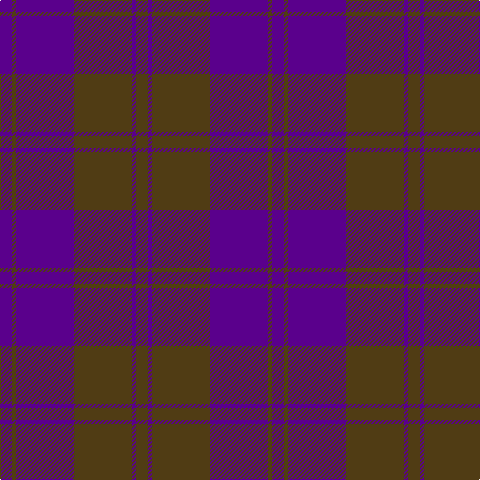

In pattern [BGBGBG](/patterns/bgbgbg/).

This was sourced from register-of-tartans.  It is a [6 stripes tartan](/stripes/stripes6/).

Original link https://www.tartanregister.gov.uk/tartanDetails.aspx?ref=1603

## Thread count
P/12 T4 P58 T58 P4 T/12

## Palette
Each colour and its ΔE from the base-6 reference it is a variant of.

| Colour | Shade | Base | ΔE (OKLab) |
|---|---|---|---|
| P | <code style="background-color:#5A008C;">#5A008C</code> `#5A008C` | B <code style="background-color:#2A418A;">#2A418A</code> | 0.13 |
| T | <code style="background-color:#503C14;">#503C14</code> `#503C14` | G <code style="background-color:#006100;">#006100</code> | 0.14 |

# Sample pattern

## Nearest tartans

The nearest existing variants by ΔTartan distance.

1. [Keeper of the Quaich Corporate Tartan Tartan Number: 1731. Earliest known date: 1988 Restricted. Sample in STS collection. See products available Copyright © Blair Urquhart, Comrie, 2015](/setts/s6/b3ba3b3ba27b40y3~b4c2424-ba2c2c80-ye8c000/) — ΔT 1.42
1. [Harmony, 11](/setts/s6/b6r2b29r29b2r6x2~b800080-r806050/) — ΔT 1.44
1. [Feniston (Personal)](/setts/s5/b30ba10b3ba30r3x2~b680028-ba202060-rec34c4/) — ΔT 1.50
1. [Hillsdale (Corporate?)](/setts/s5/b13ba6r51b51ba5x2~b1c1c50-ba5c5c5c-r880000/) — ΔT 1.52
1. [Sligo, County](/setts/s6/b50ba4b12ba23y4ba4x2~b303070-ba441800-yd8b000/) — ΔT 1.64
1. [Largan (?)](/setts/s6/b8k39b8k39b87r6~b2c2c80-k101010-rc80000/) — ΔT 1.67
1. [St. Mildreds Check (School)](/setts/s7/b4r1b18r18b1r1w1x2~b1c1c50-r901c38-we0e0e0/) — ΔT 1.71
1. [Mary Erskine School, The](/setts/s6/b6r1b24r28b1r4x2~b14283c-r880000/) — ΔT 1.74
1. [Gagetown (School)](/setts/s6/b2k11b5k1b5k1x6~b343498-k101010/) — ΔT 1.80
1. [Keepers of the Quaich](/setts/s6/y3g33b24g2b2g2x2~b2c2c80-g604000-yd09800/) — ΔT 1.80

## Neighbour map

Every grey dot is one of 15726 variants placed by the first two principal components of the ΔTartan feature space (44% of its variance). Red is this tartan; blue dots are its nearest — click one to open its page.

<svg viewBox="0 0 640 380" role="img" style="max-width:100%;height:auto;border:1px solid #e0e0e0;border-radius:4px;display:block" xmlns="http://www.w3.org/2000/svg"><image href="/nn/cloud.v1.png" width="640" height="380"/><a href="/setts/s6/b3ba3b3ba27b40y3~b4c2424-ba2c2c80-ye8c000/"><circle cx="456.7" cy="233.1" r="4" fill="#3465a4"><title>Keeper of the Quaich Corporate Tartan Tartan Number: 1731. Earliest known date: 1988 Restricted. Sample in STS collection. See products available Copyright © Blair Urquhart, Comrie, 2015</title></circle></a><a href="/setts/s6/b6r2b29r29b2r6x2~b800080-r806050/"><circle cx="475.0" cy="253.2" r="4" fill="#3465a4"><title>Harmony, 11</title></circle></a><a href="/setts/s5/b30ba10b3ba30r3x2~b680028-ba202060-rec34c4/"><circle cx="424.4" cy="277.7" r="4" fill="#3465a4"><title>Feniston (Personal)</title></circle></a><a href="/setts/s5/b13ba6r51b51ba5x2~b1c1c50-ba5c5c5c-r880000/"><circle cx="386.1" cy="262.7" r="4" fill="#3465a4"><title>Hillsdale (Corporate?)</title></circle></a><a href="/setts/s6/b50ba4b12ba23y4ba4x2~b303070-ba441800-yd8b000/"><circle cx="471.1" cy="243.2" r="4" fill="#3465a4"><title>Sligo, County</title></circle></a><a href="/setts/s6/b8k39b8k39b87r6~b2c2c80-k101010-rc80000/"><circle cx="427.8" cy="248.7" r="4" fill="#3465a4"><title>Largan (?)</title></circle></a><a href="/setts/s7/b4r1b18r18b1r1w1x2~b1c1c50-r901c38-we0e0e0/"><circle cx="421.7" cy="194.2" r="4" fill="#3465a4"><title>St. Mildreds Check (School)</title></circle></a><a href="/setts/s6/b6r1b24r28b1r4x2~b14283c-r880000/"><circle cx="494.7" cy="228.2" r="4" fill="#3465a4"><title>Mary Erskine School, The</title></circle></a><a href="/setts/s6/b2k11b5k1b5k1x6~b343498-k101010/"><circle cx="411.0" cy="276.4" r="4" fill="#3465a4"><title>Gagetown (School)</title></circle></a><a href="/setts/s6/y3g33b24g2b2g2x2~b2c2c80-g604000-yd09800/"><circle cx="439.7" cy="216.7" r="4" fill="#3465a4"><title>Keepers of the Quaich</title></circle></a><circle cx="451.4" cy="254.2" r="5" fill="#c00000"/></svg>

ID: /setts/s6/b6g2b29g29b2g6x2~b5a008c-g503c14/
