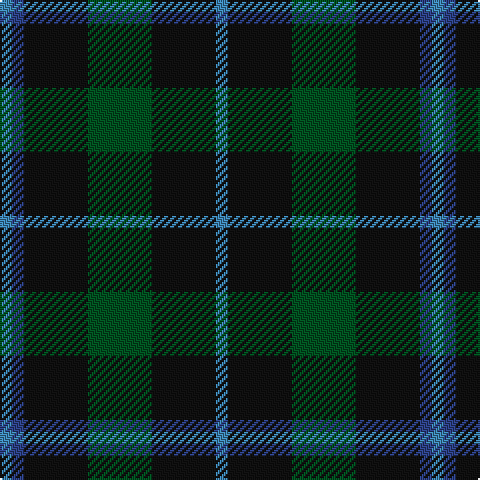

In pattern [BBKGKB](/patterns/bbkgkb/).

This was sourced from register-of-tartans.  It is a [6 stripes tartan](/stripes/stripes6/).

Original link https://www.tartanregister.gov.uk/tartanDetails.aspx?ref=3056

## Thread count
B/6 Ba6 K32 G32 K32 B/6

## Palette
Each colour and its ΔE from the base-6 reference it is a variant of.

| Colour | Shade | Base | ΔE (OKLab) |
|---|---|---|---|
| B | <code style="background-color:#3C82AF;">#3C82AF</code> `#3C82AF` | B <code style="background-color:#2A418A;">#2A418A</code> | 0.19 |
| Ba | <code style="background-color:#2C4084;">#2C4084</code> `#2C4084` | B <code style="background-color:#2A418A;">#2A418A</code> | 0.01 |
| G | <code style="background-color:#005020;">#005020</code> `#005020` | G <code style="background-color:#006100;">#006100</code> | 0.07 |
| K | <code style="background-color:#101010;">#101010</code> `#101010` | K <code style="background-color:#000000;">#000000</code> | 0.17 |

# Sample pattern

## Nearest tartans

The nearest existing variants by ΔTartan distance.

1. [Glen Nevis #1](/setts/s8/g16r4g4r6g16b24g4y4-b000064-g002814-r880000-yc89600/) — ΔT 1.00
1. [Bean of Freeport (Personal)](/setts/s7/b6r15g41r15b20g41ba6-b003c64-ba1c0070-g003820-rc8002c/) — ΔT 1.04
1. [Cameron Hunting](/setts/s7/r6g20r6g28b32g6y4-b000052-g11450d-raa0000-yaaaa00/) — ΔT 1.06
1. [Cameron Hunting](/setts/s7/r3g10r3g14b16g3y2-b000052-g11450d-raa0000-yaaaa00/) — ΔT 1.06
1. [Bean Hunting Clan Tartan Tartan Number: 106. Earliest known date: 1987 The weaving and wearing of this tartan is 'Restricted'. This is not a legal definition and is applied by the Scottish Tartans Society irrespective of Design Patent or Copyright, in the spirit of a gentlemans agreement. Interested parties should contact the person listed under 'Source:' in this document. See products available Copyright © Blair Urquhart, Comrie, 2015](/setts/s7/b6g41ba20r15g41r15ba6-b1c0070-ba202060-g003820-rc8002c/) — ΔT 1.08
1. [Wcwm 1045](/setts/s6/g4b16g4k6g24r4-b346488-g004c00-k000000-r8c0000/) — ΔT 1.13
1. [Duncan](/setts/s6/k8g42y6g42b42r8-b000052-g11450d-k000000-raa0000-yaaaaaa/) — ΔT 1.17
1. [Duncan](/setts/s6/k4g21y3g21b21r4-b000052-g11450d-k000000-raa0000-yaaaaaa/) — ΔT 1.17
1. [Glen Nevis #1 (Fashion)](/setts/s8/g16r4g4r6g16b24g4y4-b1c0070-g003820-r880000-ye8c000/) — ΔT 1.18
1. [McCormick, Keith (Personal)](/setts/s8/g4k24g12k4g12k16b20k4-b2c2c80-g006818-k101010/) — ΔT 1.24

## Neighbour map

Every grey dot is one of 15726 variants placed by the first two principal components of the ΔTartan feature space (44% of its variance). Red is this tartan; blue dots are its nearest — click one to open its page.

<svg viewBox="0 0 640 380" role="img" style="max-width:100%;height:auto;border:1px solid #e0e0e0;border-radius:4px;display:block" xmlns="http://www.w3.org/2000/svg"><image href="/nn/cloud.v1.png" width="640" height="380"/><a href="/setts/s8/g16r4g4r6g16b24g4y4-b000064-g002814-r880000-yc89600/"><circle cx="273.1" cy="249.9" r="4" fill="#3465a4"><title>Glen Nevis #1</title></circle></a><a href="/setts/s7/b6r15g41r15b20g41ba6-b003c64-ba1c0070-g003820-rc8002c/"><circle cx="309.8" cy="257.6" r="4" fill="#3465a4"><title>Bean of Freeport (Personal)</title></circle></a><a href="/setts/s7/r6g20r6g28b32g6y4-b000052-g11450d-raa0000-yaaaa00/"><circle cx="283.0" cy="237.6" r="4" fill="#3465a4"><title>Cameron Hunting</title></circle></a><a href="/setts/s7/r3g10r3g14b16g3y2-b000052-g11450d-raa0000-yaaaa00/"><circle cx="283.0" cy="237.6" r="4" fill="#3465a4"><title>Cameron Hunting</title></circle></a><a href="/setts/s7/b6g41ba20r15g41r15ba6-b1c0070-ba202060-g003820-rc8002c/"><circle cx="305.1" cy="254.2" r="4" fill="#3465a4"><title>Bean Hunting Clan Tartan Tartan Number: 106. Earliest known date: 1987 The weaving and wearing of this tartan is 'Restricted'. This is not a legal definition and is applied by the Scottish Tartans Society irrespective of Design Patent or Copyright, in the spirit of a gentlemans agreement. Interested parties should contact the person listed under 'Source:' in this document. See products available Copyright © Blair Urquhart, Comrie, 2015</title></circle></a><a href="/setts/s6/g4b16g4k6g24r4-b346488-g004c00-k000000-r8c0000/"><circle cx="292.2" cy="255.0" r="4" fill="#3465a4"><title>Wcwm 1045</title></circle></a><a href="/setts/s6/k8g42y6g42b42r8-b000052-g11450d-k000000-raa0000-yaaaaaa/"><circle cx="275.4" cy="240.7" r="4" fill="#3465a4"><title>Duncan</title></circle></a><a href="/setts/s6/k4g21y3g21b21r4-b000052-g11450d-k000000-raa0000-yaaaaaa/"><circle cx="275.4" cy="240.7" r="4" fill="#3465a4"><title>Duncan</title></circle></a><a href="/setts/s8/g16r4g4r6g16b24g4y4-b1c0070-g003820-r880000-ye8c000/"><circle cx="261.3" cy="242.0" r="4" fill="#3465a4"><title>Glen Nevis #1 (Fashion)</title></circle></a><a href="/setts/s8/g4k24g12k4g12k16b20k4-b2c2c80-g006818-k101010/"><circle cx="271.9" cy="281.2" r="4" fill="#3465a4"><title>McCormick, Keith (Personal)</title></circle></a><circle cx="298.9" cy="276.1" r="5" fill="#c00000"/></svg>

ID: /setts/s6/b6k32g32k32ba6b6-b3c82af-ba2c4084-g005020-k101010/
