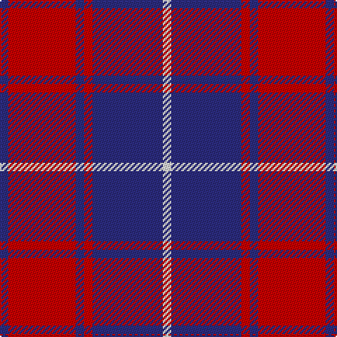

In pattern [BRBRBW](/patterns/brbrbw/).

This was sourced from register-of-tartans.  It is a [6 stripes tartan](/stripes/stripes6/).

Original link https://www.tartanregister.gov.uk/tartanDetails.aspx?ref=4914

## Attestations

This cloth appears in 3 source records; the oldest owns this page.

- 01/09/2006 — Matthews (Personal) (register-of-tartans, [record](https://www.tartanregister.gov.uk/tartanDetails.aspx?ref=4914))
- 2006 September — Matthews (Name) (tartans-authority, [record](http://www.tartansauthority.com/tartan-ferret/display/7003/))
- undated — Matthews Clan Tartan Tartan Number: 7003. Earliest known date: 2006 September A variant of the Donnachaidh (Robertson) tartan and reflects the Matthews family membership of that clan. Can be worn by all of the name. See products available Copyright © Blair Urquhart, Comrie, 2015 (house-of-tartan, [record](http://www.house-of-tartan.scotland.net/house/TartanViewjs.asp?colr=Def&tnam=7003))

## Thread count
DB/6 R48 DB6 R6 DB50 LN/6

## Palette
Each colour and its ΔE from the base-6 reference it is a variant of.

| Colour | Shade | Base | ΔE (OKLab) |
|---|---|---|---|
| DB | <code style="background-color:#2C2C80;">#2C2C80</code> `#2C2C80` | B <code style="background-color:#2A418A;">#2A418A</code> | 0.06 |
| LN | <code style="background-color:#E0E0E0;">#E0E0E0</code> `#E0E0E0` | W <code style="background-color:#F7F7F7;">#F7F7F7</code> | 0.07 |
| R | <code style="background-color:#C80000;">#C80000</code> `#C80000` | R <code style="background-color:#CC0000;">#CC0000</code> | 0.01 |

# Sample pattern

## Nearest tartans

The nearest existing variants by ΔTartan distance.

1. [Butler](/setts/s6/b96r36b12r26y8r28-b2c2c80-rc80000-ye8c000/) — ΔT 0.76
1. [Bon Accord (District)](/setts/s7/r12w6r34b6r6b50r6-b003c64-rc80000-wfcfcfc/) — ΔT 0.93
1. [Edinburgh Marketing Corporate Tartan Tartan Number: 2106. Earliest known date: 1991 The tartan was based on the Drummond tartan after the famous Lord Provost of Edinburgh, Lord Drummond, who is regarded as the father of the New Town and the "bridge" between the Old town of Edinburgh and the New Town. The colours are the corporate colours of Edinburgh Marketing, Navy, Red and White. The tartan was designed by Messrs. Kinloch Anderson of Leith, Edinburgh. See products available Copyright © Blair Urquhart, Comrie, 2015](/setts/s8/b38r6b6r9w5r12b8r16-b202060-rc80000-we0e0e0/) — ΔT 0.94
1. [Bon Accord](/setts/s7/r12w6r34b6r6b50r6-b003c64-rc80000-wffffff/) — ΔT 0.94
1. [British European](/setts/s6/r24b4r24b34w4r4-b2c2c80-ra00000-wfcfcfc/) — ΔT 0.98
1. [British European (Corporate)](/setts/s6/r48b8r48b68w8r8-b2c2c80-ra00000-wfcfcfc/) — ΔT 0.98
1. [Masai Shuka 25 (Artefact)](/setts/s5/b30w4r40b4r8-b2c2c80-rc80000-we0e0e0/) — ΔT 1.03
1. [Hamilton Red Clan Tartan Tartan Number: 477. Earliest known date: 1842 First recorded in the Vestiarium Scoticum which was supposedly based on an ancient manuscript now known to have been forged. The original illustration shows the four main stripes in a very dark shade of blue. There is no evidence of a Hamilton tartan prior to the publication of this spectacular work. The authors, the Sobieski Stuart brothers, enjoyed a popular following amongst the Scottish gentry of the period and it is probable that the design can be attributed to Charles Edward Stuart (Allan Hay) who prepared the illustrations for the book. See products available Copyright © Blair Urquhart, Comrie, 2015](/setts/s5/b24r4b24r36w4-b2c2c80-rc80000-we0e0e0/) — ΔT 1.15
1. [MacGregor of Glengyle](/setts/s6/b4r4b28r28b4r4-b2c2c80-rd05054/) — ΔT 1.17
1. [Hamilton (Clan)](/setts/s5/b32r8b32r60w8-b2c2c80-rc80000-we0e0e0/) — ΔT 1.18

## Neighbour map

Every grey dot is one of 15726 variants placed by the first two principal components of the ΔTartan feature space (44% of its variance). Red is this tartan; blue dots are its nearest — click one to open its page.

<svg viewBox="0 0 640 380" role="img" style="max-width:100%;height:auto;border:1px solid #e0e0e0;border-radius:4px;display:block" xmlns="http://www.w3.org/2000/svg"><image href="/nn/cloud.v1.png" width="640" height="380"/><a href="/setts/s6/b96r36b12r26y8r28-b2c2c80-rc80000-ye8c000/"><circle cx="349.0" cy="213.5" r="4" fill="#3465a4"><title>Butler</title></circle></a><a href="/setts/s7/r12w6r34b6r6b50r6-b003c64-rc80000-wfcfcfc/"><circle cx="310.8" cy="206.6" r="4" fill="#3465a4"><title>Bon Accord (District)</title></circle></a><a href="/setts/s8/b38r6b6r9w5r12b8r16-b202060-rc80000-we0e0e0/"><circle cx="308.3" cy="216.4" r="4" fill="#3465a4"><title>Edinburgh Marketing Corporate Tartan Tartan Number: 2106. Earliest known date: 1991 The tartan was based on the Drummond tartan after the famous Lord Provost of Edinburgh, Lord Drummond, who is regarded as the father of the New Town and the &quot;bridge&quot; between the Old town of Edinburgh and the New Town. The colours are the corporate colours of Edinburgh Marketing, Navy, Red and White. The tartan was designed by Messrs. Kinloch Anderson of Leith, Edinburgh. See products available Copyright © Blair Urquhart, Comrie, 2015</title></circle></a><a href="/setts/s7/r12w6r34b6r6b50r6-b003c64-rc80000-wffffff/"><circle cx="310.2" cy="206.4" r="4" fill="#3465a4"><title>Bon Accord</title></circle></a><a href="/setts/s6/r24b4r24b34w4r4-b2c2c80-ra00000-wfcfcfc/"><circle cx="348.8" cy="235.2" r="4" fill="#3465a4"><title>British European</title></circle></a><a href="/setts/s6/r48b8r48b68w8r8-b2c2c80-ra00000-wfcfcfc/"><circle cx="348.8" cy="235.2" r="4" fill="#3465a4"><title>British European (Corporate)</title></circle></a><a href="/setts/s5/b30w4r40b4r8-b2c2c80-rc80000-we0e0e0/"><circle cx="360.2" cy="220.5" r="4" fill="#3465a4"><title>Masai Shuka 25 (Artefact)</title></circle></a><a href="/setts/s5/b24r4b24r36w4-b2c2c80-rc80000-we0e0e0/"><circle cx="321.7" cy="244.8" r="4" fill="#3465a4"><title>Hamilton Red Clan Tartan Tartan Number: 477. Earliest known date: 1842 First recorded in the Vestiarium Scoticum which was supposedly based on an ancient manuscript now known to have been forged. The original illustration shows the four main stripes in a very dark shade of blue. There is no evidence of a Hamilton tartan prior to the publication of this spectacular work. The authors, the Sobieski Stuart brothers, enjoyed a popular following amongst the Scottish gentry of the period and it is probable that the design can be attributed to Charles Edward Stuart (Allan Hay) who prepared the illustrations for the book. See products available Copyright © Blair Urquhart, Comrie, 2015</title></circle></a><a href="/setts/s6/b4r4b28r28b4r4-b2c2c80-rd05054/"><circle cx="364.8" cy="244.8" r="4" fill="#3465a4"><title>MacGregor of Glengyle</title></circle></a><a href="/setts/s5/b32r8b32r60w8-b2c2c80-rc80000-we0e0e0/"><circle cx="296.6" cy="246.6" r="4" fill="#3465a4"><title>Hamilton (Clan)</title></circle></a><circle cx="331.9" cy="211.9" r="5" fill="#c00000"/></svg>

ID: /setts/s6/b6r48b6r6b50w6-b2c2c80-rc80000-we0e0e0/
