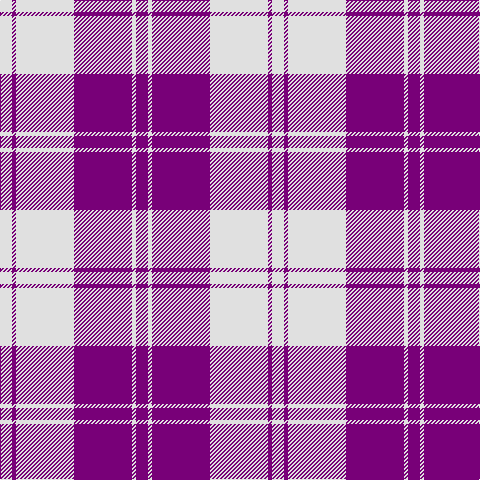

In pattern [BWBWBW](/patterns/bwbwbw/).

This was sourced from house-of-tartan.  It is a [6 stripes tartan](/stripes/stripes6/).

Original link http://www.house-of-tartan.scotland.net/house/TartanViewjs.asp?colr=Def&tnam=6534

## Thread count
LN/12 P4 LN58 P58 LN4 P/12

## Palette
Each colour and its ΔE from the base-6 reference it is a variant of.

| Colour | Shade | Base | ΔE (OKLab) |
|---|---|---|---|
| LN | <code style="background-color:#E0E0E0;">#E0E0E0</code> `#E0E0E0` | W <code style="background-color:#F7F7F7;">#F7F7F7</code> | 0.07 |
| P | <code style="background-color:#780078;">#780078</code> `#780078` | B <code style="background-color:#2A418A;">#2A418A</code> | 0.17 |

# Sample pattern

## Nearest tartans

The nearest existing variants by ΔTartan distance.

1. [Erskine Purple (Dance)](/setts/s6/b2w1b9w9b1w2~b780078-wf8f8f8~x6/) — ΔT 0.85
1. [MacLachlan (Chief's Dress) Blue](/setts/s8/b6y2b21y2b6y24b2y6~b6840fc-ye8c000~x2/) — ΔT 1.35
1. [Erskine Dress Burgandy Clan Tartan Tartan Number: 1972. Earliest known date: 1971 A popular Dress tartan for Scottish Highland Dancing. See products available Copyright © Blair Urquhart, Comrie, 2015](/setts/s6/r5w2r25w25r2w5~r901c38-we0e0e0~x2/) — ΔT 1.39
1. [Erskine, Burgundy (Dance)](/setts/s6/r6w2r29w29r2w6~r800028-wfcfcfc~x2/) — ΔT 1.46
1. [Erskine Royal Blue Dress Clan Tartan Tartan Number: 632. Earliest known date: 1980 One of a number of dress tartans produced by Hugh Macpherson, a kiltmaker in Edinburgh, intended for dancing and other informal occassions. The 'dress' version of clan tartan is usually created by substituting white for one of the 'ground' colours. See products available Copyright © Blair Urquhart, Comrie, 2015](/setts/s6/b6w2b29w29b2w6~b2c2c80-we0e0e0~x2/) — ΔT 1.60
1. [Erskine Blue (Dance)](/setts/s6/b6w2b29w29b2w6~b2c2c80-wfcfcfc~x2/) — ΔT 1.63
1. [Buchanan 4](/setts/s6/k2w28r13w2r13w2~k000000-r900030-we0e0e0~x2/) — ΔT 1.65
1. [Erskine, dress](/setts/s6/b6w2b29w29b2w6~b304080-we0e0e0~x2/) — ΔT 1.69
1. [Buchanan #5](/setts/s6/k2w28r13w2r13w2~k101010-r960028-we0e0e0~x2/) — ΔT 1.76
1. [Glen App](/setts/s5/r13w3r1k3w1~k101010-r9c68a4-wfcfcfc~x6/) — ΔT 1.77

## Neighbour map

Every grey dot is one of 15726 variants placed by the first two principal components of the ΔTartan feature space (44% of its variance). Red is this tartan; blue dots are its nearest — click one to open its page.

<svg viewBox="0 0 640 380" role="img" style="max-width:100%;height:auto;border:1px solid #e0e0e0;border-radius:4px;display:block" xmlns="http://www.w3.org/2000/svg"><image href="/nn/cloud.v1.png" width="640" height="380"/><a href="/setts/s6/b2w1b9w9b1w2~b780078-wf8f8f8~x6/"><circle cx="308.7" cy="212.8" r="4" fill="#3465a4"><title>Erskine Purple (Dance)</title></circle></a><a href="/setts/s8/b6y2b21y2b6y24b2y6~b6840fc-ye8c000~x2/"><circle cx="324.4" cy="195.6" r="4" fill="#3465a4"><title>MacLachlan (Chief's Dress) Blue</title></circle></a><a href="/setts/s6/r5w2r25w25r2w5~r901c38-we0e0e0~x2/"><circle cx="340.8" cy="200.8" r="4" fill="#3465a4"><title>Erskine Dress Burgandy Clan Tartan Tartan Number: 1972. Earliest known date: 1971 A popular Dress tartan for Scottish Highland Dancing. See products available Copyright © Blair Urquhart, Comrie, 2015</title></circle></a><a href="/setts/s6/r6w2r29w29r2w6~r800028-wfcfcfc~x2/"><circle cx="332.0" cy="188.8" r="4" fill="#3465a4"><title>Erskine, Burgundy (Dance)</title></circle></a><a href="/setts/s6/b6w2b29w29b2w6~b2c2c80-we0e0e0~x2/"><circle cx="326.0" cy="202.9" r="4" fill="#3465a4"><title>Erskine Royal Blue Dress Clan Tartan Tartan Number: 632. Earliest known date: 1980 One of a number of dress tartans produced by Hugh Macpherson, a kiltmaker in Edinburgh, intended for dancing and other informal occassions. The 'dress' version of clan tartan is usually created by substituting white for one of the 'ground' colours. See products available Copyright © Blair Urquhart, Comrie, 2015</title></circle></a><a href="/setts/s6/b6w2b29w29b2w6~b2c2c80-wfcfcfc~x2/"><circle cx="317.6" cy="198.0" r="4" fill="#3465a4"><title>Erskine Blue (Dance)</title></circle></a><a href="/setts/s6/k2w28r13w2r13w2~k000000-r900030-we0e0e0~x2/"><circle cx="318.9" cy="178.6" r="4" fill="#3465a4"><title>Buchanan 4</title></circle></a><a href="/setts/s6/b6w2b29w29b2w6~b304080-we0e0e0~x2/"><circle cx="330.2" cy="204.0" r="4" fill="#3465a4"><title>Erskine, dress</title></circle></a><a href="/setts/s6/k2w28r13w2r13w2~k101010-r960028-we0e0e0~x2/"><circle cx="322.4" cy="179.1" r="4" fill="#3465a4"><title>Buchanan #5</title></circle></a><a href="/setts/s5/r13w3r1k3w1~k101010-r9c68a4-wfcfcfc~x6/"><circle cx="391.0" cy="192.6" r="4" fill="#3465a4"><title>Glen App</title></circle></a><circle cx="340.4" cy="195.2" r="5" fill="#c00000"/></svg>

ID: /setts/s6/b6w2b29w29b2w6~b780078-we0e0e0~x2/
