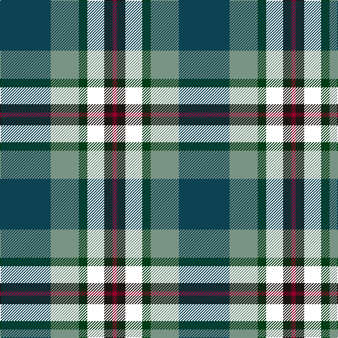

In pattern [BGGWKR](/patterns/bggwkr/).

This was sourced from register-of-tartans.  It is a [6 stripes tartan](/stripes/stripes6/).

Original link https://www.tartanregister.gov.uk/tartanDetails.aspx?ref=11641

## Thread count
DB/72 LG40 DG12 W24 K12 DR/6

## Palette
Each colour and its ΔE from the base-6 reference it is a variant of.

| Colour | Shade | Base | ΔE (OKLab) |
|---|---|---|---|
| DB | <code style="background-color:#0C4252;">#0C4252</code> `#0C4252` | B <code style="background-color:#2C4084;">#2C4084</code> | 0.10 |
| DG | <code style="background-color:#003C14;">#003C14</code> `#003C14` | G <code style="background-color:#006400;">#006400</code> | 0.14 |
| DR | <code style="background-color:#960028;">#960028</code> `#960028` | R <code style="background-color:#C80000;">#C80000</code> | 0.11 |
| K | <code style="background-color:#1C1714;">#1C1714</code> `#1C1714` | K <code style="background-color:#000000;">#000000</code> | 0.21 |
| LG | <code style="background-color:#789484;">#789484</code> `#789484` | G <code style="background-color:#006400;">#006400</code> | 0.23 |
| W | <code style="background-color:#FFFFFF;">#FFFFFF</code> `#FFFFFF` | W <code style="background-color:#F4F4F0;">#F4F4F0</code> | 0.03 |

# Sample pattern

ID: /setts/s6/b72g40ga12w24k12r6-b0c4252-g789484-ga003c14-k1c1714-r960028-wffffff/
