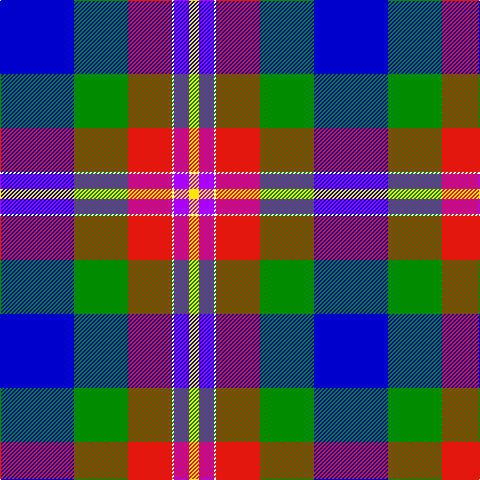

In pattern [BGRWBY](/patterns/bgrwby/).

This was sourced from register-of-tartans.  It is a [6 stripes tartan](/stripes/stripes6/).

Original link https://www.tartanregister.gov.uk/tartanDetails.aspx?ref=10543

## Thread count
B/74 G54 R44 W2 P15 Y/10

## Palette
Each colour and its ΔE from the base-6 reference it is a variant of.

| Colour | Shade | Base | ΔE (OKLab) |
|---|---|---|---|
| B | <code style="background-color:#0000CD;">#0000CD</code> `#0000CD` | B <code style="background-color:#2A418A;">#2A418A</code> | 0.14 |
| G | <code style="background-color:#008B00;">#008B00</code> `#008B00` | G <code style="background-color:#006100;">#006100</code> | 0.13 |
| P | <code style="background-color:#AA00FF;">#AA00FF</code> `#AA00FF` | B <code style="background-color:#2A418A;">#2A418A</code> | 0.28 |
| R | <code style="background-color:#E3170D;">#E3170D</code> `#E3170D` | R <code style="background-color:#CC0000;">#CC0000</code> | 0.05 |
| W | <code style="background-color:#FFFFFF;">#FFFFFF</code> `#FFFFFF` | W <code style="background-color:#F7F7F7;">#F7F7F7</code> | 0.02 |
| Y | <code style="background-color:#FFE600;">#FFE600</code> `#FFE600` | Y <code style="background-color:#F2BF00;">#F2BF00</code> | 0.10 |

# Sample pattern

## Nearest tartans

The nearest existing variants by ΔTartan distance.

1. [Crookstoun, James (West Lothian) (Personal)](/setts/s6/b53w27r5k19y1g11~b5f749c-g23321b-k1c1714-rca2625-wf9f5ef-ye0a126~x2/) — ΔT 1.23
1. [Crookstoun (Personal)](/setts/s6/b53w27r5k19y1g11~b1474b4-g006818-k101010-rc8002c-wfcfcfc-ybc8c00~x2/) — ΔT 1.28
1. [Berger-MacLaren](/setts/s7/b37k12r17ra3r17k1y3~b007fff-k101010-rac7f24-racc1100-yffe303~x2/) — ΔT 1.40
1. [George Heriot's School](/setts/s7/w3k1b24ba10r24k1y3~b2c2c80-ba1c1c50-k101010-r888888-we0e0e0-ye8c000~x2/) — ΔT 1.46
1. [Wrens (WRNS) (Military)](/setts/s9/w16y3w9b14w1b8k32r1wa4~b1474b4-k000000-r8c0000-w98c8e8-waf0f0f0-ye8c000~x2/) — ΔT 1.48
1. [Ferguson Dress #2](/setts/s7/b68k42w32r5w32g4w6~b2c4084-g002814-k101010-r960028-we0e0e0/) — ΔT 1.59
1. [Queen Margaret University](/setts/s9/b4w3b17wa10k1ba5k1wa6g3~b2c4084-ba5a008c-g005020-k101010-we0e0e0-wac0c0c0~x2/) — ΔT 1.61
1. [Ferguson, dress](/setts/s7/b68k42w32r5w32g4w6~b304080-g003000-k000000-r900030-we0e0e0/) — ΔT 1.67
1. [Ogilvie of Inverquharity or Ohio](/setts/s9/b16w6r8b3y1g1ya3b1g10~b1c0070-g006818-rc80000-we0e0e0-yd09800-ya48a4c0~x4/) — ΔT 1.71
1. [Alan Stone Family (Personal)](/setts/s6/r2w6k12b36ra12y1~b27408b-k101010-rb0171f-ra8c8c8c-wffffff-ycdad00~x2/) — ΔT 1.71

## Neighbour map

Every grey dot is one of 15726 variants placed by the first two principal components of the ΔTartan feature space (44% of its variance). Red is this tartan; blue dots are its nearest — click one to open its page.

<svg viewBox="0 0 640 380" role="img" style="max-width:100%;height:auto;border:1px solid #e0e0e0;border-radius:4px;display:block" xmlns="http://www.w3.org/2000/svg"><image href="/nn/cloud.v1.png" width="640" height="380"/><a href="/setts/s6/b53w27r5k19y1g11~b5f749c-g23321b-k1c1714-rca2625-wf9f5ef-ye0a126~x2/"><circle cx="219.9" cy="97.4" r="4" fill="#3465a4"><title>Crookstoun, James (West Lothian) (Personal)</title></circle></a><a href="/setts/s6/b53w27r5k19y1g11~b1474b4-g006818-k101010-rc8002c-wfcfcfc-ybc8c00~x2/"><circle cx="210.1" cy="99.0" r="4" fill="#3465a4"><title>Crookstoun (Personal)</title></circle></a><a href="/setts/s7/b37k12r17ra3r17k1y3~b007fff-k101010-rac7f24-racc1100-yffe303~x2/"><circle cx="230.6" cy="123.6" r="4" fill="#3465a4"><title>Berger-MacLaren</title></circle></a><a href="/setts/s7/w3k1b24ba10r24k1y3~b2c2c80-ba1c1c50-k101010-r888888-we0e0e0-ye8c000~x2/"><circle cx="193.5" cy="122.5" r="4" fill="#3465a4"><title>George Heriot's School</title></circle></a><a href="/setts/s9/w16y3w9b14w1b8k32r1wa4~b1474b4-k000000-r8c0000-w98c8e8-waf0f0f0-ye8c000~x2/"><circle cx="146.1" cy="93.2" r="4" fill="#3465a4"><title>Wrens (WRNS) (Military)</title></circle></a><a href="/setts/s7/b68k42w32r5w32g4w6~b2c4084-g002814-k101010-r960028-we0e0e0/"><circle cx="157.0" cy="150.3" r="4" fill="#3465a4"><title>Ferguson Dress #2</title></circle></a><a href="/setts/s9/b4w3b17wa10k1ba5k1wa6g3~b2c4084-ba5a008c-g005020-k101010-we0e0e0-wac0c0c0~x2/"><circle cx="166.6" cy="126.5" r="4" fill="#3465a4"><title>Queen Margaret University</title></circle></a><a href="/setts/s7/b68k42w32r5w32g4w6~b304080-g003000-k000000-r900030-we0e0e0/"><circle cx="151.6" cy="149.7" r="4" fill="#3465a4"><title>Ferguson, dress</title></circle></a><a href="/setts/s9/b16w6r8b3y1g1ya3b1g10~b1c0070-g006818-rc80000-we0e0e0-yd09800-ya48a4c0~x4/"><circle cx="145.0" cy="125.2" r="4" fill="#3465a4"><title>Ogilvie of Inverquharity or Ohio</title></circle></a><a href="/setts/s6/r2w6k12b36ra12y1~b27408b-k101010-rb0171f-ra8c8c8c-wffffff-ycdad00~x2/"><circle cx="266.6" cy="114.1" r="4" fill="#3465a4"><title>Alan Stone Family (Personal)</title></circle></a><circle cx="160.2" cy="118.3" r="5" fill="#c00000"/></svg>

ID: /setts/s6/b74g54r44w2ba15y10~b0000cd-baaa00ff-g008b00-re3170d-wffffff-yffe600/
