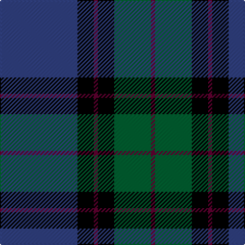

In pattern [BGKBKB](/patterns/bgkbkb/).

This was sourced from weddslist.  It is a [6 stripes tartan](/stripes/stripes6/).

Original link http://www.weddslist.com/cgi-bin/tartans/pg.pl?source=sts

## Thread count
B/76 K16 DR4 K16 G36 DR/4

## Palette
Each colour and its ΔE from the base-6 reference it is a variant of.

| Colour | Shade | Base | ΔE (OKLab) |
|---|---|---|---|
| B | <code style="background-color:#304080;">#304080</code> `#304080` | B <code style="background-color:#2C4084;">#2C4084</code> | 0.01 |
| DR | <code style="background-color:#600030;">#600030</code> `#600030` | B <code style="background-color:#2C4084;">#2C4084</code> | 0.19 |
| G | <code style="background-color:#006030;">#006030</code> `#006030` | G <code style="background-color:#006400;">#006400</code> | 0.04 |
| K | <code style="background-color:#000000;">#000000</code> `#000000` | K <code style="background-color:#000000;">#000000</code> | 0.00 |

# Sample pattern

## Nearest tartans

The nearest existing variants by ΔTartan distance.

1. [MacRobart](/setts/s6/b144k42g32ba6g34ba6-b304080-ba5480b0-g008000-k000000/) — ΔT 1.03
1. [MacFadzean Clan Tartan Tartan Number: 645. Earliest known date: pre 2003 Nothing See products available Copyright © Blair Urquhart, Comrie, 2015](/setts/s6/b96w4k40g44r6g8-b2c2c80-g006818-k101010-rc80000-we0e0e0/) — ΔT 1.04
1. [Hakkarain Personal Finnish Tartan Tartan Number: 6110. Earliest known date: 2003 A personal tartan designed by Jari Hakkarainen of Porvoo in Finland. See products available Copyright © Blair Urquhart, Comrie, 2015](/setts/s6/b74r36k74ra4k4ra4-b202060-k101010-r888888-rac80000/) — ΔT 1.06
1. [MacRobart (Personal)](/setts/s6/b60k20g20w4g30w4-b202060-g006818-k101010-wa8ace8/) — ΔT 1.09
1. [Mowat](/setts/s7/b52k2b4k36y4g32k32-b2c2c80-g006818-k101010-ye8c000/) — ΔT 1.15
1. [Alexander](/setts/s7/b48k16g16ba4g16k2w4-b1c0070-ba440044-g006818-k101010-wfcfcfc/) — ΔT 1.15
1. [Martinez, Clément (Personal)](/setts/s6/b88k64y16k44ba8bb4-b003c64-ba780078-bb5c5c5c-k101010-ye8c000/) — ΔT 1.18
1. [Colvin](/setts/s8/b72w8b8w8b32g128r18b12-b00008c-g004c00-r8c0000-wc8c8c8/) — ΔT 1.19
1. [Kinross (Fashion)](/setts/s8/g40b4ga12b4g8b54y4b16-b1c0070-g285800-ga408060-yd09800/) — ΔT 1.20
1. [Ferguson of Athol Clan Tartan Tartan Number: 337. Earliest known date: 1850 D.C. Stewart points to the similarity with the Murray of Athol as a common source or association for the tartan. Some of the Fergussons of Athol and the MacLarens were followers of the Murray of Athol. The Ferguson tartan has a white stripe where the MacLaren has yellow. Chiefs of the clan are the Fergussons of Kilkerran, descended from Fergus of Dalriada, who brought the Stone of Scone to Scotland. See products available Copyright © Blair Urquhart, Comrie, 2015](/setts/s7/b48k16g16r4g16k2w4-b2c2c80-g006818-k101010-rc80000-we0e0e0/) — ΔT 1.20

## Neighbour map

Every grey dot is one of 15726 variants placed by the first two principal components of the ΔTartan feature space (44% of its variance). Red is this tartan; blue dots are its nearest — click one to open its page.

<svg viewBox="0 0 640 380" role="img" style="max-width:100%;height:auto;border:1px solid #e0e0e0;border-radius:4px;display:block" xmlns="http://www.w3.org/2000/svg"><image href="/nn/cloud.v1.png" width="640" height="380"/><a href="/setts/s6/b144k42g32ba6g34ba6-b304080-ba5480b0-g008000-k000000/"><circle cx="323.8" cy="169.9" r="4" fill="#3465a4"><title>MacRobart</title></circle></a><a href="/setts/s6/b96w4k40g44r6g8-b2c2c80-g006818-k101010-rc80000-we0e0e0/"><circle cx="292.3" cy="167.9" r="4" fill="#3465a4"><title>MacFadzean Clan Tartan Tartan Number: 645. Earliest known date: pre 2003 Nothing See products available Copyright © Blair Urquhart, Comrie, 2015</title></circle></a><a href="/setts/s6/b74r36k74ra4k4ra4-b202060-k101010-r888888-rac80000/"><circle cx="268.8" cy="191.5" r="4" fill="#3465a4"><title>Hakkarain Personal Finnish Tartan Tartan Number: 6110. Earliest known date: 2003 A personal tartan designed by Jari Hakkarainen of Porvoo in Finland. See products available Copyright © Blair Urquhart, Comrie, 2015</title></circle></a><a href="/setts/s6/b60k20g20w4g30w4-b202060-g006818-k101010-wa8ace8/"><circle cx="260.3" cy="212.9" r="4" fill="#3465a4"><title>MacRobart (Personal)</title></circle></a><a href="/setts/s7/b52k2b4k36y4g32k32-b2c2c80-g006818-k101010-ye8c000/"><circle cx="282.6" cy="193.5" r="4" fill="#3465a4"><title>Mowat</title></circle></a><a href="/setts/s7/b48k16g16ba4g16k2w4-b1c0070-ba440044-g006818-k101010-wfcfcfc/"><circle cx="249.6" cy="155.3" r="4" fill="#3465a4"><title>Alexander</title></circle></a><a href="/setts/s6/b88k64y16k44ba8bb4-b003c64-ba780078-bb5c5c5c-k101010-ye8c000/"><circle cx="292.5" cy="184.7" r="4" fill="#3465a4"><title>Martinez, Clément (Personal)</title></circle></a><a href="/setts/s8/b72w8b8w8b32g128r18b12-b00008c-g004c00-r8c0000-wc8c8c8/"><circle cx="285.6" cy="173.5" r="4" fill="#3465a4"><title>Colvin</title></circle></a><a href="/setts/s8/g40b4ga12b4g8b54y4b16-b1c0070-g285800-ga408060-yd09800/"><circle cx="330.3" cy="193.4" r="4" fill="#3465a4"><title>Kinross (Fashion)</title></circle></a><a href="/setts/s7/b48k16g16r4g16k2w4-b2c2c80-g006818-k101010-rc80000-we0e0e0/"><circle cx="259.0" cy="156.3" r="4" fill="#3465a4"><title>Ferguson of Athol Clan Tartan Tartan Number: 337. Earliest known date: 1850 D.C. Stewart points to the similarity with the Murray of Athol as a common source or association for the tartan. Some of the Fergussons of Athol and the MacLarens were followers of the Murray of Athol. The Ferguson tartan has a white stripe where the MacLaren has yellow. Chiefs of the clan are the Fergussons of Kilkerran, descended from Fergus of Dalriada, who brought the Stone of Scone to Scotland. See products available Copyright © Blair Urquhart, Comrie, 2015</title></circle></a><circle cx="300.9" cy="189.5" r="5" fill="#c00000"/></svg>

ID: /setts/s6/b76k16ba4k16g36ba4-b304080-ba600030-g006030-k000000/
