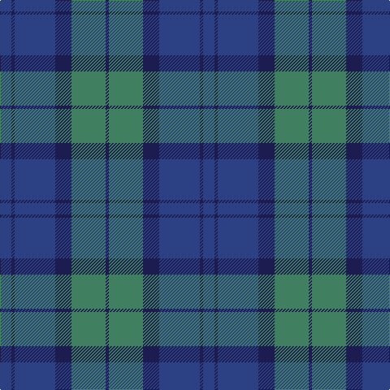

In pattern [BBBBGB](/patterns/bbbbgb/).

This was sourced from register-of-tartans.  It is a [6 stripes tartan](/stripes/stripes6/).

Original link https://www.tartanregister.gov.uk/tartanDetails.aspx?ref=10639

## Thread count
B/14 DB4 B50 DB20 G42 DB/4

## Palette
Each colour and its ΔE from the base-6 reference it is a variant of.

| Colour | Shade | Base | ΔE (OKLab) |
|---|---|---|---|
| B | <code style="background-color:#2C4084;">#2C4084</code> `#2C4084` | B <code style="background-color:#2A418A;">#2A418A</code> | 0.01 |
| DB | <code style="background-color:#1C1C50;">#1C1C50</code> `#1C1C50` | B <code style="background-color:#2A418A;">#2A418A</code> | 0.14 |
| G | <code style="background-color:#408060;">#408060</code> `#408060` | G <code style="background-color:#006100;">#006100</code> | 0.14 |

# Sample pattern

## Nearest tartans

The nearest existing variants by ΔTartan distance.

1. [Sugiyama Jogakuen University (Corp)](/setts/s6/b7ba2b25ba10g21ba2~b2c2c80-ba202060-g006818~x2/) — ΔT 0.45
1. [Unidentified No 17](/setts/s7/g10b2g2b6ba5b1ba2~b2c4084-ba3c82af-g005020~x2/) — ΔT 1.13
1. [Unidentified Tweed](/setts/s6/b4w1b12g12b1g4~b2c4084-g005020-we0e0e0~x2/) — ΔT 1.31
1. [Gammell (Brown) (Personal)](/setts/s8/b20g2b2g2b2g6ga15g2~b2c2c80-g604000-ga006818~x2/) — ΔT 1.43
1. [Bryson](/setts/s5/b8r3ba29bb29b4~b3c82af-ba2c4084-bb141e46-rdc0000~x2/) — ΔT 1.44
1. [Rhode Island, The State of](/setts/s6/g15b2w2b11ba28b4~b102040-ba606080-g407050-we0e0e0~x2/) — ΔT 1.48
1. [Skibo (Corporate)](/setts/s5/r2g23b11ba22r2~b2c2c80-ba1474b4-g406054-rc80000~x2/) — ΔT 1.53
1. [Hamilton Hunting](/setts/s5/b11g2b15g18w2~b2c4084-g005020-we0e0e0~x2/) — ΔT 1.60
1. [Monarchs](/setts/s6/b19k4ba1k4g9ba1~b2c2c80-ba680028-g005448-k101010~x4/) — ΔT 1.61
1. [Devlin, Craig (Personal)](/setts/s6/g8w3b6ba11b30ba5~b5c5c5c-ba2c2c80-g006818-we0e0e0~x2/) — ΔT 1.66

## Neighbour map

Every grey dot is one of 15726 variants placed by the first two principal components of the ΔTartan feature space (44% of its variance). Red is this tartan; blue dots are its nearest — click one to open its page.

<svg viewBox="0 0 640 380" role="img" style="max-width:100%;height:auto;border:1px solid #e0e0e0;border-radius:4px;display:block" xmlns="http://www.w3.org/2000/svg"><image href="/nn/cloud.v1.png" width="640" height="380"/><a href="/setts/s6/b7ba2b25ba10g21ba2~b2c2c80-ba202060-g006818~x2/"><circle cx="345.1" cy="261.8" r="4" fill="#3465a4"><title>Sugiyama Jogakuen University (Corp)</title></circle></a><a href="/setts/s7/g10b2g2b6ba5b1ba2~b2c4084-ba3c82af-g005020~x2/"><circle cx="306.6" cy="266.6" r="4" fill="#3465a4"><title>Unidentified No 17</title></circle></a><a href="/setts/s6/b4w1b12g12b1g4~b2c4084-g005020-we0e0e0~x2/"><circle cx="383.3" cy="262.2" r="4" fill="#3465a4"><title>Unidentified Tweed</title></circle></a><a href="/setts/s8/b20g2b2g2b2g6ga15g2~b2c2c80-g604000-ga006818~x2/"><circle cx="338.2" cy="230.9" r="4" fill="#3465a4"><title>Gammell (Brown) (Personal)</title></circle></a><a href="/setts/s5/b8r3ba29bb29b4~b3c82af-ba2c4084-bb141e46-rdc0000~x2/"><circle cx="280.9" cy="253.1" r="4" fill="#3465a4"><title>Bryson</title></circle></a><a href="/setts/s6/g15b2w2b11ba28b4~b102040-ba606080-g407050-we0e0e0~x2/"><circle cx="297.2" cy="215.9" r="4" fill="#3465a4"><title>Rhode Island, The State of</title></circle></a><a href="/setts/s5/r2g23b11ba22r2~b2c2c80-ba1474b4-g406054-rc80000~x2/"><circle cx="288.7" cy="256.0" r="4" fill="#3465a4"><title>Skibo (Corporate)</title></circle></a><a href="/setts/s5/b11g2b15g18w2~b2c4084-g005020-we0e0e0~x2/"><circle cx="363.5" cy="286.3" r="4" fill="#3465a4"><title>Hamilton Hunting</title></circle></a><a href="/setts/s6/b19k4ba1k4g9ba1~b2c2c80-ba680028-g005448-k101010~x4/"><circle cx="378.7" cy="221.2" r="4" fill="#3465a4"><title>Monarchs</title></circle></a><a href="/setts/s6/g8w3b6ba11b30ba5~b5c5c5c-ba2c2c80-g006818-we0e0e0~x2/"><circle cx="356.0" cy="236.1" r="4" fill="#3465a4"><title>Devlin, Craig (Personal)</title></circle></a><circle cx="343.2" cy="258.2" r="5" fill="#c00000"/></svg>

ID: /setts/s6/b7ba2b25ba10g21ba2~b2c4084-ba1c1c50-g408060~x2/
