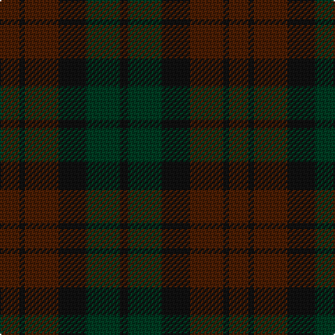

In pattern [BKBKGK](/patterns/bkbkgk/).

This was sourced from tartans-authority.  It is a [6 stripes tartan](/stripes/stripes6/).

Original link http://www.tartansauthority.com/tartan-ferret/display/7812/

## Attestations

This cloth appears in 2 source records; the oldest owns this page.

- pre 1986 — Brown Watch (single) (Fashion) (tartans-authority, [record](http://www.tartansauthority.com/tartan-ferret/display/7812/))
- undated — Brown Watch (single tramlines) (register-of-tartans, [record](https://www.tartanregister.gov.uk/tartanDetails.aspx?ref=5770))

## Thread count
DR/14 K4 DR24 K20 DG24 K/6

## Palette
Each colour and its ΔE from the base-6 reference it is a variant of.

| Colour | Shade | Base | ΔE (OKLab) |
|---|---|---|---|
| DG | <code style="background-color:#003820;">#003820</code> `#003820` | G <code style="background-color:#006100;">#006100</code> | 0.15 |
| DR | <code style="background-color:#481C04;">#481C04</code> `#481C04` | B <code style="background-color:#2A418A;">#2A418A</code> | 0.22 |
| K | <code style="background-color:#101010;">#101010</code> `#101010` | K <code style="background-color:#000000;">#000000</code> | 0.17 |

# Sample pattern

## Nearest tartans

The nearest existing variants by ΔTartan distance.

1. [Gleneagles (Corporate)](/setts/s7/g6ga6gb1ga6g5b6g1x4~b083454-g581c00-ga003820-gb684800/) — ΔT 1.14
1. [Chindecella Ruadh (Kemete Heil)](/setts/s8/b9ba4b4ba4b24g19ba19g4x2~b6c2c23-ba241a19-g3f4129/) — ΔT 1.43
1. [Brown Heather (Fashion)](/setts/s6/b1g6b6g1ba6g1x8~b3c2010-ba5c5c5c-g64340c/) — ΔT 1.58
1. [Inneryne (Personal)](/setts/s7/b4k4b16k14g14r3g3x2~b141e46-g003c14-k101010-r781c38/) — ΔT 2.09
1. [Laois, County](/setts/s9/b15ba2b5ba5k18g5b5g2b15x2~b441800-ba202060-g604000-k101010/) — ΔT 2.28
1. [Callum (Buchan)](/setts/s5/b7r1ba6r8ra1x8~b4b4f4b-ba4b4b58-r8c2828-raa07d73/) — ΔT 2.29
1. [MacArthur of Milton Hunting](/setts/s6/g7b1g1k4ba4k1x4~b202060-ba440044-g003820-k101010/) — ΔT 2.34
1. [St. Mirren (Corporate)](/setts/s12/b10k4ba16k4ba10k16ba8k24ba28r3b4r3~b404040-ba343434-k101010-r880000/) — ΔT 2.40
1. [Calais (Fashion)](/setts/s7/g11b4g6ga11b1k1ga4x4~b306084-g085454-ga604000-k000000/) — ΔT 2.59
1. [Hueg (Bavaria) Hunting (Personal)](/setts/s10/b17g5b5g17b4g17k2ka2k2g5x2~b433a5a-g23321b-k1c1714-ka000000/) — ΔT 2.69

## Neighbour map

Every grey dot is one of 15726 variants placed by the first two principal components of the ΔTartan feature space (44% of its variance). Red is this tartan; blue dots are its nearest — click one to open its page.

<svg viewBox="0 0 640 380" role="img" style="max-width:100%;height:auto;border:1px solid #e0e0e0;border-radius:4px;display:block" xmlns="http://www.w3.org/2000/svg"><image href="/nn/cloud.v1.png" width="640" height="380"/><a href="/setts/s7/g6ga6gb1ga6g5b6g1x4~b083454-g581c00-ga003820-gb684800/"><circle cx="328.6" cy="333.6" r="4" fill="#3465a4"><title>Gleneagles (Corporate)</title></circle></a><a href="/setts/s8/b9ba4b4ba4b24g19ba19g4x2~b6c2c23-ba241a19-g3f4129/"><circle cx="388.9" cy="314.6" r="4" fill="#3465a4"><title>Chindecella Ruadh (Kemete Heil)</title></circle></a><a href="/setts/s6/b1g6b6g1ba6g1x8~b3c2010-ba5c5c5c-g64340c/"><circle cx="365.5" cy="321.7" r="4" fill="#3465a4"><title>Brown Heather (Fashion)</title></circle></a><a href="/setts/s7/b4k4b16k14g14r3g3x2~b141e46-g003c14-k101010-r781c38/"><circle cx="290.5" cy="310.8" r="4" fill="#3465a4"><title>Inneryne (Personal)</title></circle></a><a href="/setts/s9/b15ba2b5ba5k18g5b5g2b15x2~b441800-ba202060-g604000-k101010/"><circle cx="431.8" cy="280.0" r="4" fill="#3465a4"><title>Laois, County</title></circle></a><a href="/setts/s5/b7r1ba6r8ra1x8~b4b4f4b-ba4b4b58-r8c2828-raa07d73/"><circle cx="376.1" cy="315.5" r="4" fill="#3465a4"><title>Callum (Buchan)</title></circle></a><a href="/setts/s6/g7b1g1k4ba4k1x4~b202060-ba440044-g003820-k101010/"><circle cx="343.8" cy="296.6" r="4" fill="#3465a4"><title>MacArthur of Milton Hunting</title></circle></a><a href="/setts/s12/b10k4ba16k4ba10k16ba8k24ba28r3b4r3~b404040-ba343434-k101010-r880000/"><circle cx="389.5" cy="264.3" r="4" fill="#3465a4"><title>St. Mirren (Corporate)</title></circle></a><a href="/setts/s7/g11b4g6ga11b1k1ga4x4~b306084-g085454-ga604000-k000000/"><circle cx="368.7" cy="274.8" r="4" fill="#3465a4"><title>Calais (Fashion)</title></circle></a><a href="/setts/s10/b17g5b5g17b4g17k2ka2k2g5x2~b433a5a-g23321b-k1c1714-ka000000/"><circle cx="469.7" cy="279.0" r="4" fill="#3465a4"><title>Hueg (Bavaria) Hunting (Personal)</title></circle></a><circle cx="376.8" cy="359.7" r="5" fill="#c00000"/></svg>

ID: /setts/s6/b7k2b12k10g12k3x2~b481c04-g003820-k101010/
