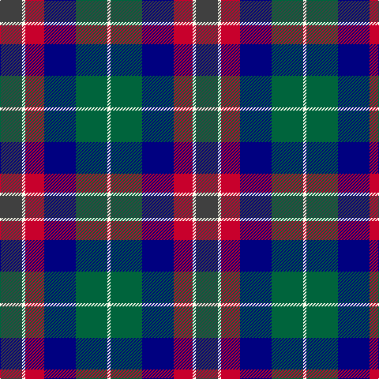

In pattern [BWRBGW](/patterns/bwrbgw/).

This was sourced from register-of-tartans.  It is a [6 stripes tartan](/stripes/stripes6/).

Original link https://www.tartanregister.gov.uk/tartanDetails.aspx?ref=10765

## Register references

External register numbers recorded for this tartan.

- Scottish Register of Tartans: [10765](https://www.tartanregister.gov.uk/tartanDetails.aspx?ref=10765)

## Thread count
N/28 W4 R24 DB40 G40 W/4

## Palette
Each colour and its ΔE from the base-6 reference it is a variant of.

| Colour | Shade | Base | ΔE (OKLab) |
|---|---|---|---|
| DB | <code style="background-color:#000080;">#000080</code> `#000080` | B <code style="background-color:#2A418A;">#2A418A</code> | 0.14 |
| G | <code style="background-color:#00643C;">#00643C</code> `#00643C` | G <code style="background-color:#006100;">#006100</code> | 0.05 |
| N | <code style="background-color:#404040;">#404040</code> `#404040` | B <code style="background-color:#2A418A;">#2A418A</code> | 0.13 |
| R | <code style="background-color:#C8002C;">#C8002C</code> `#C8002C` | R <code style="background-color:#CC0000;">#CC0000</code> | 0.03 |
| W | <code style="background-color:#FFFFF0;">#FFFFF0</code> `#FFFFF0` | W <code style="background-color:#F7F7F7;">#F7F7F7</code> | 0.03 |

# Sample pattern

## Nearest tartans

The nearest existing variants by ΔTartan distance.

1. [Gold Brothers](/setts/s6/b6g27b3k19ba27w3~b2c2c80-ba780078-g006818-k101010-wf8f8f8~x2/) — ΔT 0.80
1. [Inverary](/setts/s6/g10k1b13k3w9y3~b1c0070-g5c6428-k101010-wc0c0c0-yd09800~x2/) — ΔT 0.95
1. [Cooke Family Tartan Tartan Number: 2131. Earliest known date: 1993 Designed for Mr Bob Cooke and his family. Cookes were seafarers from the West Coast of Scotland and Ireland. Some including the designer, can trace forebears to Liverpool and the North West coast of England. The colours of the tartan reflect the seas, the skys and the heart of the sailor. See products available Copyright © Blair Urquhart, Comrie, 2015](/setts/s7/k6b2ba12g8r5k2g3~b2888c4-ba2c2c80-g408060-k101010-rc8002c~x4/) — ΔT 1.03
1. [Edelstein (Personal)](/setts/s5/b10ba10g10w1y1~b780078-ba2c2c80-g006818-we0e0e0-ye8c000~x6/) — ΔT 1.03
1. [MacCaughan or MacEachain Clan Tartan Tartan Number: 169. Earliest known date: 1972 Nothing See products available Copyright © Blair Urquhart, Comrie, 2015](/setts/s6/r2g6k2b6k1ra2~b2c2c80-g006818-k101010-rb468ac-rac80000~x4/) — ΔT 1.03
1. [MacNeil Clan Tartan Tartan Number: 1767. Earliest known date: 1886 This version shows the narrow 'tramlines' about the yellow stripe, the usual modern form that differs from Logans earlier version. The MacNeils claim descent from Niall, King of Ireland, who came to Barra in 1049. The present chief, Professor Ian Roderick MacNeil of Barra, lives in Chicago, U.S.A. There is also a tartan for the MacNeils of Colonsay. MacNeils are hereditary pipers to the MacLeans of Duart. See products available Copyright © Blair Urquhart, Comrie, 2015](/setts/s6/w3b14k12g12k2y3~b2c2c80-g006818-k101010-we0e0e0-ye8c000~x2/) — ΔT 1.04
1. [Fruin Colquhoun (Commemorative?)](/setts/s7/r5g19w3k19b19k3b2~b2c2c80-g00643c-k101010-rc80000-we0e0e0~x2/) — ΔT 1.05
1. [Monaghan County Crest (Fashion)](/setts/s8/y15b2ya8ba21w2b21ba6w7~b2c2c80-ba1c1c50-we0e0e0-ybc8c00-yaa0a0a0~x2/) — ΔT 1.05
1. [Martin Hunting](/setts/s5/b20k5ka19g19y2~b780078-g006818-k000030-ka101010-ye8c000~x2/) — ΔT 1.05
1. [Leslie Hunting Clan Tartan Tartan Number: 1113. Earliest known date: 1810-15 Said to have been worn by George 14th Earl of Rothes who died in 1841. This sett is shown by Smibert (1850) and by W & A Smith (1850) but without the definition of 'Hunting'. This sett is very similar to Duncan, the difference lies in the broad black present in the Leslie Hunting which is green in the Duncan See products available Copyright © Blair Urquhart, Comrie, 2015](/setts/s6/r2b8k8w1g8k1~b2c2c80-g006818-k101010-rc80000-we0e0e0~x2/) — ΔT 1.06

## Neighbour map

Every grey dot is one of 15726 variants placed by the first two principal components of the ΔTartan feature space (44% of its variance). Red is this tartan; blue dots are its nearest — click one to open its page.

<svg viewBox="0 0 640 380" role="img" style="max-width:100%;height:auto;border:1px solid #e0e0e0;border-radius:4px;display:block" xmlns="http://www.w3.org/2000/svg"><image href="/nn/cloud.v1.png" width="640" height="380"/><a href="/setts/s6/b6g27b3k19ba27w3~b2c2c80-ba780078-g006818-k101010-wf8f8f8~x2/"><circle cx="137.9" cy="204.2" r="4" fill="#3465a4"><title>Gold Brothers</title></circle></a><a href="/setts/s6/g10k1b13k3w9y3~b1c0070-g5c6428-k101010-wc0c0c0-yd09800~x2/"><circle cx="114.2" cy="184.6" r="4" fill="#3465a4"><title>Inverary</title></circle></a><a href="/setts/s7/k6b2ba12g8r5k2g3~b2888c4-ba2c2c80-g408060-k101010-rc8002c~x4/"><circle cx="108.2" cy="227.0" r="4" fill="#3465a4"><title>Cooke Family Tartan Tartan Number: 2131. Earliest known date: 1993 Designed for Mr Bob Cooke and his family. Cookes were seafarers from the West Coast of Scotland and Ireland. Some including the designer, can trace forebears to Liverpool and the North West coast of England. The colours of the tartan reflect the seas, the skys and the heart of the sailor. See products available Copyright © Blair Urquhart, Comrie, 2015</title></circle></a><a href="/setts/s5/b10ba10g10w1y1~b780078-ba2c2c80-g006818-we0e0e0-ye8c000~x6/"><circle cx="159.3" cy="217.3" r="4" fill="#3465a4"><title>Edelstein (Personal)</title></circle></a><a href="/setts/s6/r2g6k2b6k1ra2~b2c2c80-g006818-k101010-rb468ac-rac80000~x4/"><circle cx="113.6" cy="231.9" r="4" fill="#3465a4"><title>MacCaughan or MacEachain Clan Tartan Tartan Number: 169. Earliest known date: 1972 Nothing See products available Copyright © Blair Urquhart, Comrie, 2015</title></circle></a><a href="/setts/s6/w3b14k12g12k2y3~b2c2c80-g006818-k101010-we0e0e0-ye8c000~x2/"><circle cx="93.6" cy="218.4" r="4" fill="#3465a4"><title>MacNeil Clan Tartan Tartan Number: 1767. Earliest known date: 1886 This version shows the narrow 'tramlines' about the yellow stripe, the usual modern form that differs from Logans earlier version. The MacNeils claim descent from Niall, King of Ireland, who came to Barra in 1049. The present chief, Professor Ian Roderick MacNeil of Barra, lives in Chicago, U.S.A. There is also a tartan for the MacNeils of Colonsay. MacNeils are hereditary pipers to the MacLeans of Duart. See products available Copyright © Blair Urquhart, Comrie, 2015</title></circle></a><a href="/setts/s7/r5g19w3k19b19k3b2~b2c2c80-g00643c-k101010-rc80000-we0e0e0~x2/"><circle cx="144.6" cy="198.9" r="4" fill="#3465a4"><title>Fruin Colquhoun (Commemorative?)</title></circle></a><a href="/setts/s8/y15b2ya8ba21w2b21ba6w7~b2c2c80-ba1c1c50-we0e0e0-ybc8c00-yaa0a0a0~x2/"><circle cx="106.8" cy="177.3" r="4" fill="#3465a4"><title>Monaghan County Crest (Fashion)</title></circle></a><a href="/setts/s5/b20k5ka19g19y2~b780078-g006818-k000030-ka101010-ye8c000~x2/"><circle cx="135.1" cy="226.0" r="4" fill="#3465a4"><title>Martin Hunting</title></circle></a><a href="/setts/s6/r2b8k8w1g8k1~b2c2c80-g006818-k101010-rc80000-we0e0e0~x2/"><circle cx="135.7" cy="216.9" r="4" fill="#3465a4"><title>Leslie Hunting Clan Tartan Tartan Number: 1113. Earliest known date: 1810-15 Said to have been worn by George 14th Earl of Rothes who died in 1841. This sett is shown by Smibert (1850) and by W &amp; A Smith (1850) but without the definition of 'Hunting'. This sett is very similar to Duncan, the difference lies in the broad black present in the Leslie Hunting which is green in the Duncan See products available Copyright © Blair Urquhart, Comrie, 2015</title></circle></a><circle cx="101.3" cy="207.1" r="5" fill="#c00000"/></svg>

ID: /setts/s6/b7w1r6ba10g10w1~b404040-ba000080-g00643c-rc8002c-wfffff0~x4/
