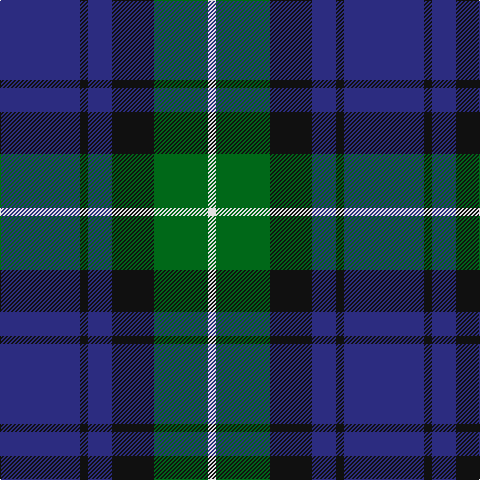

In pattern [BKBKGW](/patterns/bkbkgw/).

This was sourced from tartans-authority.  It is a [6 stripes tartan](/stripes/stripes6/).

Original link http://www.tartansauthority.com/tartan-ferret/display/2226/

## Thread count
DB/80 K8 DB24 K42 G54 LN/8

## Palette
Each colour and its ΔE from the base-6 reference it is a variant of.

| Colour | Shade | Base | ΔE (OKLab) |
|---|---|---|---|
| DB | <code style="background-color:#2C2C80;">#2C2C80</code> `#2C2C80` | B <code style="background-color:#2C4084;">#2C4084</code> | 0.05 |
| G | <code style="background-color:#006818;">#006818</code> `#006818` | G <code style="background-color:#006400;">#006400</code> | 0.02 |
| K | <code style="background-color:#101010;">#101010</code> `#101010` | K <code style="background-color:#000000;">#000000</code> | 0.17 |
| LN | <code style="background-color:#E0E0E0;">#E0E0E0</code> `#E0E0E0` | W <code style="background-color:#F4F4F0;">#F4F4F0</code> | 0.06 |

# Sample pattern

## Nearest tartans

The nearest existing variants by ΔTartan distance.

1. [Mowat (Clans Originaux)](/setts/s7/b48k6b10k46y4k22g44-b2c2c80-g006818-k101010-ye8c000/) — ΔT 0.98
1. [MacRobart (Personal)](/setts/s6/b60k20g20w4g30w4-b202060-g006818-k101010-wa8ace8/) — ΔT 0.99
1. [Notre Dame Marching Guard (Corp)](/setts/s6/b10ba70k48ba18g18b10-b4c0000-ba1474b4-g289c18-k101010/) — ΔT 1.01
1. [Bareback (Corporate)](/setts/s6/b6k6b21k16ba36y4-b5c5c5c-ba2c2c80-k101010-ye8c000/) — ΔT 1.04
1. [Joker Fancy Tartan Tartan Number: 6769. Earliest known date: 2005 I have a photo of a fabric swatch that I am trying to match as close as possible. I have been commissioned to make a life size mannequin of Jack Nicholson as the Joker and he wore plaid/tartan pants. I could send you some photos through email and possibly you could help me. Thanks, Andy Garringer USA, January 2008. (96 threads @ 40 epi heavyweight = 2.5 inch repeat) See products available Copyright © Blair Urquhart, Comrie, 2015](/setts/s6/b22k2b6k10ba18y2-b1870a4-ba4c0470-k101010-yd87c00/) — ΔT 1.05
1. [MacArthur of Milton (Clan)](/setts/s6/g28b4g4k16ba16k4-b28287c-ba700070-g006c3c-k101010/) — ΔT 1.09
1. [Unidentified #28](/setts/s6/g4b8k12ba2g18k4-b0596fa-ba3c82af-g005020-k101010/) — ΔT 1.13
1. [Graham of Menteith](/setts/s6/g32b4g4k24ba24k4-b2474e8-ba28287c-g006c3c-k101010/) — ΔT 1.13
1. [Forbes Ancient Clan Tartan Tartan Number: 212. Earliest known date: Logan 1831 Lord Lyon includes the word 'Ancient' in register entry. The Clan Forbes is said to originate from one Ochonochar, who slew a bear to gain possession of the Braes of Forbes in Aberdeenshire. The charter for the land was granted later in 1271. See products available Copyright © Blair Urquhart, Comrie, 2015](/setts/s7/b2k12b12k12g12k2w2-b2c2c80-g006818-k101010-we0e0e0/) — ΔT 1.14
1. [Midlothian](/setts/s6/b62ba8b10k38g40y8-b1c0070-ba2474e8-g006818-k101010-yd09800/) — ΔT 1.15

## Neighbour map

Every grey dot is one of 15726 variants placed by the first two principal components of the ΔTartan feature space (44% of its variance). Red is this tartan; blue dots are its nearest — click one to open its page.

<svg viewBox="0 0 640 380" role="img" style="max-width:100%;height:auto;border:1px solid #e0e0e0;border-radius:4px;display:block" xmlns="http://www.w3.org/2000/svg"><image href="/nn/cloud.v1.png" width="640" height="380"/><a href="/setts/s7/b48k6b10k46y4k22g44-b2c2c80-g006818-k101010-ye8c000/"><circle cx="234.7" cy="226.8" r="4" fill="#3465a4"><title>Mowat (Clans Originaux)</title></circle></a><a href="/setts/s6/b60k20g20w4g30w4-b202060-g006818-k101010-wa8ace8/"><circle cx="260.3" cy="212.9" r="4" fill="#3465a4"><title>MacRobart (Personal)</title></circle></a><a href="/setts/s6/b10ba70k48ba18g18b10-b4c0000-ba1474b4-g289c18-k101010/"><circle cx="232.7" cy="232.4" r="4" fill="#3465a4"><title>Notre Dame Marching Guard (Corp)</title></circle></a><a href="/setts/s6/b6k6b21k16ba36y4-b5c5c5c-ba2c2c80-k101010-ye8c000/"><circle cx="229.7" cy="235.8" r="4" fill="#3465a4"><title>Bareback (Corporate)</title></circle></a><a href="/setts/s6/b22k2b6k10ba18y2-b1870a4-ba4c0470-k101010-yd87c00/"><circle cx="260.5" cy="224.4" r="4" fill="#3465a4"><title>Joker Fancy Tartan Tartan Number: 6769. Earliest known date: 2005 I have a photo of a fabric swatch that I am trying to match as close as possible. I have been commissioned to make a life size mannequin of Jack Nicholson as the Joker and he wore plaid/tartan pants. I could send you some photos through email and possibly you could help me. Thanks, Andy Garringer USA, January 2008. (96 threads @ 40 epi heavyweight = 2.5 inch repeat) See products available Copyright © Blair Urquhart, Comrie, 2015</title></circle></a><a href="/setts/s6/g28b4g4k16ba16k4-b28287c-ba700070-g006c3c-k101010/"><circle cx="230.6" cy="244.8" r="4" fill="#3465a4"><title>MacArthur of Milton (Clan)</title></circle></a><a href="/setts/s6/g4b8k12ba2g18k4-b0596fa-ba3c82af-g005020-k101010/"><circle cx="226.1" cy="239.3" r="4" fill="#3465a4"><title>Unidentified #28</title></circle></a><a href="/setts/s6/g32b4g4k24ba24k4-b2474e8-ba28287c-g006c3c-k101010/"><circle cx="216.5" cy="245.0" r="4" fill="#3465a4"><title>Graham of Menteith</title></circle></a><a href="/setts/s7/b2k12b12k12g12k2w2-b2c2c80-g006818-k101010-we0e0e0/"><circle cx="219.8" cy="253.7" r="4" fill="#3465a4"><title>Forbes Ancient Clan Tartan Tartan Number: 212. Earliest known date: Logan 1831 Lord Lyon includes the word 'Ancient' in register entry. The Clan Forbes is said to originate from one Ochonochar, who slew a bear to gain possession of the Braes of Forbes in Aberdeenshire. The charter for the land was granted later in 1271. See products available Copyright © Blair Urquhart, Comrie, 2015</title></circle></a><a href="/setts/s6/b62ba8b10k38g40y8-b1c0070-ba2474e8-g006818-k101010-yd09800/"><circle cx="186.9" cy="222.8" r="4" fill="#3465a4"><title>Midlothian</title></circle></a><circle cx="250.7" cy="234.7" r="5" fill="#c00000"/></svg>

ID: /setts/s6/b80k8b24k42g54w8-b2c2c80-g006818-k101010-we0e0e0/
