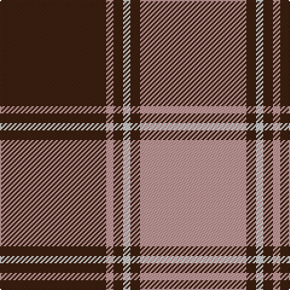

In pattern [BYBWBY](/patterns/bybwby/).

This was sourced from register-of-tartans.  It is a [6 stripes tartan](/stripes/stripes6/).

Original link https://www.tartanregister.gov.uk/tartanDetails.aspx?ref=4514

## Thread count
K/88 N6 K8 Na6 K8 N/88

## Palette
Each colour and its ΔE from the base-6 reference it is a variant of.

| Colour | Shade | Base | ΔE (OKLab) |
|---|---|---|---|
| K | <code style="background-color:#3C2010;">#3C2010</code> `#3C2010` | B <code style="background-color:#2A418A;">#2A418A</code> | 0.21 |
| N | <code style="background-color:#C09898;">#C09898</code> `#C09898` | Y <code style="background-color:#F2BF00;">#F2BF00</code> | 0.19 |
| Na | <code style="background-color:#C8C8C8;">#C8C8C8</code> `#C8C8C8` | W <code style="background-color:#F7F7F7;">#F7F7F7</code> | 0.14 |

# Sample pattern

## Nearest tartans

The nearest existing variants by ΔTartan distance.

1. [Machair (warp)](/setts/s6/r144k32w18k8w10k32-k000030-r906030-we0e0e0/) — ΔT 0.95
1. [Auburn University (Alabama)](/setts/s6/b6y6b48y60b6y4-b2c2c80-yd87c00/) — ΔT 1.04
1. [Dunbar Ancient](/setts/s6/k26w4k8r56k8w4-k101010-rcc4438-we0e0e0/) — ΔT 1.19
1. [Korner-Macpherson (Personal)](/setts/s7/g10r6g70k56g8k22g4-g808080-k101010-rc80000/) — ΔT 1.25
1. [Atlas Textile (Corporate)](/setts/s8/w4y4k4y48k48y4k4y4-k101010-we0e0e0-yd87c00/) — ΔT 1.32
1. [Flynn](/setts/s6/r116k44r16k34ra10k28-k101010-r888888-rac8002c/) — ΔT 1.32
1. [Highland Park High School (Texas)](/setts/s9/b76w4b24w4b8w8y8w4y72-b1c1c50-we0e0e0-ye0a126/) — ΔT 1.34
1. [Stutterheim](/setts/s6/k4y18b44k3y10k4-b565c76-k101010-yecdc8e/) — ΔT 1.36
1. [Kansai Highland Games Corporate Tartan Tartan Number: 2708. Earliest known date: 1999 Designed for the first Highland Games in Japan, started by Maud Robertson and heavy weight husband, Masonori Nomiyam. See products available Copyright © Blair Urquhart, Comrie, 2015](/setts/s5/b8k4b64g64w8-b780078-g289c18-k101010-we0e0e0/) — ΔT 1.36
1. [Bon Accord](/setts/s7/r12w6r34b6r6b50r6-b003c64-rc80000-wffffff/) — ΔT 1.39

## Neighbour map

Every grey dot is one of 15726 variants placed by the first two principal components of the ΔTartan feature space (44% of its variance). Red is this tartan; blue dots are its nearest — click one to open its page.

<svg viewBox="0 0 640 380" role="img" style="max-width:100%;height:auto;border:1px solid #e0e0e0;border-radius:4px;display:block" xmlns="http://www.w3.org/2000/svg"><image href="/nn/cloud.v1.png" width="640" height="380"/><a href="/setts/s6/r144k32w18k8w10k32-k000030-r906030-we0e0e0/"><circle cx="361.0" cy="170.2" r="4" fill="#3465a4"><title>Machair (warp)</title></circle></a><a href="/setts/s6/b6y6b48y60b6y4-b2c2c80-yd87c00/"><circle cx="385.2" cy="199.1" r="4" fill="#3465a4"><title>Auburn University (Alabama)</title></circle></a><a href="/setts/s6/k26w4k8r56k8w4-k101010-rcc4438-we0e0e0/"><circle cx="334.6" cy="179.4" r="4" fill="#3465a4"><title>Dunbar Ancient</title></circle></a><a href="/setts/s7/g10r6g70k56g8k22g4-g808080-k101010-rc80000/"><circle cx="345.8" cy="187.5" r="4" fill="#3465a4"><title>Korner-Macpherson (Personal)</title></circle></a><a href="/setts/s8/w4y4k4y48k48y4k4y4-k101010-we0e0e0-yd87c00/"><circle cx="324.1" cy="162.1" r="4" fill="#3465a4"><title>Atlas Textile (Corporate)</title></circle></a><a href="/setts/s6/r116k44r16k34ra10k28-k101010-r888888-rac8002c/"><circle cx="320.5" cy="215.2" r="4" fill="#3465a4"><title>Flynn</title></circle></a><a href="/setts/s9/b76w4b24w4b8w8y8w4y72-b1c1c50-we0e0e0-ye0a126/"><circle cx="313.7" cy="141.5" r="4" fill="#3465a4"><title>Highland Park High School (Texas)</title></circle></a><a href="/setts/s6/k4y18b44k3y10k4-b565c76-k101010-yecdc8e/"><circle cx="304.6" cy="179.1" r="4" fill="#3465a4"><title>Stutterheim</title></circle></a><a href="/setts/s5/b8k4b64g64w8-b780078-g289c18-k101010-we0e0e0/"><circle cx="291.4" cy="181.0" r="4" fill="#3465a4"><title>Kansai Highland Games Corporate Tartan Tartan Number: 2708. Earliest known date: 1999 Designed for the first Highland Games in Japan, started by Maud Robertson and heavy weight husband, Masonori Nomiyam. See products available Copyright © Blair Urquhart, Comrie, 2015</title></circle></a><a href="/setts/s7/r12w6r34b6r6b50r6-b003c64-rc80000-wffffff/"><circle cx="310.2" cy="206.4" r="4" fill="#3465a4"><title>Bon Accord</title></circle></a><circle cx="345.7" cy="180.2" r="5" fill="#c00000"/></svg>

ID: /setts/s6/b88y6b8w6b8y88-b3c2010-wc8c8c8-yc09898/
