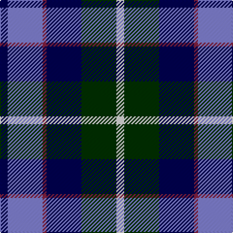

In pattern [BBRBGW](/patterns/bbrbgw/).

This was sourced from weddslist.  It is a [6 stripes tartan](/stripes/stripes6/).

Original link http://www.weddslist.com/cgi-bin/tartans/pg.pl?source=sts

## Thread count
DB/8 B36 DR4 DB36 DG36 LN/8

## Palette
Each colour and its ΔE from the base-6 reference it is a variant of.

| Colour | Shade | Base | ΔE (OKLab) |
|---|---|---|---|
| B | <code style="background-color:#8080D0;">#8080D0</code> `#8080D0` | B <code style="background-color:#2C4084;">#2C4084</code> | 0.24 |
| DB | <code style="background-color:#000050;">#000050</code> `#000050` | B <code style="background-color:#2C4084;">#2C4084</code> | 0.20 |
| DG | <code style="background-color:#003000;">#003000</code> `#003000` | G <code style="background-color:#006400;">#006400</code> | 0.18 |
| DR | <code style="background-color:#802040;">#802040</code> `#802040` | R <code style="background-color:#C80000;">#C80000</code> | 0.16 |
| LN | <code style="background-color:#E0E0E0;">#E0E0E0</code> `#E0E0E0` | W <code style="background-color:#F4F4F0;">#F4F4F0</code> | 0.06 |

# Sample pattern

ID: /setts/s6/b8ba36r4b36g36w8-b000050-ba8080d0-g003000-r802040-we0e0e0/
