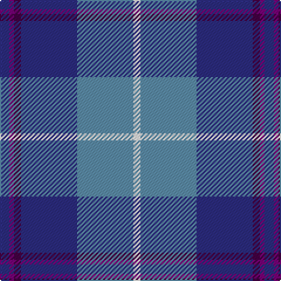

In pattern [BBBBBW](/patterns/bbbbbw/).

This was sourced from tartans-authority.  It is a [6 stripes tartan](/stripes/stripes6/).

Original link http://www.tartansauthority.com/tartan-ferret/display/11181/

## Thread count
DB/8 P4 DP6 DB48 B48 W/6

## Palette
Each colour and its ΔE from the base-6 reference it is a variant of.

| Colour | Shade | Base | ΔE (OKLab) |
|---|---|---|---|
| B | <code style="background-color:#5C8CA8;">#5C8CA8</code> `#5C8CA8` | B <code style="background-color:#2A418A;">#2A418A</code> | 0.23 |
| DB | <code style="background-color:#2C2C80;">#2C2C80</code> `#2C2C80` | B <code style="background-color:#2A418A;">#2A418A</code> | 0.06 |
| DP | <code style="background-color:#440044;">#440044</code> `#440044` | B <code style="background-color:#2A418A;">#2A418A</code> | 0.18 |
| P | <code style="background-color:#780078;">#780078</code> `#780078` | B <code style="background-color:#2A418A;">#2A418A</code> | 0.17 |
| W | <code style="background-color:#FCFCFC;">#FCFCFC</code> `#FCFCFC` | W <code style="background-color:#F7F7F7;">#F7F7F7</code> | 0.01 |

# Sample pattern

## Nearest tartans

The nearest existing variants by ΔTartan distance.

1. [Aberdeen Academy of Performing Arts](/setts/s6/b8ba4bb6b48bc48w6-b1c1c50-ba9058d8-bb440044-bc1870a4-wffffff/) — ΔT 0.66
1. [Georgian Bay, Waters of](/setts/s6/b70w6b16ba72g18r6-b1b3f8b-ba009acd-g002618-rbb7168-wffffff/) — ΔT 1.00
1. [Icelandair](/setts/s7/b6ba48k22b40w4b10y6-b2c4084-ba2888c4-k101010-wffffff-yd87c00/) — ΔT 1.06
1. [Mina Perhonen Japanese Corporate Tartan Tartan Number: 5797. Earliest known date: pre 2003 Designed by Fiona Hall of Lochcarron as a corporate tartan for the Mina Company of Tokyo whose logo is a butterfly. The blues are from the company's colours and represent the sky, the yellow represents the butterfly and the white is for the clouds.'Perhonen' is Finnish for butterfly and chosen because the Japanese design world has a great affinity with some Scandinavian countries. See products available Copyright © Blair Urquhart, Comrie, 2015](/setts/s7/w8b48y4ba48bb10b8y8-b202060-ba2c2c80-bb5c8ca8-we0e0e0-ye8c000/) — ΔT 1.13
1. [Federal Bureau of Investigation](/setts/s7/b12w4b4w6b32ba52r4-b1c0070-ba1870a4-r880000-wc0c0c0/) — ΔT 1.14
1. [SABA](/setts/s5/w12b8ba60bb60r8-b003c64-ba2c2c80-bb2888c4-rc80000-we0e0e0/) — ΔT 1.17
1. [Isle of Harris (District)](/setts/s6/b24k16g16k8ba80w8-b2888c4-ba2c2c80-g289c18-k101010-wfcfcfc/) — ΔT 1.19
1. [Peterson, Oren (Name)](/setts/s6/w4g8r40ra4b60wa4-b2c2c80-g009020-r888888-rac80000-wc49cd8-wae0e0e0/) — ΔT 1.20
1. [Pride of the Nation (Fashion)](/setts/s8/b12ba6b50bb39bc12bd6bc6w4-b5c8ca8-ba2c2c80-bb1c1c50-bc9050d8-bd780078-we0e0e0/) — ΔT 1.22
1. [Jamieson, Robert (Personal)](/setts/s5/w12y12b42ba64r6-b1474b4-ba003c64-rc8002c-wc0c0c0-ybc8c00/) — ΔT 1.26

## Neighbour map

Every grey dot is one of 15726 variants placed by the first two principal components of the ΔTartan feature space (44% of its variance). Red is this tartan; blue dots are its nearest — click one to open its page.

<svg viewBox="0 0 640 380" role="img" style="max-width:100%;height:auto;border:1px solid #e0e0e0;border-radius:4px;display:block" xmlns="http://www.w3.org/2000/svg"><image href="/nn/cloud.v1.png" width="640" height="380"/><a href="/setts/s6/b8ba4bb6b48bc48w6-b1c1c50-ba9058d8-bb440044-bc1870a4-wffffff/"><circle cx="260.2" cy="184.5" r="4" fill="#3465a4"><title>Aberdeen Academy of Performing Arts</title></circle></a><a href="/setts/s6/b70w6b16ba72g18r6-b1b3f8b-ba009acd-g002618-rbb7168-wffffff/"><circle cx="243.3" cy="191.8" r="4" fill="#3465a4"><title>Georgian Bay, Waters of</title></circle></a><a href="/setts/s7/b6ba48k22b40w4b10y6-b2c4084-ba2888c4-k101010-wffffff-yd87c00/"><circle cx="202.1" cy="184.1" r="4" fill="#3465a4"><title>Icelandair</title></circle></a><a href="/setts/s7/w8b48y4ba48bb10b8y8-b202060-ba2c2c80-bb5c8ca8-we0e0e0-ye8c000/"><circle cx="208.1" cy="173.4" r="4" fill="#3465a4"><title>Mina Perhonen Japanese Corporate Tartan Tartan Number: 5797. Earliest known date: pre 2003 Designed by Fiona Hall of Lochcarron as a corporate tartan for the Mina Company of Tokyo whose logo is a butterfly. The blues are from the company's colours and represent the sky, the yellow represents the butterfly and the white is for the clouds.'Perhonen' is Finnish for butterfly and chosen because the Japanese design world has a great affinity with some Scandinavian countries. See products available Copyright © Blair Urquhart, Comrie, 2015</title></circle></a><a href="/setts/s7/b12w4b4w6b32ba52r4-b1c0070-ba1870a4-r880000-wc0c0c0/"><circle cx="283.9" cy="186.9" r="4" fill="#3465a4"><title>Federal Bureau of Investigation</title></circle></a><a href="/setts/s5/w12b8ba60bb60r8-b003c64-ba2c2c80-bb2888c4-rc80000-we0e0e0/"><circle cx="199.3" cy="215.5" r="4" fill="#3465a4"><title>SABA</title></circle></a><a href="/setts/s6/b24k16g16k8ba80w8-b2888c4-ba2c2c80-g289c18-k101010-wfcfcfc/"><circle cx="239.3" cy="182.6" r="4" fill="#3465a4"><title>Isle of Harris (District)</title></circle></a><a href="/setts/s6/w4g8r40ra4b60wa4-b2c2c80-g009020-r888888-rac80000-wc49cd8-wae0e0e0/"><circle cx="265.8" cy="147.1" r="4" fill="#3465a4"><title>Peterson, Oren (Name)</title></circle></a><a href="/setts/s8/b12ba6b50bb39bc12bd6bc6w4-b5c8ca8-ba2c2c80-bb1c1c50-bc9050d8-bd780078-we0e0e0/"><circle cx="212.4" cy="149.7" r="4" fill="#3465a4"><title>Pride of the Nation (Fashion)</title></circle></a><a href="/setts/s5/w12y12b42ba64r6-b1474b4-ba003c64-rc8002c-wc0c0c0-ybc8c00/"><circle cx="237.5" cy="210.1" r="4" fill="#3465a4"><title>Jamieson, Robert (Personal)</title></circle></a><circle cx="262.0" cy="180.5" r="5" fill="#c00000"/></svg>

ID: /setts/s6/b8ba4bb6b48bc48w6-b2c2c80-ba780078-bb440044-bc5c8ca8-wfcfcfc/
