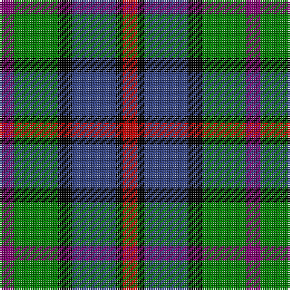

In pattern [BGKBKR](/patterns/bgkbkr/).

This was sourced from weddslist.  It is a [6 stripes tartan](/stripes/stripes6/).

Original link http://www.weddslist.com/cgi-bin/tartans/pg.pl?source=sts

## Thread count
P/8 G24 K8 B24 K4 R/8

## Palette
Each colour and its ΔE from the base-6 reference it is a variant of.

| Colour | Shade | Base | ΔE (OKLab) |
|---|---|---|---|
| B | <code style="background-color:#304080;">#304080</code> `#304080` | B <code style="background-color:#2C4084;">#2C4084</code> | 0.01 |
| G | <code style="background-color:#008000;">#008000</code> `#008000` | G <code style="background-color:#006400;">#006400</code> | 0.09 |
| K | <code style="background-color:#000000;">#000000</code> `#000000` | K <code style="background-color:#000000;">#000000</code> | 0.00 |
| P | <code style="background-color:#800070;">#800070</code> `#800070` | B <code style="background-color:#2C4084;">#2C4084</code> | 0.17 |
| R | <code style="background-color:#C00000;">#C00000</code> `#C00000` | R <code style="background-color:#C80000;">#C80000</code> | 0.02 |

# Sample pattern

## Nearest tartans

The nearest existing variants by ΔTartan distance.

1. [Cooke](/setts/s7/k24b8ba48g32r20k8g12-b8080d0-ba304080-g008000-k000000-rc00020/) — ΔT 0.44
1. [MacNeil Clan Tartan Tartan Number: 1767. Earliest known date: 1886 This version shows the narrow 'tramlines' about the yellow stripe, the usual modern form that differs from Logans earlier version. The MacNeils claim descent from Niall, King of Ireland, who came to Barra in 1049. The present chief, Professor Ian Roderick MacNeil of Barra, lives in Chicago, U.S.A. There is also a tartan for the MacNeils of Colonsay. MacNeils are hereditary pipers to the MacLeans of Duart. See products available Copyright © Blair Urquhart, Comrie, 2015](/setts/s6/w6b28k24g24k4y6-b2c2c80-g006818-k101010-we0e0e0-ye8c000/) — ΔT 0.56
1. [Birse Family Tartan Tartan Number: 1087. Earliest known date: 1930-50 This sample comes from the MacGregor-Hastie collection which forms the basis of the cloth archive of the Scottish Tartans Society. Some of the samples, including this one, were unmarked. One can assume that the sample dates between 1930 and 1950. See products available Copyright © Blair Urquhart, Comrie, 2015](/setts/s6/k8g32k28y6b32r8-b2c2c80-g006818-k101010-rc80000-ye8c000/) — ΔT 0.59
1. [Thompson's Fancy (Fashion)](/setts/s6/r6g36b12w24k24w6-b1c0070-g604000-k101010-r880000-w98c8e8/) — ΔT 0.73
1. [Dyce Family Tartan Tartan Number: 1266. Earliest known date: 1880 From Ross-Craven research. Black guards on the white. See products available Copyright © Blair Urquhart, Comrie, 2015](/setts/s6/k8y4g24k24b24w4-b2c2c80-g006818-k101010-we0e0e0-ye8c000/) — ΔT 0.75
1. [Nobiliary Fraternity](/setts/s5/b22ba4k20g20y6-b780078-ba5c8ca8-g006818-k101010-ye8c000/) — ΔT 0.78
1. [Royal Highland](/setts/s6/y8g34k34b34r6b6-b304080-g008000-k000000-rc00000-yb0b0b0/) — ΔT 0.78
1. [Casely](/setts/s6/r16g44k44g8b44ga12-b304080-g008000-ga607030-k000000-rc00000/) — ΔT 0.79
1. [Selkirk (Name)](/setts/s5/b22g4k20ga20y4-b780078-g789484-ga006818-k101010-yd09800/) — ΔT 0.81
1. [Friebe (2014)](/setts/s5/g30ga36b46w8r16-b1c1c50-g649848-ga23321b-rb62531-wf9f5ef/) — ΔT 0.85

## Neighbour map

Every grey dot is one of 15726 variants placed by the first two principal components of the ΔTartan feature space (44% of its variance). Red is this tartan; blue dots are its nearest — click one to open its page.

<svg viewBox="0 0 640 380" role="img" style="max-width:100%;height:auto;border:1px solid #e0e0e0;border-radius:4px;display:block" xmlns="http://www.w3.org/2000/svg"><image href="/nn/cloud.v1.png" width="640" height="380"/><a href="/setts/s7/k24b8ba48g32r20k8g12-b8080d0-ba304080-g008000-k000000-rc00020/"><circle cx="78.2" cy="218.4" r="4" fill="#3465a4"><title>Cooke</title></circle></a><a href="/setts/s6/w6b28k24g24k4y6-b2c2c80-g006818-k101010-we0e0e0-ye8c000/"><circle cx="93.5" cy="218.6" r="4" fill="#3465a4"><title>MacNeil Clan Tartan Tartan Number: 1767. Earliest known date: 1886 This version shows the narrow 'tramlines' about the yellow stripe, the usual modern form that differs from Logans earlier version. The MacNeils claim descent from Niall, King of Ireland, who came to Barra in 1049. The present chief, Professor Ian Roderick MacNeil of Barra, lives in Chicago, U.S.A. There is also a tartan for the MacNeils of Colonsay. MacNeils are hereditary pipers to the MacLeans of Duart. See products available Copyright © Blair Urquhart, Comrie, 2015</title></circle></a><a href="/setts/s6/k8g32k28y6b32r8-b2c2c80-g006818-k101010-rc80000-ye8c000/"><circle cx="104.1" cy="240.1" r="4" fill="#3465a4"><title>Birse Family Tartan Tartan Number: 1087. Earliest known date: 1930-50 This sample comes from the MacGregor-Hastie collection which forms the basis of the cloth archive of the Scottish Tartans Society. Some of the samples, including this one, were unmarked. One can assume that the sample dates between 1930 and 1950. See products available Copyright © Blair Urquhart, Comrie, 2015</title></circle></a><a href="/setts/s6/r6g36b12w24k24w6-b1c0070-g604000-k101010-r880000-w98c8e8/"><circle cx="85.0" cy="219.1" r="4" fill="#3465a4"><title>Thompson's Fancy (Fashion)</title></circle></a><a href="/setts/s6/k8y4g24k24b24w4-b2c2c80-g006818-k101010-we0e0e0-ye8c000/"><circle cx="122.7" cy="231.8" r="4" fill="#3465a4"><title>Dyce Family Tartan Tartan Number: 1266. Earliest known date: 1880 From Ross-Craven research. Black guards on the white. See products available Copyright © Blair Urquhart, Comrie, 2015</title></circle></a><a href="/setts/s5/b22ba4k20g20y6-b780078-ba5c8ca8-g006818-k101010-ye8c000/"><circle cx="85.7" cy="245.2" r="4" fill="#3465a4"><title>Nobiliary Fraternity</title></circle></a><a href="/setts/s6/y8g34k34b34r6b6-b304080-g008000-k000000-rc00000-yb0b0b0/"><circle cx="89.7" cy="223.2" r="4" fill="#3465a4"><title>Royal Highland</title></circle></a><a href="/setts/s6/r16g44k44g8b44ga12-b304080-g008000-ga607030-k000000-rc00000/"><circle cx="70.1" cy="235.2" r="4" fill="#3465a4"><title>Casely</title></circle></a><a href="/setts/s5/b22g4k20ga20y4-b780078-g789484-ga006818-k101010-yd09800/"><circle cx="109.3" cy="245.2" r="4" fill="#3465a4"><title>Selkirk (Name)</title></circle></a><a href="/setts/s5/g30ga36b46w8r16-b1c1c50-g649848-ga23321b-rb62531-wf9f5ef/"><circle cx="88.9" cy="249.1" r="4" fill="#3465a4"><title>Friebe (2014)</title></circle></a><circle cx="90.9" cy="224.5" r="5" fill="#c00000"/></svg>

ID: /setts/s6/b8g24k8ba24k4r8-b800070-ba304080-g008000-k000000-rc00000/
