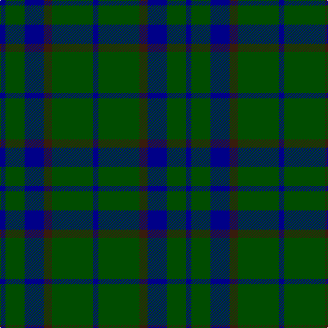

In pattern [BGBBGB](/patterns/bgbbgb/).

This was sourced from register-of-tartans.  It is a [6 stripes tartan](/stripes/stripes6/).

Original link https://www.tartanregister.gov.uk/tartanDetails.aspx?ref=1523

## Thread count
DB/8 G28 DB28 K12 G60 DB/8

## Palette
Each colour and its ΔE from the base-6 reference it is a variant of.

| Colour | Shade | Base | ΔE (OKLab) |
|---|---|---|---|
| DB | <code style="background-color:#000088;">#000088</code> `#000088` | B <code style="background-color:#2C4084;">#2C4084</code> | 0.14 |
| G | <code style="background-color:#004C00;">#004C00</code> `#004C00` | G <code style="background-color:#006400;">#006400</code> | 0.08 |
| Ga | <code style="background-color:#004800;">#004800</code> `#004800` | G <code style="background-color:#006400;">#006400</code> | 0.09 |
| K | <code style="background-color:#381C0C;">#381C0C</code> `#381C0C` | B <code style="background-color:#2C4084;">#2C4084</code> | 0.21 |

# Sample pattern

ID: /setts/s6/b8g28b28ba12g60b8-b000088-ba381c0c-g004c00/
